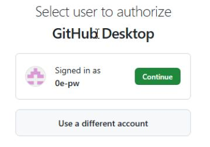
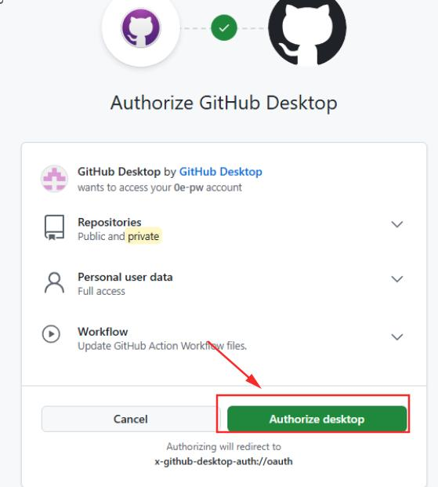
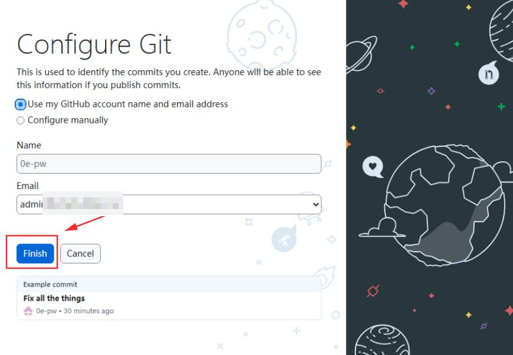
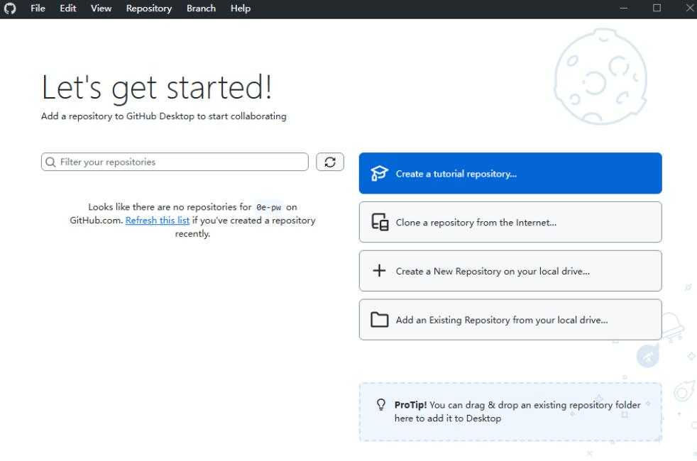

+++
date = '2025-08-06 12:30:25'
title = 'GithubDesktop安装'
description = "Git GUI Github Desktop安装教程"
categories = ['文档']
showAuthor = false
authors = ["Gu-f"]
weight = 49
+++

## 下载

[Github Desktop下载地址](https://desktop.github.com/download/)(注: 仅支持Windows和Mac)

## 安装

以Windows系统为例

下载后得到文件`GithubDesktopSetup-x64.exe`文件，双击打开(双击后会在桌面创建快捷方式，后续可通过该快捷方式打开)，如下图：  

然后我们点击`Sign in to GitHub.com`登录我们的Github账号(如果没有，需要先去站点[Github](https://github.com/signup)注册一个)  
这个时候会跳转到网页，输入账号密码后点击Sign in.  
  
然后我们点击Continue，得到如下图：  
  
然后点击Authorize desktop,这个时候会提示你打开客户端，这个时候选择打开。  
  
然后我们得到如下登录后的结果：  
  
然后我们点击Finish，得到如下界面即安装登录完成。  

