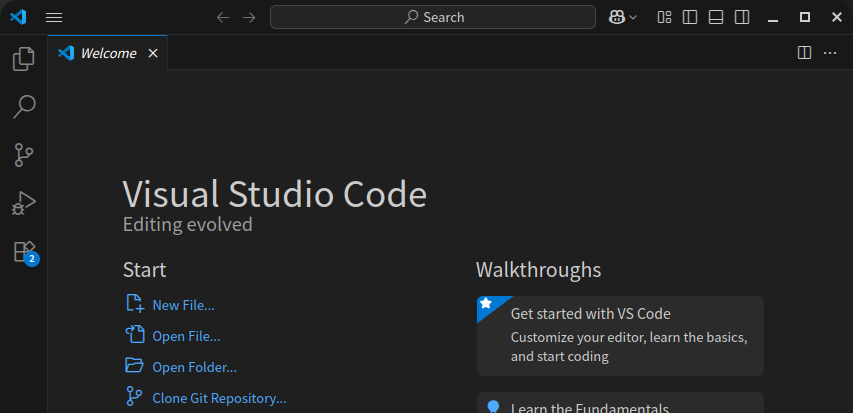

+++
date = '2025-07-09 12:20:25'
title = '准备环境'
description = ""
categories = ['文档']
showAuthor = false
authors = ["Gu-f"]
+++

## 准备编辑(写作)环境

你可以使用任何你喜欢的写作环境：

- 文本编辑器：如 VSCode，等等...
- Markdown编辑器：如 Typora、Mark-Text，等等...
- 集成开发环境：如 Pycharm、IDLE、等等...
- 如果你想，甚至是可以使用txt文本编辑器-记事本（不推荐）。

如果你是一个软件开发者，你应该对该流程十分熟悉，并且有了自己的一套集成开发环境，那么你完全不需要纠结使用什么，用你自己最擅长的就是最完美的！

如果你是一个文字作者，推荐使用VSCode或者是你熟悉的写作软件（注意：写作软件需要支持文件创建和目录管理）

文档教程使用VSCode

## VSCode下载/安装

VSCode官方下载地址：[VSCode](https://code.visualstudio.com/)

选择适合你的操作系统进行下载，如果你是Windows系统，请下载Windows版本，我这里是Linux，所以进入官网你会看到如下界面：  
  
如果你是Windows系统，则会看到英文Download for Windows，没错毫不犹豫点击这个黑色按钮就对了。

接下来你会有一个漫长的下载过程，如果你网速慢的情况下。耐心等待下载完成！

下载完成后，双击打开，按照提示进行一步一步安装，如果你看不懂英文，翻译软件是个好东西，它可以帮助你看明白。

至此，编辑器安装完成。

让我们打开它，得到如下界面：  

完成！非常完美！

