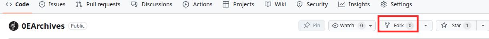
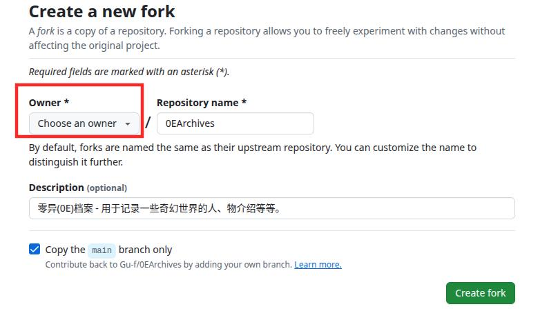
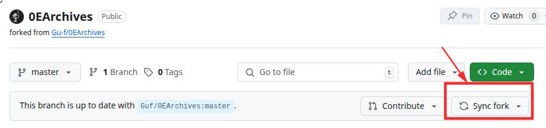
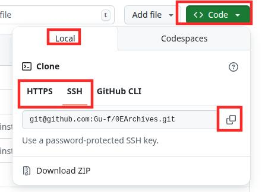
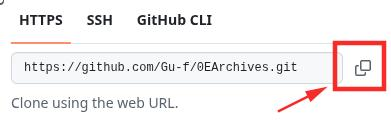

+++
date = '2025-07-10 12:30:25'
title = '3.Fork并克隆0EArchives仓库'
description = ""
categories = ['文档']
showAuthor = false
authors = ["Gu-f"]
weight = 3
+++

## Fork并克隆0EArchives仓库

在参与贡献内容之前，你需要先把0E仓库给fork一份，然后克隆(clone)下来，用于后续PR(Pull Request)的提交和合并。

如果你还不熟悉git流程，这里有该文章出现的名词解释：

- fork：Fork 是指在 GitHub 或 GitLab 这类代码托管平台上，从他人的仓库复制一份完整的副本到你自己的账户名下, 也就是你复制一份0E的副本到自己Github账户下。
- 克隆(clone): Clone 是将远程仓库的代码下载到你的本地电脑，创建一个可以本地开发/写作的副本。
- PR(Pull Request)：Pull Request，拉取请求，当你 fork 并修改了一个项目，想要将你的改动提交回原项目时，就要发起一个 PR，便可等待原作者审核和合并等操作。

## 1.Fork

首先来到0E档案的仓库，地址在这里[0EArchives](https://github.com/Gu-f/0EArchives)

点击右上角Fork按钮进行fork。(fork右手边还有一个Star(点赞)按钮，如果喜欢的话可以点击呦)

进入fork配置页面，如下：  

红框部分选择你自己呦，因为是创建一个副本到你自己的仓库下。  
最后点击Create Fork，你就会发现你的Github仓库里面就有一个0EArchives档案的仓库啦~

### 1.1 Sync Fork同步fork

对于刚创建Fork无需关注这个步骤，这个步骤主要是用来，当你提交过一次之后，有很长时间没有提交了。想要再次提交的时候，由于0EArchives主仓库可能已经有很多其他人提交过内容了，这个时候你就需要同步一下主仓库内容。  
刚创建的由于本来就是新的，所以不需要同步。  
同步之后你的fork的仓库就跟主仓库内容一致了，然后你就可以继续基于你创建的这个fork进行提交新的内容啦。  
（不需要每次提交新内容都进行一个新的fork呦，当你创建过一次fork后，没有删除的情况下，你可以使用Sync Fork进行拉齐内容）  

## 2.Clone克隆项目

在你Fork后的项目仓库里面点击绿色按钮Code，会弹出一个框，在Local选项卡里面可以选择Clone方式，有HTTPS、SSH、Github CLI  

通常我们使用的方式有两种，分别是HTTPS和SSH（SSH需要配置秘钥）  
演示样例使用HTTPS，SSH感兴趣可以自行搜索研究。  
我们切换到HTTPS选项卡，然后点击地址后方的复制按钮：  

然后我们在电脑中找到一个存放项目的位置，如果你有自己的文件夹规划，可以根据自己的情况来，任何位置均可，但是建议不要放到系统目录下（比如Windows的`C:`盘，Linux或MacOS的根目录`/`）  
我将其存放在了`/home/workspace/`目录下，Windows可以放在`D:\workspace\`目录下。  
然后命令行进入上方的目录(如何打开命令行前面文档已介绍), 如果文件夹不存在请先创建。进入文件夹命令如下:  
Linux/MacOS: `cd /home/workspace/`  cd为进入某个目录  
Windows：`d: && cd D:\workspace\`  d: 代表首先切换到D盘，cd为进入某个目录

如果命令没有任何输出则说明是成功了。  
如果命令输出`没有那个文件或目录`或`系统找不到指定的路径。`，这说明没有对应文件夹，你需要先创建一个。

上方执行完之后，我们在将刚刚复制的内容，与`git clone`拼到一起，拼成如下命令：  
注意，你的命令地址应该是你的账户下的，也就是下面命令xxxxx位置应该显示你的用户名才是正确的。  
`git clone https://github.com/xxxxx/0EArchives.git`  
输入到命令行，然后回车即可开始clone  
（！注：GitHub部分地区可能需要科学上网，不然没有网络，需要自行解决）

克隆完成后即可在目录下找到0EArchives文件夹，里面则是0E档案的内容。

至此，Fork并克隆0EArchives仓库完成。  

