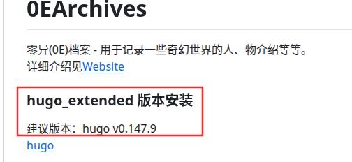
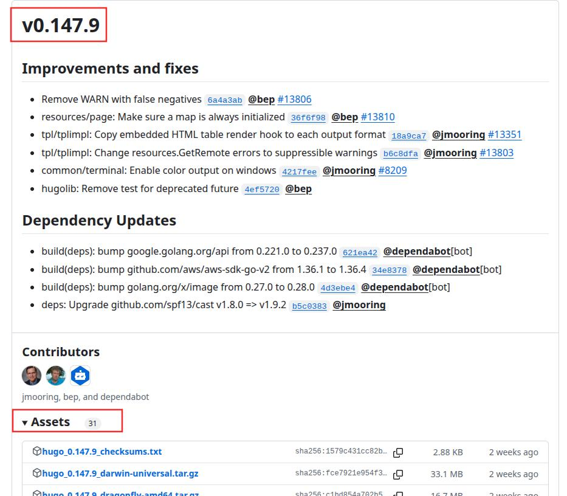
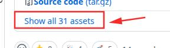
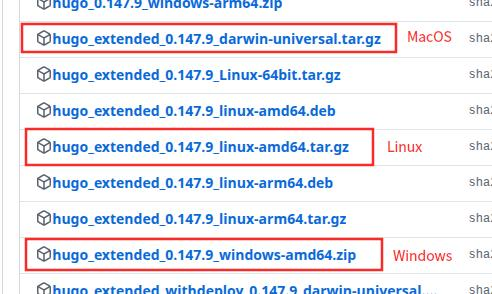
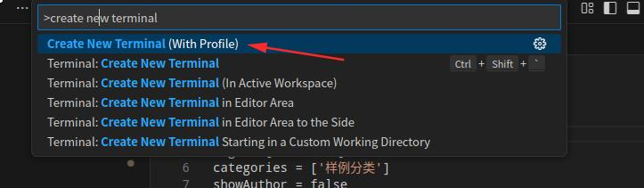
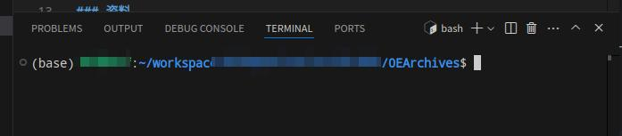

+++
date = '2025-07-10 12:25:15'
title = '本地档案预览'
description = ""
categories = ['文档']
showAuthor = false
authors = ["Gu-f"]
weight = 5
+++

## 本地档案预览

我们的站点是使用hugo进行的驱动生成的，所以我们要在本地安装hugo，以便于本地预览我们的站点。

## Hugo下载安装

Hugo官方下载地址：[Hugo](https://github.com/gohugoio/hugo/releases)  
（下载地址在Github，如果打不开该链接请考虑科学上网）

打开下载地址后，有好多版本，请下载我们0E仓库的[Readme.md](https://github.com/Gu-f/0EArchives/blob/main/README.md)文件中建议的版本  
  
注意：该版本可能会随时更新，请保持自己使用的版本跟Readme.md文件中建议的版本号一致，而不是上方图片上的版本号。  
同时，**我们使用的是hugo_extended而不是hugo**，下载的时候不要下载错误。

在下载地址页面找到我们需要的软件包（注意版本号可能会随时更新，以下以v0.147.9为例）：  
点击Assets，展开软件包  
  
如果软件包没有找到，未展示全，点击下面这个按钮Show all全部展开：  


然后向下滚动找到适合我们系统的软件包（注意一定是包含extended的）：

- Windows：hugo_extended_0.147.9_windows-amd64.zip
- Linux：hugo_extended_0.147.9_linux-amd64.tar.gz
- MacOS：hugo_extended_0.147.9_darwin-universal.tar.gz



上方软件包下载下来，解压缩后，将其复制到对应位置：

- Windows：解压缩后的文件为`hugo.exe`,将该文件复制到目录`C:\Windows\System32\`下，然后重启VSCode。
- Linux：解压缩后的文件为`hugo`,将该文件复制到目录`/usr/bin`下，并给予运行权限`chmod +x /usr/bin/hugo`，然后重启VSCode。
- MacOS：解压缩后的文件为`hugo`,将该文件复制到目录`/usr/local/bin`下，并给予运行权限`chmod +x /usr/local/bin/hugo`，然后重启VSCode。

接下来验证hugo是否安装成功，新开一个命令行终端，然后输入`hugo`命令，如果出现如下提示，则安装成功：

```text
Total in 0 ms
Error: Unable to locate config file or config directory. Perhaps you need to create a new site.
Run `hugo help new` for details.
```  

升级也非常简单，只需要按照同样的步骤，将旧的文件覆盖掉，然后重启VSCode即可。

## 档案站点预览

完成上述步骤后，接下来我们执行如下步骤进行档案预览。  
我们使用的是Blowfish主题，所以第一步我们需要先使用git拉取对应主题。  
用VSCode打开我们的项目，然后快捷键

```
Ctrl+`
```

打开我们VSCode里面的终端，或使用F1键，然后输入create new terminal,然后回车，打开一个终端  


打开后如下图：  


然后我们执行拉取主题操作：  
检查你的主题文件夹0EArchives/themes，此时的themes文件夹应该是空文件夹，然后执行下面的命令  
`git submodule update --init --recursive`  
执行完成后，themes文件夹下面应该多出个blowfish文件夹，并且里面有很多内容，那么你就成功了。

然后我们开始站点预览，同样在VSCode的终端里面执行命令`hugo server`,如果出现如下界面，则说明运行成功：  

然后我们将终端上给出的地址 `http://localhost:1313/` 复制下来，放到浏览器中打开,如果你能看到我们的0E档案站点，那么恭喜你，成功了。

后续当你完成一篇文章后，可以先在本地进行站点预览，确认没问题后再提交PR

恭喜你完成本节内容！    


