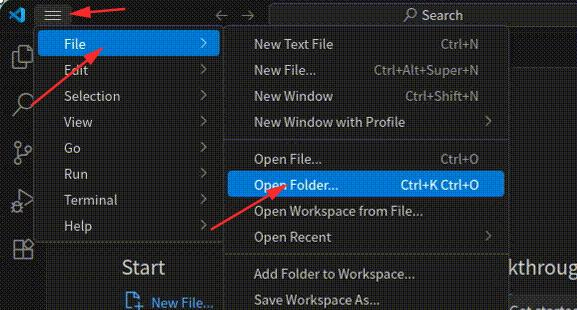
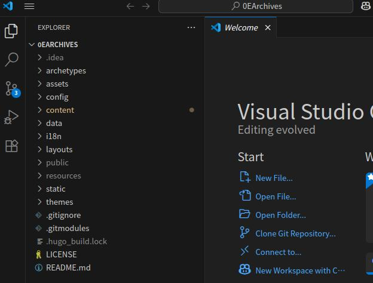
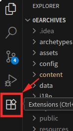
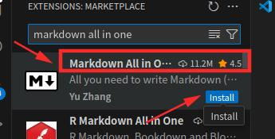
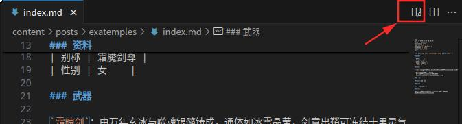
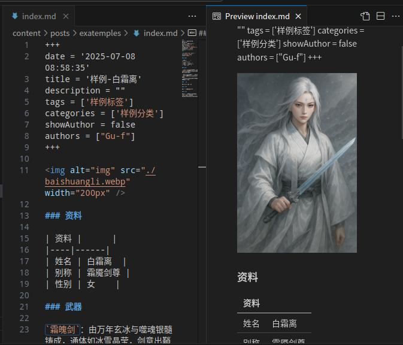

+++
date = '2025-07-10 12:20:25'
title = '写作前准备'
description = ""
categories = ['文档']
showAuthor = false
authors = ["Gu-f"]
weight = 4
+++

## 写作前准备工作

由于我们使用Markdown进行编写内容，因此我们需要给我们的写作环境增加Markdown文本支持，以便于提供更方便的预览等功能。  
首先打开我们前面安装好的VSCode  
然后打开我们前面克隆下来的项目，打开方式如下：  
  
然后选择克隆下来的文件夹，然后点击打开即可。  
打开后界面如下：  

接下来我们要安装Markdown插件支持，以便于我们方便使用Markdown语法进行写作信息（当然你也可以选择不安装，为了更快捷和方便建议安装）。  
点击左侧插件市场：  
  
上方输入框搜索Markdown all in one  
然后找到匹配的内容，点击Install按钮安装。  

如果出现如下弹窗：  
  
点击按钮Trust Publisher & Install信任并安装。

等待安装完成，安装完成后我们点击右上角X号关闭VSCode，重新打开（重启VSCode使插件生效）。

重新打开后，我们展开content目录下的内容，这里就是我们要写的0E档案的位置啦~
（具体content下内容写作格式，请参见内容格式规范）

我们可以预览一下写的内容。

打开content->posts->examples->index.md  

然后点击右上角的这个按钮，或使用Ctrl+Shift+V快捷键进行预览Markdown内容  

预览效果：  

（注：+++号部分没有渲染无需关注，该部分为hugo参数部分，后面文档会介绍到）

恭喜你完成本节内容！    

