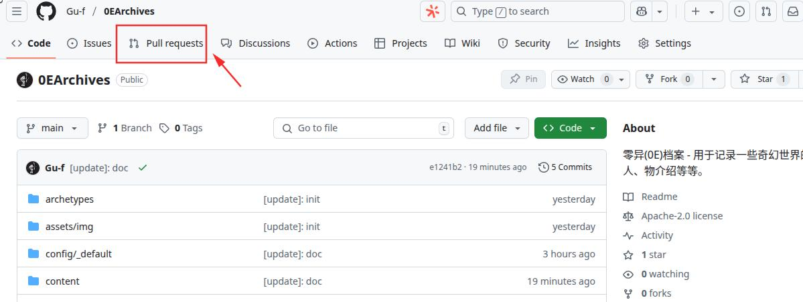
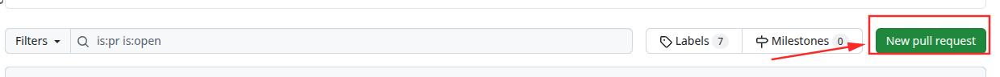
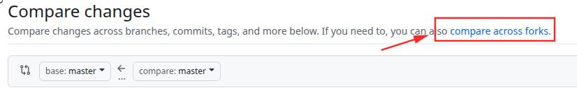
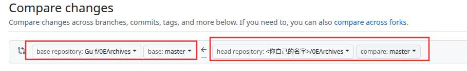
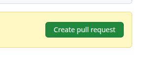
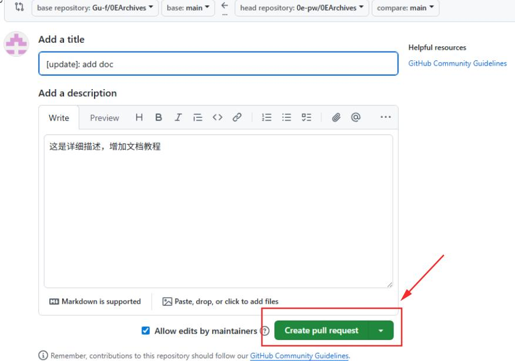

+++
date = '2025-07-10 12:28:16'
title = '8.开始发起合并请求到0E网站'
description = ""
categories = ['文档']
showAuthor = false
authors = ["Gu-f"]
weight = 8
+++

## 发起合并请求到0E主仓，并自动发布到0E网站

当你已经完成推送到自己账号下的Fork的仓库后，你需要将推送的内容发布到0e的网站和主仓。如果你熟悉Github的多人写作流程，你应该很熟悉这个PR的发起流程。  
如果不熟悉，跟着文档一步步来，你很快就能学会！

首先打开0EArchives的主代码仓库 [0EArchives](https://github.com/Gu-f/0EArchives/)

然后上方点击Pull Request，如下图：  

然后点击绿色按钮New pull request来发起一个新的PR:  

然后我们点击蓝色小字 compare across forks 进行跨Fork比较内容变动：  

然后我们选择要比较的分支：  
   
左侧为0EArchives的主仓库，右侧为你自己的仓库，右侧需要选择你Fork的哪个仓库，名称通常为`<你的Github用户名>/0EArchives`

选择好后，我们点击右侧绿色按钮Create pull request，开始发起合并请求：  

然后点击下方绿色按钮即可完成发起合并请求：  

至此你已完成了你的内容贡献，耐心等待0E仓库管理员审核，通过后你将会在网站中看到你的内容，如果没有通过，请根据未通过原因，及时修改提交内容。

基本教程到这里就结束了，祝生活愉快！    

