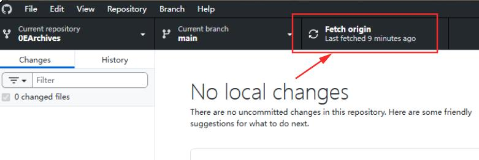

+++
date = '2025-07-10 12:25:15'
title = '7.推送内容到自己Fork的仓库'
description = ""
categories = ['文档']
showAuthor = false
authors = ["Gu-f"]
weight = 7
+++

## 推送你的内容到你自己Fork的仓库

当你按照要求写完一份档案后，需要先将其推送到你的Fork的仓库，再进行PR请求合并。  
如果你熟悉Git流程，这里你应该非常轻松就能搞定，甚至不需要看该文章。如果你不熟悉也没关系，跟着一步步来，一定能做到！
两种方式：  
1、[使用命令行](#使用命令行)  
2、[使用GUI](#扩展-使用GUI工具)

## 使用命令行

首先要熟悉几个git的命令（我们的git命令都是在打开好0EArchives的VSCode的终端环境下执行的）

```text
git pull
# 从远程仓库拉取最新的代码并自动与当前分支合并，保持本地代码同步

git status
# 查看当前工作区状态，包括修改、未跟踪、已暂存的文件等

git add .
# 将当前目录下所有变动的文件（新增、修改、删除）添加到暂存区

git commit -m '[update]: add content'
# 将暂存区的更改提交到本地仓库，并添加提交说明, 单引号中的内容 [update]: add content 是提交说明

git push
# 将本地的提交推送到远程仓库
```  

首先在一切开始前，你需要先Sync Fork同步你Fork的仓库为最新的，如何保证Fork的仓库为最新的，前面[文档](/docs/gitclone/#11-sync-fork同步fork)有提到。

然后VSCode终端执行`git pull`命令，将最新的内容拉到你的本地。

然后开始你的写作。。。此处写作耗时20分钟。。。

写作完成后使用命令 `git status` 查看你的写作变动内容信息，红色的表示还没有提交到暂存区，绿色的表示已经存到暂存区了，通常我们需要将所有内容存到暂存区

然后使用命令`git add .`将所有的变动提交到暂存区

再次使用`git status`查看是否已经变成绿色

然后使用命令`git commit -m '[update]: add content'`将内容提交到本地，并标注`[update]: add content`表示我有一个更新，添加了新内容，当然这里你可以使用你添加的具体内容简介，并尽量保存这种格式[xxx]: xxx

然后使用命令`git push`提交内容到你自己账号下的Fork的仓库

注意以上内容执行过程中，需要关注有没有执行成功，没有执行成功会有明显的提示。

## 扩展-使用GUI工具

（前提，你已经阅读过文档[使用GUI工具进行Clone](/docs/gitclone/#扩展clone方式二)操作）

首先在一切开始前，你需要先Sync Fork同步你Fork的仓库为最新的，如何保证Fork的仓库为最新的，前面[文档](/docs/gitclone/#11-sync-fork同步fork)有提到。

将最新内容拉到本地(注：如果出现网络报错，需要多次尝试或使用科学上网)：  


然后开始你的写作。。。此处写作耗时20分钟。。。  


恭喜你完成本节内容！    


