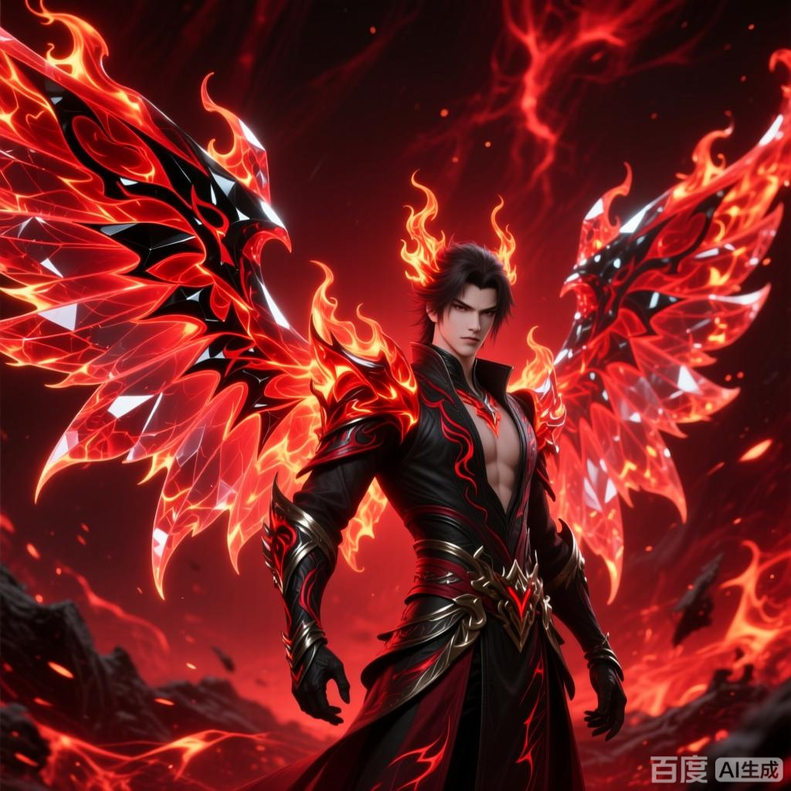

+++
date = '2025-07-08 08:58:35'
title = '样例-八荒破灭焱'
description = ""
tags = ['样例标签']
categories = ['样例分类']
showAuthor = false
authors = ["Gu-v"]
+++

### 资料

| 资料 |          |
| ---- | -------- |
| 类别 | 异火   |
| 名称 | 八荒破灭焱 |
| 异火榜排名 | 第六位       |

### 简介

八荒破灭焱兼具物理与灵魂攻击能力，可瞬间焚毁实体物质并灼烧目标灵魂能量。其释放时呈现暗红色火焰形态，极端高温可扭曲空间。使用者可将异火凝聚为百丈火焰双翼，大幅提升速度与攻击范围 。

### 事迹

 八荒破灭焱是天蚕土豆所著玄幻小说《斗破苍穹》中异火榜排名第六的异火，由远古炎族持有，在炎族成员火炫手中。该异火具有破灭万物与焚烧灵魂的双重特性，可转化为百丈火焰双翼用于战斗。作为炎族拥有的最高级异火，其灵魂印记被历代炎族族长强化，仅限炎族血脉掌控

### 持有者和使用限制

炎族通过血脉传承掌控该异火，历代族长施加灵魂印记防止外流。截至小说主线时间线，火炫是唯一明确持有者。异火恒古尺召唤事件中，萧炎成帝后强行召唤八荒破灭焱。

### 关联异火体系

炎族持有五种异火，除八荒破灭焱外还包括：
九幽金祖炎（第七） 
红莲业火（第八）
火云水炎（第十六）
火山石焰（第十七）
炎烬（炎族族长）曾融合九幽金祖炎与火山石焰形成新型异火，但未动摇八荒破灭焱的族内最高排名。
