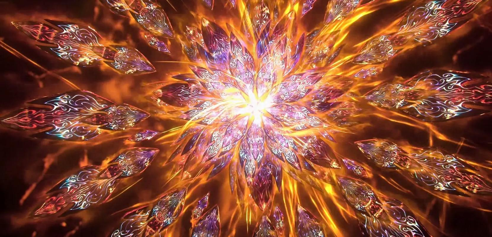

+++
date = '2025-07-08 08:58:35'
title = '样例-帝炎'
description = ""
tags = ['样例标签']
categories = ['样例分类']
showAuthor = false
authors = ["Gu-v"]
+++

### 资料

| 资料 |          |
| ---- | -------- |
| 类别 | 异火   |
| 名称 | 帝炎 |
| 异火榜排名 | 第一位       |

### 简介

帝炎，天蚕土豆所著玄幻小说《斗破苍穹》中异火榜排名第一的异火，由异火榜第二至第二十三的二十二种异火融合形成，呈现绚丽多彩的复合色泽，为异火间吞噬竞争后突破束缚的存在形态 。

### 事迹

斗气大陆第一朵帝炎为陀舍古帝，陀舍古帝原为普通异火，通过吞噬其他二十一种异火完成蜕变，而后自命名为帝炎，最终更是成就斗帝之身 。
第二朵帝炎为萧炎创造，萧炎通过焚决炼化异火，先后成功吸收青莲地心火、陨落心炎等二十二种异火，最终形成新的帝炎。萧炎前往大千世界后，该帝炎在又吸收了火灵族镇族之火等诸多神炎，威力得到进一步提升

### 背景设定

帝炎在自然界并不存在，它是由异火榜排名第二到第二十三的二十二种异火融合而成。异火之中，就如同缩小的人类帝国，即便你生而富贵，坐拥高职，但却依然可能会被推翻而去。互相吞食，对于异火来说，就是一种本能。二十二种异火中，谁能够突破束缚，吞食掉其余的二十一种异火，从那残酷的异火吞噬中脱颖而出，那么它，便可成为异火榜排名第一的炎中之帝——帝炎。

陀舍古帝
第一朵帝炎，最初只是异火榜排名后二十二的其中一种。
陀舍古帝千年成形，万年聚灵，又万载潜修，之后偶遇功法《焚决》，从此便开始沿着地底岩浆游荡，以吞火为生。
陀舍古帝吞火时趋吉避凶，以弱火为先，耗费数千载，终于成功吞噬了其余二十一种不同的异火。
陀舍古帝在功成之后，自命帝炎，而后再度修炼千年，终于成功突破至斗帝，方才破世而出。在他破世而出后，他在斗气大陆上，也是有了一个新的称谓-陀舍古帝。

萧炎的帝炎
药尘从远古洞府中得到《焚决》（不确定是否是陀舍古帝那卷，可能存在多卷），他自己没有修炼（《斗破苍穹前传之药老传奇》中，药尘说自己转修焚决要散尽斗气、废功重修，而且大成希望渺茫，故未曾修炼），后被他传给萧炎
