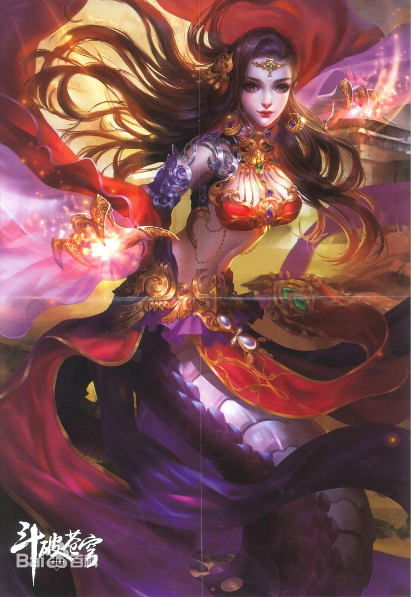

+++
date = '2025-11-03 08:58:35'
title = '美杜莎'
description = ""
tags = ['样例标签']
categories = ['样例分类']
showAuthor = false
authors = ["Gu-v"]
+++

### 资料

| 资料 |        |
| ---- | ------ |
| 姓名 | 美杜莎 |
| 别称 | 彩鳞   |
| 性别 | 女     |

### 简介

美杜莎，又名彩鳞，天蚕土豆所著异世大陆类玄幻小说《斗破苍穹》及其衍生作品中的女主角之一，《武动乾坤》《大主宰》当中客串出场。原为加玛帝国塔戈尔大沙漠蛇人部落女王，在天焚练气塔底部时受到“陨落心炎”的煅烧而与七彩吞天蟒的灵魂融为一体，虚弱之际因萧炎吞噬“陨落心炎”的后遗症发作而失身于萧炎。事后虽然暴怒追杀萧炎，但却因七彩吞天蟒灵魂的影响而迟迟下不了杀手。
后来萧炎与她达成交易让她留在自己身边，并给她改名彩鳞。最后两人日久生情，对萧炎确定心意后便死心塌地，在萧炎与其家人面前显露出女人的一面，后生有一女，名为萧潇。

### 身份背景

加玛帝国塔戈尔大沙漠蛇人部落的美杜莎女王，艳名与凶名名闻斗气大陆，凭借斗皇巅峰的修为震慑周边各国。停留在斗皇级别多年的她，为了成为斗宗，扩张蛇人族的势力，带领血脉阴寒的族人寻找一片合适的居住地，从塔戈尔沙漠地下取来了青莲地心火，使用古法尝试进化。

### 相貌衣着

美杜莎的容颜美丽得几乎到达了妖艳级别，一对狭长的淡紫眸子，眼波流转间，魅惑天成，几乎能将每一个男人的视线给吸扯而过。她身着一件雍容的紫色锦袍，锦袍之下的娇躯，丰满玲珑，犹如那成熟的蜜桃一般，渗透出淡淡的妩媚，一头三千青丝，随意的从香肩披散而下，垂直那纤细地柳腰之间，而在那锦袍之下，露出一截紫色的蛇尾，蛇尾微微摆动，一股野性的妖娆吸引，让得人莫名其妙地浑身有些滚烫。
一位娇躯修长的女子，一身彩裙勾勒着惊人动魄般的曲线，妖娆至极。她的容颜也是极为的妖媚，凤目中眼波流转，妩媚横生，而其声音，也是带着丝丝娇酥，堪称是绝世尤物.

### 性格特点

美杜莎很重视族群，为了给族群夺得一片更好的地盘，甘愿用与自身属性相冲的异火来进行危险性极大的进化。性格高傲，但不会为了没有结果的事情较劲。美杜莎心狠手辣，用杀戮来震慑周边各国。她不是喜欢费唇舌之人，所以常常用别人的命来做威胁，以此达到自己的目的。美杜莎虽然冷漠无情，可却傲气十足，答应下来的事情就不会反悔，且完成的令人无可挑剔。不过若是交易期间有让她不舒服的地方，她会在交易完成后将交易者干掉.
自从生了小萧潇之后，美杜莎的性子变得柔顺许多，对于萧炎的任何要求，她都选择的听从，但在美杜莎的骨子深处，那个曾经冷傲的美杜莎女王其实依旧存在着。

### 九彩吞天蟒

蛇人族在出身之后的不久，就会被用秘法，将一条蛇形魔兽的灵魂灌注进入身体之中，随着年龄以及实力的增长。这种作为伴生灵魂的蛇形魔兽，也会逐渐的与她们相融合，最后不分彼此。融合了蛇形灵魂之后，她们便能召唤出类似现在的这种本体，那时候，实力将会暴涨很多，这也是蛇人的最后底牌
美杜莎的伴生灵魂，是种六阶魔兽紫幽炎蛇。这种紫幽炎蛇，体内流淌着一抹远古异兽的血脉，如果机缘足够，它能够激内的那丝淡薄血脉，从而进化成为它们的远古祖宗。而美杜莎在使用美杜莎女王的秘法进化后，成为了能与斗圣强者相抗衡的远古异兽七彩吞天蟒。
数十年后，在九幽黄泉之底，美杜莎得到了七彩吞天蟒一族的传承，借助空间空间交易会上淘到了一枚九彩原石进化为足可匹敌远古天蛇王的九彩吞天蟒。

### 人际关系

萧炎
美杜莎的丈夫，为了夺取异火潜入美杜莎神殿，遇到了进化后沉睡的美杜莎，此后将她带在身边。之后的相处中，美杜莎渐渐爱上了萧炎。
萧潇
美杜莎的女儿，因为七彩吞天蟒的灵魂借助萧潇的身体再度重生，作为回报，萧潇可以借用吞天蟒的力量，所以萧潇一出生便是斗宗。美杜莎很疼爱萧潇，愿意为她成为贤妻良母。
萧薰儿
美杜莎的姐妹，萧炎的妻子之一。美杜莎早在加玛帝国时，便听萧鼎说起过。明白其在萧炎心中的分量，以及知道若非岩浆内的失身，她不会成为萧炎的妻子，所以美杜莎初次见到薰儿时有点尴尬。
花蛇儿
美杜莎蛇卫队长，对美杜莎很是忠诚。
海波东
美杜莎的敌人，前加玛帝国十大强者之一，十几年前被美杜莎封印实力，就此沉寂。就算恢复了实力，海波东依旧对美杜莎畏之如蛇蝎。
小医仙
因为毒宗让蛇人族损失惨重，美杜莎对小医仙有着不小的芥蒂，就算是有着萧炎的担保，美杜莎还是不信任小医仙。这一芥蒂在隔了五六年后化为乌有，美杜莎愿意将女儿托付给小医仙。

### 角色经历

早年经历
美杜莎刚成为族长时，和出云帝国万蝎门的蝎毕岩交过一次手。早年间海波东来到了塔戈尔大沙漠，被美杜莎用蛇之封印咒封印了他的实力。
加玛帝国曾经想要出兵围剿蛇人部落，请动了三名斗王强者，被美杜莎杀得重伤而回。美杜莎曾经在蛇人族与加玛帝国的战争中将三名斗灵轰成了漫天肉酱；和八翼黑蛇皇白牙的比试中将它打成重伤。
萧炎首次到达石漠城的半年前，为了用异火进化晋阶斗宗，美杜莎去到石漠城东部偏南的地带取走了青莲地心火。

异火进化
得知美杜莎拿到异火的古河，召集了斗皇云韵和两位斗王前来夺取。准备进化的美杜莎分出一具拥有许些意念的能量体前去拖延时间，却被云韵戳破。趁着古河一行被蛇人部落拖住，美杜莎直接开始进化。虽然进化成功，但因为进化时出了问题，美杜莎的灵魂陷入沉睡，本体诞生的新灵魂被萧炎以伴生紫晶源收服。
因为萧炎注入的地火莲子能量，美杜莎短暂苏醒，给萧炎发出死亡宣告后再次沉睡。炼药师大会前夕，美杜莎再次苏醒，告诉萧炎如果他能夺得炼药师大会冠军，获得能融合灵魂的六品丹药融灵丹药方，她就不杀他。
在云山强留萧炎时出现，七彩吞天蟒的灵魂为了救出萧炎，主动放松对美杜莎的压制。最终，忌惮美杜莎的云山妥协，放萧炎离开。事后美杜莎和萧炎进行交易，用一年的保护换取六品丹药融灵丹。回到萧家的萧炎惊闻噩耗，萧家遭到神秘强者袭击，父亲萧战失踪。美杜莎感知下发现袭击者是云岚宗大长老云棱，愤怒的萧炎再上云岚宗，强势击杀云棱。被激怒的云山不顾美杜莎的阻止，坚决要杀死萧炎，所幸药尘及时复苏，帮助萧炎逃出了云岚宗，美杜莎随之沉睡，身体交由七彩吞天蟒掌管。

不幸失身
萧炎进入迦南学院期间，美杜莎开始反向压制七彩吞天蟒。在萧炎让吞天蟒与雪魔天猿战斗时，美杜莎暂时压制了消耗不少力量的吞天蟒，和药尘达成放弃对萧炎的杀意，一年后得到融灵丹的约定。
在萧炎被陨落心炎吞噬，被陨落心炎和岩浆包围时，美杜莎战胜了吞天蟒的意志。然而未能彻底占据躯体的两个灵魂，在陨落心炎的倾力炼化之下陷入剧烈的痛苦之中。不过时来运转，美杜莎和吞天蟒的灵魂在陨落心炎的炙烤中缓慢融合。另一边萧炎在心火炙烤下晋阶斗王，炼化了陨落心炎。然而在其将两朵异火融合之后，收纳异火的“纳灵”中蔓延出一股邪火，不巧美杜莎刚刚完成灵魂融合，虚弱无力的她被萧炎强行发生了性关系。而融合了吞天蟒灵魂的她也受到了影响，虽然是美杜莎作主导，可其中依然或多或少的会有着吞天蟒的一些情绪掺杂，美杜莎对萧炎充满杀意，而吞天蟒，却是对萧炎颇为依恋，两相融合，便是导致了如今美杜莎对萧炎那种极为复杂的情绪。原本按照正常情况，美杜莎已经融合了吞天蟒的灵魂，既然实力已经恢复，那么她便是应该离开这里，回到塔戈尔大沙漠的蛇人族，却因吞天蟒对萧炎的眷恋在暗中影响，总是在萧炎周身。
为了消除吞天蟒的影响，美杜莎用一年的保护换取能医治受其他灵魂影响症状的复魂丹，得到了萧炎取的新名字“彩鳞”。之后多次帮助萧炎，让他成功在黑角域站稳跟脚。

坐镇炎盟
陪伴萧炎返回加玛帝国，途中因为紫妍那对天地灵物的特殊感应，待她很好，紫妍投桃报李，帮助美杜莎找到许多炼制复魂丹所需的药材。虽然美杜莎口口声声说没能杀了萧炎是因为吞天蟒的灵魂影响，但实际上还有她对夺了自己身子萧炎有好感的因素。决战之日从魂殿鹜护法手中救下了萧炎，逼退了鹜护法，却还是未能阻止药尘被抓。
事后不舍得杀萧炎的美杜莎将复魂丹的材料喂给紫妍，在萧炎成立炎盟时替他压阵。跟随萧炎前往魔兽山脉，帮助紫妍搜刮魔兽山脉的药材，让紫妍得以凝聚足够的能量进阶。萧炎闭关突破斗皇时为其护法，期间收到蛇人族的秘法呼唤，美杜莎在布置了双重空间封锁保护小山谷后回援蛇人族，打退了入侵蛇人族的毒宗，帮助海波东三人打退毒宗宗主天毒女。对战落雁帝国与慕兰帝国的落雁天与慕兰三老时落入下风，为萧炎所救。之后萧炎劝服了曾为小医仙的天毒女，结束了战争。
随着时间的推移，虽说吞天蟒灵魂的影响的效果越来越弱，但相处得多了，美杜莎心中对萧炎的抗拒与杀心，也是逐渐的减弱了许多，到得如今，她已经放弃了这个念头。因为蛇人族的四大长老通过秘法发现美杜莎不再是处子之身，要求美杜莎带回拿了她身子的男人，所以美杜莎将萧炎带来。四大长老通过秘法感知到美杜莎已经怀孕，希望萧炎炼制用于美杜莎婴儿的滋养的中等秘法六品丹药“蛇髓蜕骨丹”，而考虑到这是萧家血脉的萧炎选择炼制上等秘法的七品丹药“天魂融血丹”，承诺两年内送来天魂融血丹。
之后联合萧炎暗杀养伤的落雁天和慕兰三老，毒宗也在之后撤离。随着战乱的平息，加玛帝国边境也是逐渐的平稳而下，对于蛇人族，帝国也是履行了承诺，将靠近魔兽山脉的一片阴凉区域，划分给了蛇人族，在得到了一块繁衍之地后，蛇人族心中对加玛帝国人的那份戒意，也是消减了许多。美杜莎身为族长，在回了加玛帝国之后不久，她便是暂时与萧炎告别，带着众多的蛇人，大举迁移，最后停留在了靠近魔兽山脉的那一大片区域，开始建造新的繁衍之地。
收到小医仙的消息的萧炎，找来紫妍和美杜莎前往出云帝国，帮助小医仙对付万蝎门，擒获魂殿铁护法，但萧炎却被蝎毕岩全身毒斗气凝聚在一起射出的“魔毒斑”击中。为了化解魔毒斑，萧炎返回迦南学院，寻找斗尊阶别的内院院长帮忙，拜托美杜莎在此期间守护炎盟和蛇人族。前往中州前，萧炎炼出天魂融血丹，托萧厉转交美杜莎。

九彩吞天
五六年后，经过美杜莎的发展，炎盟成为了西北大陆足以排进前三的强大联盟势力，有着十位斗尊坐镇，美杜莎也为萧炎诞下一女萧潇。
在狮冥宗大军压境时，萧炎带着三十位斗尊赶到，杀死了狮冥宗宗主狮天和魂殿的九天尊，重创魂殿四天尊，平定了战乱。事后萧炎当众炼制八品五色丹雷的一始丹，并借此一举扫灭炎盟丹堂的骄狂份子。并在萧鼎与萧厉的主持下，和美杜莎进行了一个萧家的简单婚礼，全了彩鳞多年的付出。萧炎返回星陨阁时，美杜莎带着女儿一同跟随。
菩提古树出世后，萧炎、美杜莎、小医仙和青鳞一同前往，第一次见到了萧薰儿。事后萧炎闭关突破斗圣，美杜莎的修为在药尘的丹药攻势下，从五星斗尊，提升到了斗尊巅峰。在魂殿和冥河盟大举进攻星陨阁时，和小医仙、青鳞联手拦下初级半圣修为的魂殿三天尊，被打成重伤。而萧炎也终于出关，杀死了魂殿三天尊和天冥老妖，并带队攻破冥河盟总部，覆灭冰河谷和风雷阁。
天府联盟组建后，为了夺得九月后出世的净莲妖火，萧炎带着美杜莎前往九幽地冥蟒族的九幽黄泉，帮助九幽地冥蟒族前族长妖瞑拨乱反正。事后美杜莎服下九品宝丹菩提大还丹和黄泉妖圣精血，在九幽黄泉的尽头，美杜莎发现了七彩吞天蟒一族的巢穴，得到传承的她修为突破至四星斗圣。
萧炎救回萧战后，美杜莎和薰儿一起拜见了他。古帝洞府大战开始前，萧炎向薰儿和美杜莎承诺，大战结束后，三人举办一个盛大的婚礼。双帝之战后，萧炎履行承诺，举行了一场斗气大陆万民见证的盛大婚礼。数十年后，晋入斗帝的美杜莎、薰儿、古元、烛坤四人与萧炎一同前往大千世界。

大千世界
穿越位面通道时，萧炎五人遭遇了位面乱流，不幸分开。之后分散的四人被萧炎逐一找到，于极北之域建立了无尽火域。身边的一条七彩吞天蟒，曾经硬生生吞掉一位上位地至尊。抗击域外邪族的最终决战上，薰儿和美杜莎镇守无尽火域总部以及前敌指挥总部。天邪神陨落一年后，萧炎带着薰儿和美杜莎参加牧尘和洛璃的婚礼。

### 角色评价

旁白
对于这种女人，唯有用妖艳两个字来形容，然而在那抹妖艳之下，却偏偏又噙着一抹女皇般的高贵与雍容。

加玛帝国人
那个冷艳而心狠手辣的美丽女人，在以往与玛帝国的战争中，不知道亲手斩杀了多少成名强者，在这个帝国之中，也只有那寥寥可数的几人，有着实力能够与这个妖艳女人相抗衡。这个女人，用自己丝毫不逊色于那些铁血帝王的狠辣手段，震慑着塔戈尔大沙漠附近的几个帝国，不敢轻易动战争。

古河
“这个女人，杀起人来可不比杀只鸡麻烦多少啊。”

萧炎
“按照那女人的狠辣程度看，掌控了身体，第一个就是拿我祭刀…”

药尘
“嗯，突破了斗皇界限的美杜莎女王，日后的确潜力无限。”
