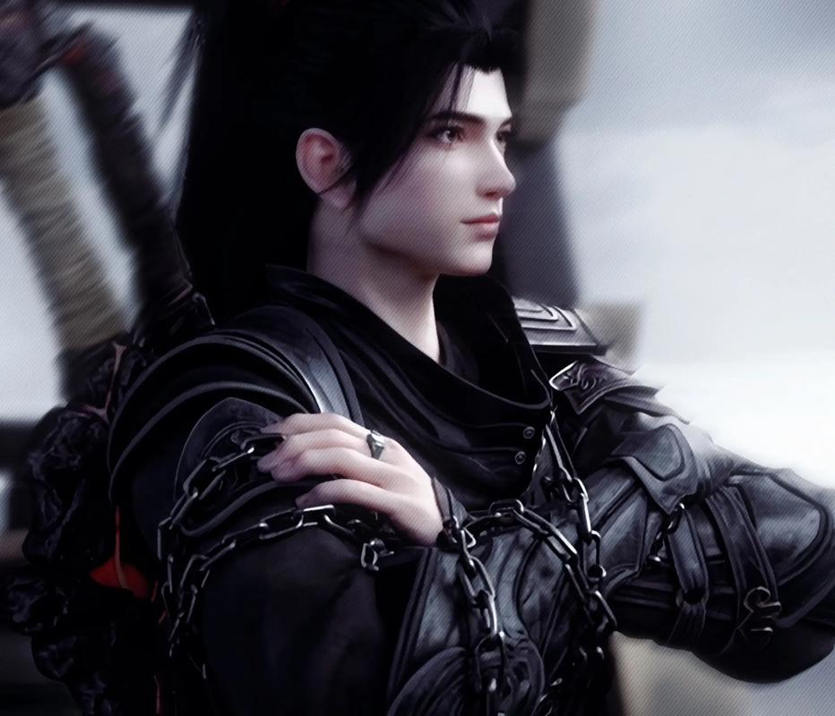

+++
date = '2025-11-02 08:58:35'
title = '萧炎'
description = ""
tags = ['样例标签']
categories = ['样例分类']
showAuthor = false
authors = ["Gu-v"]
+++

### 资料

| 资料 |      |
| ---- | ---- |
| 姓名 | 萧炎 |
| 别称 | 炎帝 |
| 性别 | 男   |

### 简介

萧炎，天蚕土豆所著异世大陆类玄幻小说《斗破苍穹》及其衍生作品中的男主角，在《武动乾坤》《斗破苍穹前传之药老传奇》《大主宰》《苍穹榜之圣灵纪》《苍穹榜之万兽归源》中客串出场。
资质卓绝，四岁练气，十岁拥有九段斗之气，十一岁成功凝聚斗之气旋，一跃成为家族百年之内最年轻的斗者。却又连续三年功力倒退保持在斗之气三段，从此逐渐沦为遭人白眼的废柴。十五岁被指腹为婚的纳兰嫣然当众退婚，立下了三年之约。在吸收他斗气的灵魂药尘的教导下，萧炎凭借执着与信念闯荡大陆，不断取得辉煌的战绩。
近不惑之年晋升斗帝，自号“炎帝”，双帝之战中击败魂天帝，封印他千载万世，拯救天下苍生。炎帝之名响彻斗气大陆。后为寻找斗帝失踪之谜前往大千世界，在大千世界创立“无尽火域”，短短数百年就成为与武境、剑域、万墓之地齐名的大千世界超级巨擘。
天邪神陨落二十八年后在苍穹榜上留下完整真名，晋入主宰境，与武祖林动、牧尊牧尘一起成为大千世界的守护者，无尽火域也一跃成为大千世界最强三大势力之一，与武境、牧府齐名

### 背景

资质卓绝，十一岁成为斗者却又连续三年功力倒退保持在斗之气三段。三年的废物生涯让萧炎的心性有了极大的成长，而导致萧炎斗气消失的元凶药尘也随之出现，收下萧炎为弟子。在药尘的培养下，天赋重展的萧炎实力突飞猛进，成为了加玛帝国年轻一辈的最强者。凭借他执着与信念闯荡大陆，不断取得辉煌的战绩，成长速度异常惊人，稳步向着大陆巅峰强者迈进。

### 相貌衣着

萧炎相貌清秀，脸上带着懒散的笑容，漆黑色的双眸中有着绚丽的光泽涌动，看上去显得异常的温和以及深邃。在其额头处，有着一道火焰印记，呈现诸多绚丽之色。身着黑衣，身躯修长，气质洒脱，斜背负着一把黑色大尺。在其身体表面，燃烧着绚丽的火焰，远远看去，犹如是一尊掌控火焰的炎神，充满着莫名的威压。

### 性格特点

经历了三年废柴生活的萧炎有着远超常人的隐力和心智，表现出来的成熟与淡然，总是会让人不自主的将他的年龄省略过去。年轻人所具备的张狂与狂妄，似乎与这个少年老成的家伙完全不相关一般。但这成熟也是会在需要时加以掩饰，萧炎会根据面对的情况的不同来展露合适的表现。萧炎平日里看上去有着远超同龄人的成熟，可在某些事上，他可是比三岁顽童还要顽固，想要得到的东西，打死也不会松手.
三年所受的嘲讽，让萧炎清楚知道实力的重要性，因此萧炎能够忍受枯燥的清修。心境沉稳，大庭广众下失败了，面对众人的调笑也能很快调整好心态。与人交手，从来不会因为失败而变得颓废，越是强大的对手，越是能够激起他的好胜之心。性格异常谨慎，不会为了在美人面前逞英雄便要将自己置身险地。小医仙评价其为连魔兽山脉的魔兽都没有他小心。脸皮很厚，他人的吐槽也能视作夸赞，这点他自己也很清楚。
萧炎看似性子平和淡然，内里却极其喜欢刺激的冒险。多年的闯荡让萧炎的性格如磐石般沉稳，面对着任何的挑战，他都是能够将自己调整到最完美的状态。重情义，不是忘恩负义之人。平常待人温和，可骨子中却都是隐含着一股有些让人心寒的狠劲，对招惹到自己的人必定会赶尽杀绝。当年的萧炎，能够为了纳兰嫣然的一番退婚之辱，而放弃家族中的舒适生活，咬紧牙关，在山林中与魔兽搏杀，在沙漠中忍受孤独与寂默，苦修三年，他对自己尚能够如此狠心，更遑论是对上敌人。

### 角色能力

斗气大陆
斗帝（斗气）
改变自身的血脉，令自己的后人得益，能以一人之力振兴整个种族，纳天地入体，形成巨大的斗帝之身，威能可破苍穹。
帝品炼药大宗师
炼出的丹药拥有媲美人类的灵智和斗帝的实力。丹药内含位面源气，可助人成为斗帝。
帝境灵魂
由萧炎先祖萧玄灵魂自燃抽取天墓之魂灵魂本源，交予萧炎而达到。

大千世界
主宰境（灵力）
牧尘斩杀天邪神后，萧炎修炼二十八载，与林动同时于世界意志苍穹榜上留下完整真名，晋升主宰境。能调动整个大千世界天地灵力。
凭借炼丹术使无尽火域成为大千世界三大最顶尖的炼丹圣地之一。

### 血脉

萧族血脉、古族血脉和龙凰血脉三种血脉融合而成的独特血脉。因为后两者的血脉不多，新生的血脉之力暂时只能作为种子，等培养到足以流通萧炎全身所有血管时，才能真正的大成。萧炎晋升斗帝后再次升华。
族纹为萧族九笔族纹 （紫红色），晋升斗帝后化为帝炎印记

### 武器

玄重尺
药尘所赠，被萧炎取名为玄重尺。为焰陨玄铁所铸，极为坚硬，沉重无比，具有压制斗气的神奇效果。
万兽鼎
是天鼎榜上的药鼎，具体排名未知，从韩枫手中夺得。
天妖傀
萧炎用地魔老鬼的躯体，铁护法的灵魂和一枚七阶火属性魔核在琉璃莲心火的煅烧下炼制出的地级天妖傀，能与五星斗宗抗衡，但无法使用斗技和功法。在丹会上吸收五色丹雷后进化为天妖傀，经过三千焱炎火火的淬炼后，通体化为暗金色，实力在三星斗尊，经过雷池强化后达到六星斗尊。在斗圣遗迹中又收服十具地妖傀，后经过雷池全部强化成天妖傀，通过独特的阵法以第一个天妖傀为中心吸收其余十个天妖傀的力量，强化为紫色天妖傀实力媲美九星斗尊。
火雷子
萧炎根据药尘所留的卷轴，将三千焱炎火吸收了无数年的星辰之力所化的紫黑火海凝聚而成。即便是斗尊强者，若是措不及防下，都是会炸得狼狈不堪。萧炎总共凝聚了十八颗。
远古虫皇衣
一种特殊的防御斗技，萧玄用萧炎在天墓得到了远古噬虫的虫后炼制而成，能够化为盔甲状的模样覆盖在人的身体上，足以承受半圣强者的攻击而不毁。
北王
以北龙王肉体和灵魂为主再融合西南两大龙王的躯体炼制而成的斗圣级天妖傀，拥有一定智慧和北龙王曾经的战斗经验。经过黑魔雷淬炼后，实力达到六星斗圣。
异火广场
陀舍古帝所留，内含斗气大陆二十二种异火的本源，萧炎借此凝聚异火恒古尺。现为魂天帝封印之处。

### 功法

焚诀
斗破苍穹：萧炎修炼的焚诀可以融合多少种异火？又是谁所创造的？
它是药尘在光影空间得到的无名功法，药尘为其起名为“焚诀”。最初的焚诀只是黄阶低级功法，但是能依靠吞噬异火来进阶。
最初焚诀只是黄阶低级功法，萧炎在吞噬紫晶翼狮王的紫火后进化为黄阶中级，吞噬青莲地心火后进化至玄阶中级，吞噬陨落心炎后进化至地阶低级，吞噬三千焱炎火后进化至地阶高级，吞噬骨灵冷火后进化至准天阶，吞噬海心焰后进化至天阶低级，吞噬净莲妖火后进化至准天阶高级。万火凝为帝炎后再次进化，等阶未知。

### 斗技

玄阶
吸掌
玄阶低级，古老铁片所得，练至大成，可吸千斤巨石，若是遇敌，狂猛吸力，能将人体血液，强行吸出。
吹火掌
玄阶低级，药尘所赠，可造出强大风压。
八极崩
玄阶高级，药尘所赠，近身攻击斗技，以攻击力强横著称，练至大成，攻击暗含八重劲气，八重叠加，威力堪比地阶低级斗技。
鹰之翼
玄阶中级，飞行斗技，又称紫云翼。魔兽山脉山洞探宝中获得，由五阶魔兽黑焰紫云雕双翼和灵魂所制成。虽然速度不如斗气化翼，但它却能和斗气化翼叠加，爆发出更快的速度。萧炎融合天雁九行翼后被撵出体内。
爆步
玄阶中级，云韵所赠，依靠着能量爆炸的冲力而加快速度的身法斗技。
狮虎碎金吟
玄阶高级，在迦南学院得到，声波斗技，狮虎齐啸，万兽臣服，有碎金震魂之大威能。

地阶
焰分噬浪尺
地阶低级，药尘所赠，炼至大成，劈山断浪，举手投足。需搭配玄重尺才能发挥全部威力。
三千雷动
萧炎在黑角域中获得的地阶低级身法斗技，虽位列地阶低级，但论速度能与地阶中级的身法斗技相媲美，是风雷阁高级身法斗技。分为三层：雷闪 → 雷瞬 → 三千雷。
帝印决
地阶高级，为古族秘传，共五式，开山印，翻海印，覆地印，湮天印，古帝印，印印相通，五印大成，有翻江倒海，吞天噬地之能，五印叠加威力直逼天阶斗技。但每次修炼下一层需晋阶一层，也就是说，修炼古帝印，至少需晋阶至斗圣。
六合游身尺
地阶中级，攻守合一，进可攻，退可守，乃是几百年之前横行大陆的六合尊者所创。尺法分三重境界，裂火，游身火，六合火，修炼时可寻一处岩浆湖泊，荡起浆浪，穿梭其中，若是能在其中不依靠斗气而来去自如，不沾丝毫浆液，便可算是登堂入室，若勤奋足够，假以时日，达至大成，攻守一体，同等级之下，无人可近其身。
五轮离火法
控火法诀，功分五重，按兽形而辨，狼，豹，狮，虎，蛟，每一重分有各自火灵，法诀大成，五兽齐聚，可成五轮离火阵，有蒸海焚天之莫大威能，若五兽中有其四为异火所凝，法诀威力堪比天阶斗技。
三千雷幻身
地阶高级，风雷阁镇阁之宝。据悉乃是由远古流传而下的斗技，此法修成，能凝雷幻身，雷幻身实力与本体相仿，本体不死。幻身则不灭，此种效，外人以四字形容，堪比天阶！三千雷幻身固然可怕，但修炼却是异常困难，条件之一便是得先将三千雷动修炼至最高境界。分身由灵魂所凝，有着三个等级之分：入门、登堂、大成，具备实力分别为本体三分之一、三分之二和全部。
天冥修罗手
地阶高级，天冥宗镇宗绝学。需要一种义无反顾的杀伐，生于一念之中。
大地罡炎
地阶高级斗技。以一种奇异的振动，将自身斗气传入大地，创造极度炽热的劲气浆流，出其不意自对手立脚大地之处喷射而出，无声无息间给人以致命攻击此斗技对于地形有所要求，而是靠近火山地带，威力将会大幅度增强。

天阶
大天造化掌
天阶低级斗技，造化圣者融合百家武学所创，此掌法，讲究造化之意，以掌破天，以力碎万物。威力巨大。手掌需要被金灵涎淬炼方能使出，否则必遭反噬。
金刚琉璃身
天阶低级斗技，琉璃圣者所创，以身化金刚琉璃，无锋能破，无坚不摧，此技炼至大成，化金刚琉璃身，九丈九尺，乃为极致，金光耀世，拳可崩天，脚可裂地。
黄泉指
天阶低级斗技，由九幽地冥蟒族之中的黄泉石碑中获得。
黄泉掌
天阶中级斗技，由九幽地冥蟒族之中的黄泉石碑中获得。
黄泉天怒
天阶高级声波斗技，萧炎由九幽地冥蟒族黄泉石碑中接下黄泉妖圣残魂的灵魂攻击而获得，黄泉妖圣当年闻名之技，与黄泉指和黄泉掌有“黄泉指，断生死，黄泉怒，碎人魂”之说。

未知
炎之帝身
萧炎的斗帝之身，纳岩浆入体，身躯膨胀至万丈，火焰自毛孔而出，化为一条条火龙盘旋在其周身。
炎玄爆
火焰风暴席卷而开。
异火恒古尺
萧炎跨入斗帝后使用的斗技，由二十二种异火凝聚而成，存在于远古之中的神秘之物，就算是远古强者都极少有人能得见。

自创
佛怒火莲
萧炎自创斗技，通过多种火焰相融产生强大的破坏力，火莲威力随融合火焰种类多少和威力强弱变化，潜力无限，为萧炎最后底牌（融合多种火焰之后改名为“毁灭火莲”）。
无名尺法
尺法斗技，萧炎在林海中领悟，能够使得攻击仿若浪潮一般，滔滔不绝，如同风吹林海。
佛怒轮回
萧炎在晋级斗圣时所领悟。通过多种异火相融化为边缘呈四色的奇异圆环，圆环中有着轮回之力，无论是斗气还是灵魂被吸入火盘，都会在顷刻间灰飞湮灭。

特殊
天雁九行翼
得自金雁宗，一种飞行斗技的制作方法。萧炎用从黑皇城拍卖会得到的七阶魔兽天妖凰干尸的双翼炼制而成。
真·弄焰决
地魔老鬼改进后的弄焰决，从原来需要三人修炼才能凝练出“假异火”，变为一人就能凝练，且“假异火”威力远超前者，后遗症也是大为削弱。
龙凰古甲
太虚古龙一族的防御技能，龙鳞衣的最高等级，普天之下防御力最强悍的护甲之一。

### 神通

佛怒帝炎莲
萧炎自创的绝世神通，以帝炎笼罩身躯，燃烧身后的灵力海洋，自海洋深处升起一朵万丈火莲，其上跳跃着诸多颜色，每一道颜色，都是代表着一种异火。这种恐怖杀招足以毁灭一座大陆。
帝炎缚魔绳
萧炎自创的绝世神通，帝炎化为了一条绚丽的炎绳，有着极为强大的束缚之力，一旦被缠上，就算是超越圣品也会吃尽苦头。
炎神
萧炎自创的绝世神通，是其苦修多年之术。将帝炎尽数纳回体内，以自身为炉，以数十异火化作火纹，凝结成绚丽的莲花，莲花绽放时，从中孕育出的一道三尺火影，盘坐于莲花中。火影头戴帝冠，身披火炮，面目与萧炎如出一辙。火影诞生时，整个大千世界的温度都开始升高。

### 魂技

太一魂决
传自远古的修炼之法，可锻炼灵魂力量。在萧炎获得丹会冠军的奖励。
无名口诀
“魂之极，闭守天灵，纳灵锻魂”，得自远古铜片，因为残缺，只可以使灵魂捕捉到灵气，无法自动吸收，帮助萧炎成为八品炼药师。

攻击
魂手印
玄阶高级魂技，又称魂印。与曹颖对战中，曹颖所使用的变换手印发出的魂技，总三印，萧炎凭记忆所得第一印魂玄印掌，丹塔会长玄空子赠魂印卷轴习得全部，能将灵魂力量的威力扩大化。

### 秘法

天火三玄变
萧玄所创，萧炎在地摊上淘到第一变，后自焚炎谷得到其余二变。修炼这秘法需要火属性与一种奇异火焰两个条件，依靠某种玄奥的方式诱导出体内的火焰，爆发出极强的力量，短时间内提升自己的实力。隐藏作用为勾画出萧族的族纹。

升灵
继承药尘之技，八品炼药师方能使用，可提升丹药灵气，对灵魂消耗极大。

族纹
发动后效果更甚天火三玄变，远古种族特有秘法。萧族族纹不同于其他远古种族直接赐予，而是依靠自身实力修炼出来的特有九笔族纹。

毁灭火体
由于异火之灵小伊的缘故，将异火的能量释放到极致后与肉体相融，使自身相当于一朵移动性的毁灭火莲，举手投足，焚山蒸海。对斗气消耗较大。

### 纳戒

幽海纳戒
高级纳戒，从韩枫手上夺得的战利品。
骨炎戒
药尘所留，内含药尘的毕生所藏。
白色纳戒
曜天火所赠，其灵魂寄宿其中。

### 异火

萧炎以炎帝之名，敕天下万火归位陀舍古帝留下的异火广场，凝聚出异火榜第一的帝炎。复又熔炼大千世界各种异火，堪称万火之帝。掌握天下万火的萧炎，将火炎之道修炼到极致，论玩火，大千世界无人能出其右。

### 人际关系

美杜莎：萧炎的妻子。因为进化时出了问题而陷入沉睡，身体诞生的新灵魂被萧炎拐走，这让美杜莎万分想杀了他。之后为了融合灵魂的融灵丹，暂时留在萧炎身边。在迦南学院地底失身于萧炎，因为融合了吞天蟒的灵魂，受到了它的影响，美杜莎一直对萧炎下不了手，而且还经常跟在他身旁。随着时间的推移，吞天蟒灵魂的影响逐渐减弱，但美杜莎却已爱上了萧炎，放弃杀他的念头。

萧薰儿：萧炎的妻子。萧炎幼时为了实验斗气是否存在，两年间每天晚上偷溜进薰儿的房间温养她的骨骼与经脉。薰儿因此倾心于萧炎，在萧炎沦为废柴的三年里对他不离不弃。而萧炎的心也在不知不觉间被薰儿悄悄占据。

萧潇：萧炎和美杜莎的女儿，因为七彩吞天蟒的灵魂借助萧潇的身体再度重生，作为回报，萧潇可以借用吞天蟒的力量，所以萧潇一出生便是斗宗。为了给予她最完美的修炼条件，萧炎专门为其炼制了用于筑基八品一始丹。萧炎晋入斗帝后，萧潇修为狂飙到八星斗圣。

萧霖：萧炎和萧薰儿的儿子，萧潇的弟弟。大千世界与域外邪族的最终决战结束后，生下一子萧陌。

药尘：萧炎的老师，吸收了萧炎三年的斗气，使他沦为废柴之人。苏醒后一直陪伴萧炎成长，对他付出了无数心血，这么多年的栽培，令得他从一个废物走到了如今这般地步。对于药老，萧炎对他的感情，几欲能与其父亲相比。因为韩枫一事，萧炎很在意他人对药尘眼光的认可，他会因为风尊者如药尘所说重情义感到开心，也会为在知晓其和药尘关系的人面前证明药尘的眼力而渴望胜利。

萧战：萧炎的父亲，自萧炎出生起便是对他百般宠爱，在萧炎落魄后，宠爱不减反增。如此行径，让有着前世记忆的萧炎甘心叫他一声父亲。

萧鼎：萧炎的大哥，加玛帝国石漠城漠铁佣兵团的大团长，萧炎云岚山一战后接收了迁移过来的萧家，魂殿和云岚宗联手围剿萧家时被海波东护下。告诉萧厉萧家谁都能死，但只有萧炎不能死。

萧厉：萧炎的二哥，加玛帝国石漠城漠铁佣兵团的二团长，萧炎云岚山一战后接收了迁移过来的萧家。魂殿和云岚宗联手围剿萧家时被海波东护下，来到黑角域告知萧炎这一情况。在萧炎“死后”，为了报仇吞服“噬生丹”用生命换取力量。

云韵：萧炎的红颜知己，是加玛帝国云岚宗的宗主，萧炎于魔兽山脉试炼时救下的一位斗皇。山洞同居时险些和萧炎行了男女之事，但也因此对萧炎芳心暗许。而萧炎也对云韵山洞中的春光以及赠甲之情，还有之后的数次冒险相救难以忘怀。因为云岚宗被萧炎解散，让云韵对留在萧炎身边有些抗拒。多年后再见，云韵已经放下了芥蒂，双帝之战后答应萧炎的邀请，返回加玛帝国。

小医仙：萧炎的红颜知己，是加玛帝国青山镇万药斋的医师，萧炎护卫万药斋采药时结识。在一同经历狼头佣兵团的针对期间，小医仙对萧炎暗生情愫。或许是因为她那凄惨的身世以及毒体的缘故，萧炎一直都是有种特殊的关护，而这些年后者也是一直陪在他身旁，不管他面临何等的险境，也是不离不弃，在她的心中，早已经将萧炎当做了可以无条件信赖的知己。

雅妃：萧炎的红颜知己，是加玛帝国乌坦城米特尔拍卖场的首席拍卖师，萧炎拍卖丹药时结识。从看中萧炎的潜力到认出他高品炼药师弟子的身份，两人缔结合作关系。之后因为萧炎的缘故，接手管理米特尔总部拍卖场。对萧炎有特殊的感情。

紫妍：萧炎的红颜知己，太虚古龙族的新皇。幼时误服化形草，因为实力不够一直维持在小女孩的模样，为了快快长大不断服用珍稀药材。萧炎遇到她后用将药材炼制成好吃的丹丸的方式交好，视她为妹妹对待。

青鳞:萧炎的贴身侍女，蛇人和人类的混血，遭受两个种族的歧视。因为怜悯青鳞的凄惨身世，萧炎并未将其视为侍女对待，不仅开导她从那怯弱之中走出，而且还给予了她诸多照顾。后来被天蛇府截走，虽然药尘说过那天蛇府定会好好待她，可萧炎心头依然记挂着那个怯怯弱弱的小女孩。

纳兰嫣然:萧炎的前未婚妻，和她立下的三年之约是萧炎前期变强的动力。虽然三年后的萧炎不再恨她，但萧家的脸面却是不得不讨回的。加玛帝国炼药师大会中，化名岩枭的萧炎让嫣然颇为欣赏，是唯一一个让她产生佩服和一点男女间的感情的男人。然而三年之约中暴露的身份让嫣然大受打击，之后发生的事情也给予了嫣然无尽的后悔.

林动:萧炎的好友，与萧炎齐名的大千世界巅峰强者。镇守大千世界极南之域，成为了竖立在大千世界与域外邪族之间的一道屏障。萧炎曾与其切磋，对其颇为推崇。放眼整个大千世界，林动是少数几个能让萧炎真正看重的人。

牧尘:萧炎看好的后辈，将一气化三清的机缘让与牧尘，并赠灯盏以护持他，认为其有和自己并肩的潜力。其后多次相处牧尘，为他警告战皇、托药尘帮助牧尘从浮屠古族带回母亲。

### 势力关系

无尽火域
萧炎创建的势力，位列大千世界三大超级势力之一。无尽火域位于大千世界以南，大陆以北的焚天山脉。焚天山下的地底岩浆深处，有着大千世界排名第二的异火——焚天灵火。焚天山脉有火山近千，不少火山更是处于活跃期，经常伴有猛烈的喷发，暴躁活跃的火灵力摧残着整个大陆。除了吞火族以外没有任何一支族群可以在这里生存下来。经过萧炎的改造，焚天山处于半休眠状态，焚天山脉开始渐渐接纳了人类，甚至对于火属性修炼者来说，这里已经成为了一片修炼的沃土，它是无数火之修炼者心中朝圣的不二之选。
无尽火域南北而立，北方火山休眠，植被茂密，被火山灰覆盖过的土壤异常肥沃，斗气大陆迁移而来的居民们大多躬耕于此，种植火灵果。用火灵果酿造而成的火灵酒更是激荡心肺，热辣香醇。
炎城做为无尽火域最大的城市，在炎帝的指导下，男女老少皆习丹术，家家户户皆备丹炉，火域炼丹术冠绝天下，遥遥领先与其他大陆。炼丹事业的兴盛，使得无尽火域的丹药贸易空前发展。即使在夜里，炎城丹市，丹楼，依然人声鼎沸，汇集了众多求丹者。而与北方完全不同的是，南边的活火山区域，犹似人间炼狱又是修炼圣所。

### 角色经历

废柴少年
萧炎通过灵舟终于快速的穿越位面回到斗气大陆了
萧炎的灵魂来自一个名叫地球的蔚蓝星球，因为未知原因穿越到了斗气大陆，成为西北大陆加玛帝国中乌坦城萧家的三少爷。
因为两世的经验，萧炎的灵魂比常人强上许多，这也造就了他的修炼天赋。四岁练气，十岁拥有九段斗之气，十一岁突破十段斗之气，成功凝聚斗之气旋，一跃成为家族百年之内最年轻的斗者。与青梅竹马萧薰儿一起长大，两小无猜，两人实力皆是家中的绝无仅有的佼佼者。
然而在萧炎十一岁那年，他辛辛苦苦修炼十数载方才凝聚的斗之气旋在一夜之间化为乌有，而且体内的斗之气，也是随着时间的流逝，跌至斗之气三段不得寸进。从天才的神坛，一夜跌落到了连普通人都不如的地步，沉重的打击，让得少年从此失魂落魄，天才之名，被突如其来的变故剥夺而去。
斗破苍穹：萧炎再次被称废物！这可能是他除退婚外最受侮辱的一次
而天才也是逐渐的被不屑与嘲讽所替代。一夜间，沦落成了路人口中嘲笑的废物。整整三年时间，萧炎遍尝人情冷暖，受尽了歧视与嘲讽，但也锻造出了远超常人的隐忍。

三年之约
萧炎十五岁时，指腹为婚的纳兰嫣然携云岚宗之势登门退婚，让萧炎的父亲萧战丢尽了脸面，强势的姿态让萧炎怒而休妻，并立下了三年后云岚山巅比斗的约定。“三十年河东，三十年河西，莫欺少年穷！”
但萧炎自知他的情况，就在他即将绝望之际，他手上的戒指里浮现出一位苍老灵魂体，原来三年里体内斗之气消失的原因是被这个灵魂体吸收了。为了在一年内达到七段斗之气，通过成年仪式，萧炎拜灵魂体药尘为师，跟他学习炼药。此后在药尘的帮助下，萧炎进展迅速，一年时间连连突破，在成年仪式开始前突破七段斗之气，习得玄阶高级斗技《八极崩》。在成人礼时击败挑战者，证实了他天赋归来。之后再次晋级斗者，修炼药尘给予的诡异功法《焚诀》。在药尘的帮助下成为炼药师，两月内搞垮了加列家族。
为了获得功法进化的条件“异火”，萧炎在报名入学迦南学院后，请了一年的假期，前往魔兽山脉试炼。期间结识了小医仙，得到了净莲妖火残图和飞行斗技《鹰之翼，突破六星斗者，成为真正的一品炼药师，习得地阶斗技《焰分噬浪尺》。
因为狼头佣兵团的追杀，萧炎被迫深入魔兽山脉，意外救下被紫晶翼狮王封印修为的斗皇云芝（云岚宗宗主云韵，两人在相处中险些行了男女之事，情愫渐生。之后云韵离去，萧炎突破九星斗者，获得了紫晶翼狮王的紫火；重会小医仙，击杀了狼头佣兵团团长，成功报仇。和小医仙在山谷暂住期间，萧炎发现了小医仙是厄难毒体，炼化紫火进化焚诀至黄阶中级，进阶一星斗师。
至此，魔兽山脉的修行结束，萧炎和小医仙分开，前往塔戈尔大沙漠继续修行。期间在黑岩城炼药师工会考核成为二品炼药师。
来到石漠城，萧炎遇到了被美杜莎女王封印实力的冰皇海波东，用为他炼制解除封印的破厄丹获得青莲地心火的情报和净莲妖火的残图。为了寻找异火，萧炎来到两位哥哥萧鼎和萧厉创立的漠铁佣兵团，遇到了有着碧蛇三花瞳的青鳞。在她的帮助下，萧炎找到了青莲地心火，然而异火却被先到一步的美杜莎女王取走。为了得到异火，萧炎深入塔戈尔大沙漠，趁着同样想抢异火的古河一行与蛇人部落战斗时潜入美杜莎神殿，夺走了异火，收服了进化后灵魂被七彩吞天蟒压制的美杜莎女王。吸收青莲地心火后，萧炎的修为突破斗师四星，焚诀也进化至玄阶中级。
在三年之约的最后两月，萧炎为海波东解除封印，用复灵紫丹聘请他成为护卫；帮助漠铁佣兵团成为漠城最强势力；自创斗技佛怒火莲重创八翼黑蛇皇，但药尘也被迫沉睡。为了让药尘恢复，萧炎前往帝都，易容化名为岩枭帮助纳兰桀去除烙毒，获得恢复灵魂力量的七幻青灵涎。其后夺得炼药师大会冠军，成为炼药师公会的荣誉长老。
使用七幻青灵涎唤醒了药尘失败后，萧炎服用三纹青灵丹晋阶大斗师，赴三年之约登云岚山，击败了纳兰嫣然，三年之约结束。“纳兰嫣然，日后，你与我萧家，再无半分瓜葛，你自由了...恭喜你。”
海波东救援萧炎，拦下云岚宗大军
然而当日和嫣然一起为墨承祝寿葛叶认出了萧炎的身份，恰好云岚宗大长老云棱为了挽回嫣然败北损失的声誉，坚决要留下萧炎，甚至引出了闭关多年的前代宗主云山。幸得海波东、薰儿的护卫凌影和美杜莎的出现，萧炎得以避过此劫。
下山的萧炎收到家族遇袭，萧战失踪的噩耗。因为美杜莎感知到袭击萧家的人是云棱，萧炎不得不在安顿好萧家后再上云岚宗，击杀云棱，为父报仇。在复苏的药尘和米特尔家族的帮助下，萧炎躲过云岚宗的追杀，逃离加玛帝国，来到了黑角域。

迦南学院
在黑角域，萧炎伏击了血宗的少宗主范凌，得到了净莲妖火残图、阴阳玄龙丹和地阶身法斗技《三千雷动》，并得知了药尘沦落至此的原因。之后前往迦南学院，以内院选拔赛第一名进入藏书阁，得到玄阶高级声波斗技《狮虎碎金吟》。其后在火能猎捕赛中反抢老生的火能，击败守关的黑白关煞，获得了火能猎捕赛的胜利。其后被薰儿告知家传玉片名为陀舍古帝玉。
萧炎带队反抢老生火能
为了保护被老生压迫的新生，萧炎建立的名为“磐门”的学园势力，通过炼丹赚取火能，晋入五品炼药师，炼药术上战胜药帮帮主韩闲，打破他们的丹药销售垄断。在后山使用地心淬体乳洗髓炼骨，晋阶斗灵，回院击败白帮帮主白程，登上内院强榜第三十四名。在药材库遇见了强榜第一紫妍，用帮她将食用的药材炼制成好吃的丹丸的方式交好。
地心淬体乳有什么效果，萧炎炼化后成功突破斗灵境界
强榜大赛前，萧炎收到来自萧厉的消息，迁移到漠城的萧家被云岚宗和魂殿之人围剿，仅剩少数族人被米特尔家族护下。为了尽快返回加玛复仇，萧炎摆擂接战，磨练自己，在天焚炼气塔闭关突破至三星斗灵。强榜大赛上接连击败白程和姚盛，战平柳擎，登上强榜第十。
赛后薰儿被古族黑湮军带回族内，天焚炼气塔封印的陨落心炎冲破封印，引来了药尘逆徒韩枫的觊觎。他请来了黑角域的强者帮忙夺取异火，其中恰好有能感知到杀他儿子的凶手的血宗宗主范崂。借助药尘的力量，萧炎击败了范崂，重创韩枫。但陨落心炎却趁机将虚弱的萧炎吞噬，药尘为了给萧炎一丝生机，把仅剩的灵魂力量完全灌注予萧炎，陷入了沉睡。就在萧炎无法坚持时，手中的纳戒在陨落心炎的炼化中碎掉，其内的药材和丹药凝聚成一股斑驳药液和心火打起拉锯战。在不断破坏与修复间，萧炎晋阶斗王。适应了心火炙烤的他抓住并炼化了陨落心炎的本源，将其与青莲地心火融合，晋阶斗王巅峰，炼药术晋入六品，焚诀进化至地阶低级。但融合产生的后遗症却让萧炎失去理智，强行和虚弱的美杜莎发生了关系。
到萧炎和美杜莎联手破解了内院的封印，已经过去了两年。之后萧炎击杀了范崂，联合迦南学院覆灭韩枫组建的“黑盟”，韩枫则在重伤后被美杜莎一脚踢死，灵魂和海心焰被魂殿收走。为了了结与云岚宗的恩怨，萧炎用复魂丹换取美杜莎一年的保护，为其取名彩鳞；帮助萧厉建立黑角域势力“萧门”；炼制修复药液唤醒了药尘。

建立炎盟
二十一岁，萧炎安置好萧门和磐门，带着美杜莎、内院四名斗王和黑角域的三名斗皇、六名斗王，乘坐十头四阶虎鹰兽返回加玛帝国。从云岚宗手中救下米特尔家族，击杀云岚宗的两名斗皇和七名斗王，就任萧家族长，携胜利之势拉拢三大家族、炼药师公会和皇室。另一边，云山为了拉拢帝国唯一的六品炼药师古河，将云韵嫁于他。为了阻止此事，萧炎在婚礼举办之日率兵打上云岚宗，十招内败古河，让其主动放弃婚礼，不掺和两方战斗。之后，萧炎使用三色火莲杀死了云山，但云山的灵魂却被魂殿鹜护法趁机吞噬。药尘被实力大涨的鹜护法抓走，最后关头将骨灵冷火本源和放有他毕生所藏的“骨炎戒”交给了萧炎。悲愤的萧炎本想血洗云岚宗，但在云韵的自刎威胁下，选择让云岚宗一月之内解散，云韵也因此远走中州。为了保护萧家，萧炎整合帝国皇室、三大家族和炼药师公会，成立炎盟，担任炎盟盟主。
前往魔兽山脉小山谷闭关突破斗皇时，萧炎遇到了隐藏身份的小医仙。突破斗皇后，萧炎得知出云帝国携落雁帝国与慕兰帝国进攻加玛帝国的消息，回援黑山要塞，接连击败慕兰三老和落雁天，以帮助天毒女（小医仙）控制厄难毒体的条件换取停战。后随美杜莎面见蛇人族四大长老，得知美杜莎怀孕，承诺两年内炼制用于滋养美杜莎婴儿的七品丹药“天魂融血丹”。
之后萧炎联合美杜莎暗杀落雁天和慕兰三老，解除加玛帝国的危机；邀请古河加入炎盟，主持炼制噬生丹培养斗王死士；帮助小医仙覆灭万蝎门，擒获魂殿铁护法，却被万蝎门老祖蝎毕岩在临死时凝聚全身毒斗气形成“魔毒斑”命中。小医仙用封毒之法将魔毒斑爆发期限延缓到两年，为了在这两年间化解魔毒斑，萧炎返回黑角域寻求斗尊阶别的内院院长和异火的消息。
在黑皇城拍卖会，萧炎获得地阶中级斗技《六合游身尺》和即将突破八阶的魔兽干尸，从干尸身上提取出增强人体力量的血液和一枚七阶魔核，将干尸的双翼炼制成天雁九行翼；从鹰山老人手中夺得菩提化体涎，击杀魔炎谷三大长老，联合小医仙和内院大长老苏千逼退黑皇宗宗主莫天行和复活的韩枫，重回迦南学院。可惜的是，内院院长行踪不明，苏千唯一知道的异火九龙雷罡火却是焚炎谷的传承之物。不过柳暗花明又一村，萧炎以帮助看中他潜力的内院学生欣蓝的家族重新进入丹塔的长老席为条件，得到了三千焱炎火的情报。而后魔炎谷的创始人地魔老鬼被韩枫请来，为了保命，萧炎融合四种火焰凝聚出毁灭火莲将其重创，恐怖的威力引出了迦南学院守护者千百二老。最终地魔老鬼为二人所杀，尸体赠予了萧炎。
在天焚炼气塔底的岩浆世界修习六合游身尺时，萧炎收到从陨落心炎传来的召唤，发现了幼生体的陨落心炎和体内陨落心炎的前主人天火尊者曜天火的灵魂，以帮其修复损伤的灵魂为代价获得幼生体陨落心炎、控火法诀《五轮离火法》和天火伤愈后的一年守护，期间陀舍古帝玉对岩浆世界之底产生了动静。吞噬炼化在岩浆世界击杀的火焰蜥蜴族获得的火珠晋级六星斗皇后，萧炎返回内院，将幼生体的陨落心炎交给苏千，与内院两清。在苏千、小医仙和天火的帮助下，萧炎除名魔炎谷，废掉魂殿轩护法，抓住韩枫的灵魂，拷问出药尘关押的地方。探索魔炎谷宝库时发现《弄焰决·真》和天妖傀的炼制之法。之后用天火给予的“天都火印”暂时压制了厄难毒体的爆发，用地魔老鬼的尸体和铁护法的灵魂炼制出一具地妖傀，炼制出七品天魂融血丹，托萧厉转交美杜莎。

四阁大会
穿越空间虫洞前往中州途中，四人遭遇了空间风暴，萧炎被传送到了中州北域，为韩家车队所救。萧炎投桃报李，在他们被妖蛇夏莽刁难时出手相助。为还车队管理者韩雪的人情和取走其姐韩月发现的地心淬体乳的亏欠，萧炎接下了韩洪两家的赌约，在对敌洪家少主洪辰时暴露了习有三千雷动。面对风雷北阁的长老沈云的威胁，萧炎借助天火的力量越级将其格杀，获得风雷阁镇阁斗技《三千雷幻身》的残卷；破掉其余三大长老率众摆下的九天雷狱阵，凑齐了三千雷幻身，斩杀了参与围剿的洪家老祖洪天啸，解救了被软禁的韩家。前往天目山脉期间遭遇风雷北阁阁主费天的追杀，从他分身的灵魂信息中，得到了开启三千雷幻身的钥匙。
斗破苍穹萧炎遇空间风暴 意外脱险
萧炎斩落风雷阁北阁主的分身，竟意外得到开启三千雷幻身的钥匙
摆脱费天追击的萧炎修炼出三千雷幻身，从七阶苍狼王处得知玉石骨翼真名为天凰翼，源自魔兽界三大族群中的天妖凰族。之后前往天目山脉，救下纳兰嫣然，两人互帮互助，成功通过一系列考验，获得侵泡天山血潭的名额，突破至一星斗宗，炼药师等级晋入七品炼药大师。帮助噬金鼠族最强者金石治疗火毒时，得知古族为斗帝遗族。
萧炎对战七阶苍狼王，无意中成功凝聚出三千雷幻身
狂妄托大的曾修怎么都想不到，萧炎竟然是七品炼药师
萧炎一招便击败准斗宗的王尘，岂料暴露了自己真实身份
期间遇到药尘至交好友风尊者古灵的弟子慕青鸾，得知古灵将会出现在四方阁大会。为了救出被关押在有斗尊守护的中州西域的冥城魂殿分殿的药尘，萧炎必须要得到古灵的帮忙，为此前往风雷阁四大阁主齐聚的四方阁大会。期间为了从黄泉阁王尘手中救下参赛的林焱介入赛场，被迫击败王尘，身份随之暴露。萧炎为了应对坚决要杀他的费天，向古灵展示了药尘的戒指和骨灵冷火本源。得知他是药尘弟子的古灵不惜与风雷阁开战也要护下萧炎，忌惮古灵实力的雷尊者只好退让，选择用弟子凤清儿和萧炎的对决解决恩怨。最终萧炎用火莲击败了凤清儿，但也因为纳戒内的古凰血精让身为天妖凰族族人的凤清儿盯上了他。
事后萧炎交代了药尘的死因和下落，为了救出药尘，古灵返回星陨阁打探魂殿在冥城的势力，暗中联系一些当年与药尘有着交情的人。而萧炎则赶赴中域丹域完成和叶欣蓝的约定。期间修炼弄焰决，凝练出毁灭火莲所需要的化生火火种。来到中域，萧炎帮助柳擎的家族夺得三年空间虫洞管理权，帮助焚炎谷谷主唐震炼成七品高级火菩丹,通过长老院的考验，获得完整的天火三玄变。而拜托柳擎帮忙调查的欣蓝和小医仙也有了消息，欣蓝全名叶欣蓝，丹塔五大家族之末的叶家中人；而小医仙则遭遇丹域诸多势力的搜寻，被冰河谷的强者打伤，就此销声匿迹。

丹会冠军
为了完成和欣蓝的约定，同时保护小医仙，萧炎赶往丹域叶城，强行带走欣蓝，赶往落神涧救下小医仙，杀掉了围剿小医仙的三位冰河谷长老。其后剿杀了落神涧内的七阶天毒蝎龙兽，用它的精血配合新炼制的阴阳命魂丹复活了天火，但因为刚刚得到身体，斗气还未恢复，让冰河谷带队的天蛇长老逃了。实力还不能与冰河谷硬碰的萧炎决定先治好小医仙，用叶家的阳火古坛帮助小医仙控制了厄难毒体，并获得了一枚能源源不断生成阳火的地心珠。在之后大战中，萧炎使用天火三玄变增幅到七星斗宗，击败了天蛇三位长老和与冰河谷合作的鹜护法，小医仙也是突破到了二星斗尊。然而面对冰河谷大长老天霜子、谷主冰河、魂殿青海尊者接二连三的到来，小医仙和天火两人联手也难以保护萧炎，好在薰儿及时赶到，逼退冰河谷、全灭魂殿一干人，抓住青海尊者的灵魂。
知晓魂殿真实实力的薰儿打消了萧炎立刻营救药尘的想法，将帝印决剩余三印和陀舍古帝玉的秘密交给萧炎，萧炎也因此得知了萧家曾经的风光和古界天墓的存在。其后萧炎彻底炼化魔毒斑，修为突破至四星斗宗，单凭体术击败曾带走薰儿并嘲笑他的黑湮军统领翎泉，了结了当年的恩怨，薰儿也因为血脉正在觉醒而离开，临行前与萧炎约定古界再会。
了解了让叶家重回长老席的条件后，萧炎炼药术在叶家举族支持下达到七品中级，以“叶家准女婿”之名顶替叶家前往圣丹城参加考核，通过丹塔考核，获得一枚丹塔认证的七品中级炼药师等级徽章。在圣丹城外域的炼药师交易会中购得炼制复活药尘所需的生骨融血丹的材料和一块远古铜片，通过铜片上的孕灵粉尘获得了能感应灵气的无名口诀，灵魂力达到七品高级的层次。借此萧炎在五大家族考核中夺冠，保住了叶家五大家族的名额。之后萧炎遭到的药尘的师弟慕骨老人的袭击，丹塔为了不让萧炎在丹会期间对透露他信息的玄冥宗动手，将他在考核中偷学的曹颖的魂技完整版和生骨融血丹缺的主材交给他。
丹界考核中获得能够锻魂的地心魂髓，废掉暗中陷害他的玄冥宗少宗主辰闲。因为慕骨老人的追杀重遇紫妍，被丹界万药山脉的八阶远古龙熊熊战救下。萧炎使用熊战的药材调和地心魂髓，晋入灵境灵魂，成为八品炼药宗师。最后的比试中，萧炎炼出了生骨融血丹，使用升灵之法将其品级提升到八品五色丹雷，摘得丹会桂冠，成为丹塔未来巨头候选者之一，得到一卷传自远古的灵魂修炼之法和进入星域降服三千焱炎火的机会。同时，吸收了五色丹雷的地妖傀成功进化至天妖傀。获得了紫妍种下的龙印的萧炎，趁着三千焱炎火被魂殿尊老重伤，激活了三千焱炎火体内的龙印，成功将其降服，修为晋入九星斗宗，焚诀进化至地阶高级。

星陨少主
为了之后的药尘营救战，萧炎炼制能恢复实力的茯苓青丹留住天火。从丹塔处得知药尘如今关押于中州西北地域亡魂山脉的分殿，萧炎召唤古灵前来，两位斗宗（萧炎和紫妍）、五位斗尊（天妖傀、小医仙、天火、古灵和铁剑尊者），一行六人前往营救药尘。虽然魂殿的六位尊老都被拦下，天尊摘星老鬼也和萧炎两败俱伤，但却引出了黑白天尊。最终在铁剑的断后下，众人带着药尘，通过紫妍强行开辟的空间门逃离。
重伤昏迷的萧炎被药尘带回星陨阁，借助三千焱炎火和阴阳玄龙丹，萧炎在一年后伤愈并晋级一星斗尊，成为星陨阁少主兼长老。为了获得能补足药尘这些年被魂殿吸走的本源魂气的奇物魂婴果，萧炎带着小医仙、紫妍和慕青鸾前往兽域最近出世的远古遗迹，撵走了夺走星陨阁先行部队选定的营地的风雷阁。远古遗迹中收服了十具地妖傀，在紫妍的带领下找到了一株魂婴妖树和龙凰本源果，在丹室因为争夺丹兽遇到了青鳞。青鳞入队后，萧炎夺得一卷地阶高级斗技《大地罡炎》，斩杀玄冥宗宗主辰天南，夺得三根记载着天阶斗技的斗圣肋骨和一根右臂骨。事后紫妍被太虚古龙黑擎带回族内完成古龙传承，萧炎则从肋骨中领悟天阶低级斗技《大天造化掌》。
萧炎在药尘补足魂气后，用五色丹雷的八品生骨融血丹、天妖凰的精血、古灵提供的四星斗尊骨骸和一根斗圣右臂骨复活了药尘。因为材料品阶极高的缘故，药尘成功晋入半圣，杀了魂殿来犯斗尊的七成，逼退了八天尊和九天尊，摘星老鬼则为萧炎所杀。战后药尘抹除了骨灵冷火的灵魂印记，将它交给了萧炎。不久纳兰嫣然找上门来，告诉了云韵目前面临的危局，于是萧炎赶往花宗，帮助云韵夺回了花玉钦定的宗主之位，代表星陨阁和花宗结盟。事后萧炎炼化了骨灵冷火，修为晋入四星斗尊巅峰，焚诀进化至准天阶。
花宗外，萧炎和青鳞遭遇天冥宗四位六星斗尊和魂殿九天尊的围攻，被太虚古龙族的黑擎解围。之后跟随黑擎前往东龙岛，得知了身为太虚古龙正统王族的紫妍的现状和太虚古龙一族的分裂，见到了被东龙岛三长老烛离救下的铁剑尊者。萧炎使用异火炼化龙凰本源果实体化能量，将其逼入紫妍体内，让紫妍王族血脉大成，进化为龙凰。紫妍将一丝龙凰之力注入萧炎体内，并激活了萧炎炼化龙凰晶层时服下的古龙血精，让萧炎得到了八阶魔兽的肉体强度和古龙一族的最高等级防御技能龙凰古甲。在黑擎的带领下，萧炎来到了虚空雷池，用这里的雷霆之力修复被天冥宗长老损坏的天妖傀，将十具地妖傀全部进化至天妖傀，萧炎也在修炼中晋入五星斗尊。

天墓传承
返回星陨阁后，萧炎得知星陨阁收到了古族成年礼的邀请玉贴，因为药尘要坐镇星陨阁，萧炎和完全掌握了厄难毒体的小医仙代表星陨阁前往古界。其后接连击败了黑湮军三统领杨皓和修罗都统古妖，获得进入天墓的名额。
在天墓第三层的萧玄墓府，萧家先祖萧玄的残魂用其临死前保留的最后的萧帝血脉为萧炎换血。因为萧炎身上的龙凰血脉冲突，萧玄向薰儿借来了古族的血脉之力，以龙凰血脉作为调和，融合出一股全新的血脉。但由于古族和龙凰的血脉之力不多，新生血脉暂时只能作为种子保存在心脏处。萧炎吸收压缩萧玄在血脉之力中封印的能量后，晋升八星斗尊巅峰。通过萧玄给予的完整天火三玄变，萧炎成功修炼出了族纹，斩杀了曾经袭击自己的魂崖和魂厉。离去之前，萧炎向薰儿坦白了美杜莎的事，取得了早已知晓的薰儿的原谅。

百世轮回
回到星陨阁，萧炎得知了西北地域的狮冥宗在魂殿的支持下发动战争，不断扩张地盘。为了速战速决，药尘炼制了六十枚八品丹药，招揽了二十位斗尊作为帮手，同行的还有星陨阁的十位斗尊长老。三十位斗尊齐上，迅速平定了战乱，萧炎也击杀了曾经的大敌九天尊，重伤了四天尊。在整顿炎盟丹堂后，萧炎和美杜莎在萧鼎与萧厉的主持下进行了一个萧家的简单婚礼，全了美杜莎多年的付出。构建好炎盟与星陨阁之间的虫洞后，萧炎带着美杜莎和女儿萧潇回到星陨阁。
空间交易会上，萧炎为小医仙拍下一卷《天幽毒典》，得到了菩提古树在莽荒古域出世的消息。联手药尘截杀蝎魔三鬼，得到了天阶低级斗技《金刚琉璃身》和净莲妖火最后一张残图。完整的地图经过异火的煅烧，显现出了净莲妖火的出世地点，图中隐藏的净莲妖圣残像掠进了萧炎的眉心。为了在三年后妖火出世前达到斗圣，萧炎前往莽荒古域获取菩提心，期间救下花宗一行，斩杀天冥宗副宗主柳苍和妖花邪君，用天魔血池炼体，晋入九星斗尊。通过帮助菩提古树驱散黑衣斗帝的负面情绪，萧炎得到了菩提三宝，修为达到九转斗尊巅峰。事后萧炎将韩枫的灵魂交给药尘处置，闭关两年炼化菩提心，晋入一星斗圣和天境后期灵魂，炼药术晋入九品宝丹宗师，使用晋入斗圣时领悟的佛怒轮回杀死进攻星陨阁的魂殿三天尊和天冥老妖，带队攻破冥河盟总部，覆灭冰河谷和风雷阁，扶持韩家成为新的中州北域霸主。

天府联盟
为了对抗魂殿，萧炎联盟丹塔、花宗和焚炎谷，建立天府联盟，成为天府的精神领袖。之后萧炎带着美杜莎前往九幽地冥蟒族的九幽黄泉，途中遇到了北龙岛之人，拷问出了三位龙王联合天妖凰族和九幽地冥蟒族对付东龙岛。在九幽黄泉之底发现被囚禁的九幽地冥蟒族前任族长妖暝，他将命交予萧炎，换取救援。帮助妖瞑平定九幽地冥蟒族后，萧炎从黄泉石碑中得到了黄泉妖圣的三大天阶斗技和精血，邀请妖瞑截杀天妖凰族相助三大龙岛的天妖三凰，擒下三凰之二，逼迫天妖凰族退军。之后助紫妍召唤屠龙剑，击败三大龙王。这次重伤让萧炎的血脉种子开始流动，血脉淬炼下，萧炎晋入二星斗圣，肉体强度提升到等同太虚古龙的层次。
回到中州，为了对付魂殿对天府的攻势，药尘和萧炎血洗了魂殿人殿，期间击杀慕骨老人，缴获海心焰，将焚诀提升到天阶低级。吸收人殿提炼的灵魂本源后，萧炎晋入天境大圆满灵。妖火降世之日，各方势力云集，萧炎救下了变成火奴的萧家先祖萧晨，依靠净莲妖圣的残像，妖火的灵智被抹除，在与薰儿人道之间炼化了妖火，薰儿炼化的金帝焚天炎的一些本源之火也融入了萧炎体内，助他晋入五星斗圣初期，多种异火相融合诞生了火灵小伊。
时隔两年，萧炎归来的消息传遍天府上下后，魂殿与天府约在陨落之巅决战 。此战萧炎击杀了派人抓住萧战的魂殿殿主魂灭生 ，吞噬了一缕虚无吞炎子火。事后萧炎返回九幽黄泉，联合出关的美杜莎击败将其引来的天妖凰族族长凰天，而后赶往虚无空间，杀死了吞噬西南二龙王的北龙王，将其残魂和躯体炼制成傀儡“北王”，帮助紫妍一统太虚古龙族。

双帝之战
药族药典举办之日到来，萧炎随药尘前往，在药典上拔得头筹，炼成九品玄丹，成为斗气大陆第一炼药师。然而魂族却早已封锁了药界，降临的虚无吞炎打散了药帝残魂，为了保住药族血脉，药族强者纷纷自爆以撕裂空间封锁，萧炎吞服九品玄丹，晋入六星斗圣，带着药族最后的血脉冲破魂族的封锁，逃往古界。就在古族族长古元召集炎雷二族族长来古界商讨时，魂族埋在三族的卧底夺走了三族的古玉，而萧炎的古玉也为换回萧战交给了魂族。
为了应对接下来的大战，萧炎再入天墓，尝试复活萧玄。自知无法复活的萧玄化天墓之魂助萧炎晋入帝境灵魂，萧炎在萧玄残魂消散那刻留下了他的生命印记。三族和天府联军夺回古玉失败后，将魂殿除名中州，萧炎则将九玄金雷为聚灵而舍弃的力量炼成雷劫丹，晋级七星斗圣。通过萧门在黑角域看到魂殿之人，萧炎想到当时古玉在岩浆之底产生的动静，率人前往迦南学院，确定了古帝洞府确实在其中。然而联军却在其后的洞府争夺战中输给了魂族，虽然得到了被困于此的紫妍之父烛坤的帮助，但也无法奈何必将成为斗帝的魂族族长魂天帝。
正当联军绝望之际，烛坤说出了陀舍古帝的来历，拥有异火之灵的萧炎获得了古帝传承，晋入斗帝，重新激活了萧族血脉。为了对抗晋入斗帝的魂天帝召唤的斩帝鬼血刃，萧炎以炎帝之名，号令天下万火，凝聚成异火恒古尺，战胜魂天帝。不愿放虎归山的萧炎自燃斗帝之体，身化异火，将魂天帝封印于异火广场。随着魂天帝被封，魂族之人为联军所擒，萧族重新屹立大陆。萧炎也履行承诺，与薰儿和美杜莎举行了一场斗气大陆万民见证的盛大婚礼，并逐一将云韵、小医仙和雅妃接回乌坦城居住。十数年后，薰儿为萧炎诞下一子萧霖。数十年后，薰儿、美杜莎、古元和烛坤纷纷突破斗帝，与萧炎一同前往大千世界，在位面穿越通道遇到林动一行人。
