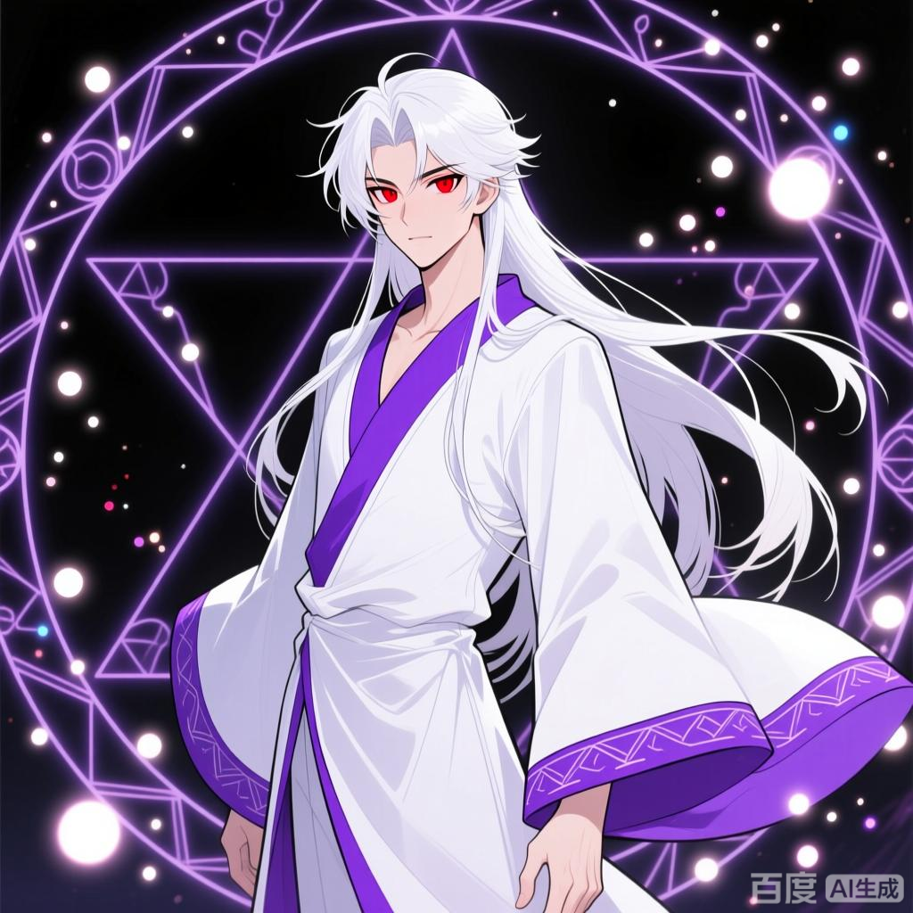

+++
date = '2025-11-08 08:58:35'
title = '药尘'
description = ""
tags = ['样例标签']
categories = ['样例分类']
showAuthor = false
authors = ["Gu-v"]
+++

### 资料

| 资料 |                  |
| ---- | ---------------- |
| 姓名 | 药尘             |
| 别称 | 药老/药尊者/药圣 |
| 性别 | 男               |

### 简介

药尘，天蚕土豆所著异世大陆类玄幻小说《斗破苍穹》及其衍生作品中的角色，《斗破苍穹前传之药老传奇》的主角，《大主宰》中为客串角色，人称药尊者、药圣。
大陆第一炼药师，八品高级炼药宗师，后为九品宝丹炼药宗师。中州星陨阁阁主、天府联盟盟主，拥有异火榜排名十一的骨灵冷火，后转赠萧炎。九转斗尊巅峰强者，在萧炎的帮助下重获肉身，突破至半圣，后又借助萧炎所带回的黄泉妖圣精血突破至一星斗圣。来到大千世界后成为无尽火域太上长老，修为达到仙品天至尊后期。
萧炎的老师，视萧炎为子，是萧炎修炼道路上最为重要的引路人，可以说，没有药尘，就不会有“炎帝”.

### 身份背景

药尘的名字取自“愿世间无人病，愿架上药生尘”，出身于药族卑微旁支，幼年丧父，受尽冷眼，更因在药会上展露锋芒而被陷害，逐出药族。经历种种磨难和奇遇之后终于进阶为中州大陆“第一炼药师”，然而却因为徒弟的背叛而尸骨无存。数年之后于骨炎戒中苏醒，一念之间收下了萧炎这个徒弟，铸就了一个传奇。

### 相貌衣着

药尘的外在形象是一位老者，身着白袍，大袖飘飘，面目苍老，显得异常的慈和。深邃的双目，散发着苍老之气也难以掩饰的睿智，犹如是历经了沧桑。在改编漫画和游戏中，药尘则是白色长发的英俊青年形象，红色双瞳，穿着紫色衣边的白色长袍。动画形象衣袍为紫色，外貌相较于漫画更还原小说，中年人的外貌，蓄有八字胡和山羊胡，须发皆白。

### 性格特点

炼药便是药族的天性，药尘也不例外，认为炼药是一个有趣的过程，相较于女人，他更爱炼药，就算是睡梦中，也在炼药。生性悠闲，不喜欢身居高位的生活，即便贵为星陨阁阁主，也不喜欢管事，专注于炼药。
答应的事情，就必然会做到。不在意他人的眼光和嘲讽，认为与这些蛆虫争执毫无意义，喜欢用实力来让他们闭嘴。经历药万归陷害一事后万分渴望力量，并尽量让自己变得残酷起来。因为父亲之死，悲愤交加的药尘以一种天魔解体的方式，消耗潜力强行晋升。为了补足透支的潜力，两年来一直浸泡药青配置的药浴。在一次次药浴的极限痛苦中，药尘习惯成自然，再痛也不会叫出声来，面部也是十分平静。当初被驱逐出药族，一直是药尘心中最深的一根刺，每当这根刺被拨动时，他那多年的修养都是会荡然无存。
珍惜天地灵物，曾教导萧炎“天地珍宝形成不易，炼药师不可夺尽天地造化之功”。性格直爽，不会拐弯抹角，欣赏就是欣赏，不会吝啬赞美。虽然是名震大陆的药尊者，但也不是自恃身份的人，为了达成目的甚至还会耍无赖。

### 天赋

药尘自幼灵魂感知力异于常人，父亲去世那天燃烧了修炼天赋，但却让灵魂得到了无穷的潜力。这些潜力，在后来对天赋潜力的修复改变中，又得到了强化。药尘在炼药师的天赋之上，有着超乎想象的可怕。每一次开炉炼药，药尘的炼药术都有着质一般的提升。借助家中传下来的各种炼药秘法秘术，越阶炼药，对药尘而言已是一种常态。炼药天赋奇高的药尘，在十八岁时便炼制出了炼药师的终极荣耀“超极品丹”。
药尘修炼天赋不错，但是他的潜力却在父亲逝去那一夜燃烧过半。为了补足潜力，药尘之后两年一直都在浸泡药浴，锻体的同时偿还潜力。在无数次的药浴当中，药尘的体质、经脉、丹田在斗师时期，便已达到了大斗师所能达到的巅峰。而木召森射进药尘体内的种木青种，补充了药尘欠缺的生机能量，不仅修复了他燃烧潜力的后遗症，更是让他不断晋升。但进境太快并非好事，药尘年轻时药浴过多，太过激进，所以晋入斗尊之后，便是炼药通灵，也难以跨越境界的壁垒，无论如何也摸不到斗圣的门槛。药尘的战斗天赋是药族数代不出的奇才，能够想到将敌人当成药材来炼杀的战斗方法。

### 异火

药尘的异火，名为骨灵冷火，位列异火榜第十一名，这种异火，只有在每百年，日月交替之时，方才能够在极寒与极阴之地遇见。因此此火极为阴寒，尽管从外观感觉极冷甚至结冰，但实际温度极高，威力极大。拥有了异火，不仅炼出的丹药药力更浓，而且与人对敌时，同等级的强者，根本不敢与之硬碰。可被萧炎借用，已赠与萧炎，把焚诀提升至准天阶功法。

### 药鼎

黑魔鼎，位列天鼎榜第八位，药尘在光影空间与焚诀一同所得。黑色的药鼎，体型颇为壮硕，浑身上下隐隐缭绕着一股沉稳的气息，通体绘满了奇异火焰纹路，一眼看上去，那些火焰犹如具有灵性一般，胃胃蠕动，宛如活物。药鼎上被药尘施加了灵魂印记，外人无法使用。
诞生于光明与黑暗两大本源的斗争与冲击当中，属天生的黑暗神物，与之对应的为天鼎榜排名第七的光耀鼎。

### 功法

筑火功
药族筑基功法，能让药族弟子各方面都走在普通修炼者的前面，更能让药族弟子对炼药产生相当的敏感性，对灵魂感知力有一定锤炼作用。

三花聚火功
药族三大开放功法之一，黄阶的基础功法。相较于其他两大开放功法，胜在不需要消耗修行资源。三花聚火功每一步都异常艰难，但一旦晋升，便直接是三星。

焚诀
陀舍古帝留在光影空间中的功法，最初只是黄阶低级功法，但能够吞噬异火来进化。

### 斗技

筑火成城
筑火功配套的基础斗技，凝结斗气形成一道防御。

元气爆破决
玄阶，药尘太爷爷所创，通过手印叠加来临时提升斗气境界。

天罗决
药尘家传的身法斗技，共有十二层，修到第十层，就能以斗气幻出天罗翼，蜕变为极特殊的飞行斗技。

八极御火
双臂张开，身体旋转，以斗火为防御，炼化所有近身的斗气攻击。

旋元斗火拳
玄阶，可以完美承接三花聚火功的一门升阶斗技。

丹火决
玄阶，与斗火有关。

吹火掌
玄阶低级，可造出强大风压。以前某人求药尘炼药，药尘以闲置丹药交易得来。

八极崩
玄阶高级，近身攻击斗技，以攻击力强横著称，练至大成，攻击暗含八重劲气，八重叠加，威力堪比地阶低级斗技。当年某人哭着求药尘收下的。

焰分噬浪尺
地阶低级，炼至大成，劈山断浪，举手投足。需搭配玄重尺才能发挥全部威力，失去玄重尺，斗技威力仅余三层。

### 秘技

刺客秘技
药尘某次炼制极品丹时，召来的丹雷劈中了想要刺杀他的中州第一刺客，从他身上搜到了各种刺客秘技，让药尘能轻易洞悉各种刺杀陷阱，再也不用担心来自暗处的刺杀。

升灵
八品炼药师方能使用，可提升丹药灵气，对灵魂消耗极大。

### 药方

一品丹药
止血丹
最常见的外伤丹药之一，除了动脉割裂的大出血，其余情况都能迅速止血。
凝血散
能起到一些疗伤的作用。炼制材料为凝血草一株，活气果一粒，罂粟花两朵。

二品丹药
青炎丹
可以短时间增强火属性功法一成的威力。
回血丹
能刺激人体潜能，瞬间大量造血，对大量出血的外伤有奇效。
护脉丹
保脉护体之用。
冰心丹
护卫心神之用。
冰清丹
从某方面来说可算三品，服用之后能够极为有效地缓和火毒的掺杂。

三品丹药
紫炎丹
脱胎于青炎丹，可以短时间增强火属性功法五成的威力，是修行火属性斗气者的破境良药。
复生丹
能够快速恢复斗气，并有强效的止血疗伤之效。
赤炎丹
能够增强火属性斗气，炼药师服用，能在一段时间内增强对火焰的掌控，从而提高炼丹的成功率。赤炎丹虽然只是三品丹药，但其炼制过程极为繁复，只有五品炼药师才能百分百炼制。
回气丹
快速的回复体内所消耗的斗气。
醒神丹
能够使得服用之人在修炼状态中，对外界天地能量的感应更加敏感，吸收能量的速度，也会适量的增加许多。炼制材料为三十年份的清心三叶草，成熟的佛心果，十年份的吸灵树好一枚三阶魔核。

四品丹药
三花聚火丹
能够提升火属性斗气的威力，同时免除敌人一切火属性斗技带来的伤害。
镇蛊化神丹
可御使妖蛊，无论是降蛊还是驱蛊，都有着奇效。原六品丹药，被药尘简化为四品。
极火丹
紫炎丹的晋阶丹药，能让人将自身的火之斗气增强数倍。一颗极火丹能带来的能力，相当于五颗紫炎丹配合三花聚火功的效果。
伪境丹
一种笼统的称呼，凡是能让人暂时跨越一个境界的丹药，都能成为伪境丹。药尘这枚适用于斗师，大斗师需要服用多颗。
镇血丸
药尘所创的疗伤药。
洗髓伐骨丹
药尘家族秘传，有着诸多用途，磨粉可配成药浴粉，泡之能提高天赋；配汤可固本培元；直接服食可壮大灵魂；副毒为零。
聚气散
能够让一位九段斗之气，百分之百的成功凝聚斗之气旋。炼制材料为四株五十年份的墨叶莲，两粒成熟的蛇涎果，一颗二十年份左右的聚灵草和一枚水属性的二级魔核。
焚血
药尘用二十三种各不相同的火属性药草以及三种二阶火属性魔兽地鲜血配制而成，只对修炼火属性斗气的人有效果。将它敷在身体之上，能够使得体内的斗气加速消耗，同时，也能加速再生，在不断消耗与再生的僵持中，使用者的实力也会逐步增强。

五品丹药
血莲丹
在服用之后，将会在人体表面形成一层奇异的能量血枷，而这层血枷，能够抵御极其炽热的温度熏烤，所以，只有借助它的功效，才有可能近距离接近异火，并且寻找机会，对之采取下一步的措施。材料为血莲精、冰灵焰草和三阶魔核。
复灵紫丹
（复紫灵丹）
丹列五品，能够将一些因为封印，或者体内残伤而导致衰退地实力，完全的修复过来。
复元丹
专门用来治愈一些重伤伤势。而且由于药性温和，不会给本就受伤的体内造成丝毫的破坏，简直堪称是治愈重伤的绝佳丹药。
养魂涎
用于滋养灵魂，炼制起来并不繁琐，但是所需要的药材太过偏门。

六品丹药
七芯丹
服用一个时辰内，会对火属性斗气产生极敏锐的直觉，并得到大幅度的灵魂感知力加成。这个加成会在一时辰后衰减，但到一定程度就会稳定下来。如果修炼得当，就能永久保留这份灵魂感知力。
破厄丹
具有破解大多封印之奇效，在服用其之后，还能在体内形成一种针对此种封印的抗性，日后，若是再遭遇此种封印，则是能够有着许些几率将之豁免。
地灵丹
丹列六品顶级，用于吞噬异火，炼制材料为地心火芝，龙须冰火果，青木仙藤和一枚六阶水属性魔核。
斗灵丹
斗王服用可以毫无风险的上升一星，一生只能服用一枚。炼制材料已知有血蟒枝。
青冥寿丹
能够提升人将近十年寿命，一人一生只能服用一枚，炼制材料为青冥果、寿王浆和万年青藤。
破宗丹
丹列六品顶级，能够令得斗皇巅峰的强者，在晋级斗宗之时，多一成的成功率，并且保证服用之人，即便冲击斗宗失败，也能将实力稳定在冲击之前的地步。
清魂丹
丹列六品顶级，能够清洗体内一切不属于本身的灵魂之力，并且还有着温养灵魂之功效。炼制材料为清体草、冰火融魂果和水灵莲子。

七品丹药
护魂神丹
用于守护灵魂。
阴阳玄龙丹
药尘在陨神冰原上独创的药方。有着诸多妙用，尤其是对重创的身体，药力能长时间存于体内，能于极细致处，进行着修复。
阴阳玄龙丹
药尘改进后的药方。能够赋予服用者在濒死之际有提升实力的机会，此外若是好运，能够将丹药内的稀薄龙气嫁接到自己身上。龙气若是配合上声波斗技，还可以对灵魂体造成极大的杀伤。炼制材料为两头死亡时间不超过七天的六阶龙类魔兽魔核。
生骨融血丹
丹列七品顶峰，只要还有一口气吊着的半死人都能立刻救活的超级灵丹。炼制材料为血精妖果万年青灵藤和雪骨参。
噬生丹
丹列七品顶峰，服用者能在极短的时间中，提升到斗王阶别，代价是寿命只剩下三年。
阴阳命魂丹
丹列七品中级，有融魂还命之奇效，炼制材料为还魂妖果，命魂鬼脸花等等。
瞬气丹
丹列七品低级，能够在极短的时间内恢复一些斗气，而且即便是斗宗强者服用，都是效果不菲。
素心丹
炼制丹药时将之服用，有助于稳定心神，从而提升炼丹成功率。

八品丹药
茯苓青丹
能够令得实力退化之人恢复八成。
一始丹
丹列八品五色丹雷，用于筑基，药效极为的温和，会伴随着服用者的成长，逐渐改善体质。

九品丹药
九阴黄泉丹
药尘花大代价弄来，丹列九品宝丹，丹内所蕴含的极阴之力能削弱净莲妖火的威力。炼制主材料为黄泉血晶。

无品丹药
火晶丹
以火蚁晶炼制，让火蚁晶的能量更容易被吸收。

品级未知
匿息丹
用于潜伏暗杀的丹药，能够暂时遮掩人身上的各种气息，屏蔽一些灵物的侦探手段。
筑基灵液
药尘所创，能无负作用地提升斗之气的修炼速度，但药效只能持续两月。炼制材料为三支完整的紫叶兰草，两株洗骨花和一枚木系一级魔核。
养气散
能够提高状态回复的速度。
冰灵护喉液
药尘所创，一种辅助药品，能够缓各种灼热之痛，并能保护喉咙不受突如其来的炽热能量摧蚀。材料为冰灵叶、三花草和水系魔核。
冰灵丹
品阶不高，有着压抑火毒的功效。
洗髓寒灵液
有着清除火毒的功效。
青芝火灵膏
品阶不高，效果稀奇的异类药方。修炼时涂抹在身上，能够让得人的皮肤对周围天地间的火属性能量才种极为敏锐的触觉以及奇异吸力，但会让涂抹者又麻又痒。炼制材料为三叶青芝，火莲果，千灵草和火系魔核。
速灵风丹
品阶不高，效果稀奇的异类药方。服用之后，它能够让得人体内的斗气加速运转，但若斗气加快的持续时间一过去，体内的斗气就会陷入一段时间的萎靡时期。炼制炼制为速龙涎、夜灵叶和风系魔核。
复体丹
一种内服的疗伤药，这种疗伤药不仅对内伤有着一定的治疗作用，并且对外伤也有着较为不错的愈合作用。
九芝续骨膏
能够迅速愈合骨裂的伤势。
醉妖涎
有着极为强烈的麻醉效果。

### 角色关系

药火
药尘的父亲，药族铁卫，四品炼药师，执行最后一次任务时身陨，是使药尘对宗族碑产生执念的人。

药青
药尘的母亲，药火离世后一直为了药尘的修行所需在药族后山采药。因为曾经顶着风寒四处求药，落下了病根，在得知药尘被驱逐出族后再也支撑不住。因为族内没人敢得罪药万归，药青随药火而去。

药览
药族族学的首席长老，负责教导启蒙炼药术，认为药尘的天赋药族年轻一辈无人能及。尽力救助了药火，但依旧没能挽回他的性命。药尘拒绝回族后，药览给予了他一卷斗技防身。

古灵
本名风闲，风家少主，性格善良，曾经帮助过药尘。因为风家被灭而跟随药尘，相互帮持中建立了真正的兄弟情谊。药尘视古灵为家人，古灵则无条件拥护药尘所做的决定。

狐九九
本体九星狐，妖谷公主，看中了药尘的潜力，救下了被药万归的人追杀的药尘。药尘对其有着些许念想，九九也很喜欢他，甚至当面宣扬主权。原本两人能喜结连理，却因为妖谷遭遇诸圣围攻而与药尘断了联络，情缘不了了之。

韩珊珊
炼药狂痴，为了炼药术，能够不顾一切，甚至愿意为此嫁给感官不错的药族中人。药尘和她相处了三年，虽然男女方面有一点想法，但更多的是亲情，因为韩珊珊喜欢小暴力的倾向不对药尘的胃口。而韩珊珊则很喜欢药尘，为了他选择自我献祭。

玄衣
圣丹城三大明珠之一，韩珊珊的莫逆之交。对药尘的态度有些暧昧，好像是喜欢，又好像是竞争，而竞争的东西，则是韩珊珊。和药尘关系时好时恶，始终有一道坎无法跨越。而当玄衣终于放下身段，主动向药尘表达情意时，药尘已经收韩枫为徒。为了专心培养他弟子，药尘拒绝了玄衣。

青仙子
花宗第一美女。药尘为了专心教导韩枫，了断了与青仙子的情丝藕莲。多年后成为花宗太上长老，念及与药尘的旧情，同意与星陨阁联盟。

慕骨
韩珊珊曾经的弟子，其阴毒的炼药手法为韩珊珊所嫌厌，被赶出了圣丹城。离开了丹塔这炼药圣地的慕骨对韩珊珊恨之入骨，而药尘则因此怀疑韩珊珊的失踪是因为慕骨的缘故。看出韩枫天生逆骨，蛊惑他背叛药尘。

韩枫
药尘从小养到大的孤儿，药尘视其为完美的弟子，百分百的信任他。然而极端自我的韩枫却在慕骨的挑拨下，为了焚诀背叛药尘，联合慕骨害死了他。

萧炎
药尘的弟子。为了复活，药尘在戒指中吸收萧炎三年斗之气恢复的同时，也观察了萧炎三年。确定了萧炎的心性后现身收徒 ，因为萧炎的选择决定将他培养成最杰出的炼药师。药尘一生无妻无子，萧炎便是他最为亲近的人，视之为亲子。

### 势力关系

星陨阁
星陨阁的星陨二字取自陨神冰原，听说，天上的星辰就是神，每当流星陨落，就是有神陨落人间之意。实为纪念药尘心中陨落的人：韩珊珊。
星陨阁坐落在中州南域天星山脉的一块天外陨石上，位于由陨石星力构建而成的空间中。在那所谓的四方阁之中，星陨阁的弟子，最为稀少，当然，虽然数量不行，但所幸在质量上，星陨阁还是颇为过关，每一位阁中弟子，都是拥有着不弱的修炼天赋，因此在中州南域，不少人都知道，若是遇见星陨阁中的弟子，万不能因为其年龄或者其他而心存小觑，因为那星陨阁中，从来都不收庸人。

天府联盟
星陨阁、丹塔、花宗和焚炎谷为了对抗魂殿组建的联盟，吸引了大量中州势力加盟。从覆灭人殿到正面抗衡魂殿，天府联盟成长为中州两极之一。陨落之巅的决战，彻底奠定了天府联盟中州霸主的地位。同时因为萧炎的缘故，与魔兽界三大族群之一的太虚古龙族和九幽地冥蟒族结成盟友，天府足以比肩部分远古种族。夺玉之战前，为了让实力愈发强大的联盟更加稳定，药尘将盟主之位转给了联盟实力最强的萧炎。双帝之战后，天府联盟成为大陆最强势力，萧炎将盟主之位交还给药尘。

### 角色经历

年少丧父
药尘是药族的支脉的弟子，在其五岁那年，父亲药火将太爷爷的故事告诉他以做激励，药尘承诺要将双亲之名铭刻在宗族碑上。为达到这一目标，药尘自六岁入族学开始，便开始疯狂地练功。
十三岁时，药尘修为已至六星斗者，作为药族铁卫的药火外出执行任务，打算回来后便辞去铁卫一职，专心培养药尘。然而世事无常，药火在执行任务时遇到了魂殿中人，中了两阴追命掌。药尘之母药青前去族长府求取能解两阴追命掌的六品丹药，但有权限调动六品丹药的族长和长老们却恰巧随妖圣离族，药青四处求药无果，族学首席长老药览只能为其炼制一枚吊命丹。最终药火还是没能坚持到药族族长归来，去世了。临死前，他将留名宗族碑的希望交托药尘。

药族弃子
两年后，药尘十五岁，在族学大比上炼成三品紫炎丹，摘得桂冠，获得药会的名额。药会上一炉两丹，以第八的名次进入决赛。为了让弟弟药锋获得药会冠军，药族刑堂首席药万归换掉了药尘打算在决赛上炼制的六品七芯丹的材料之一的星空草，导致药尘炼药失败。并指使药锋做出偷换星空草的举动，让药尘误以为他的星空草为药锋所换，借此让药尘犯下诬蔑之罪，再贿赂族学的败类诬蔑药尘偷盗药草，两罪相加，将药尘驱逐出药族。得知此事的药青立即让药尘离开药族，以躲过药万归后续的追杀。可惜药尘三星斗师的实力还是跑不过三位大斗师，在临死之际被妖圣谷小公主狐九九救下。
（此处剧情与斗破苍穹有出入，正篇中药尘是因为年少时执行一项任务失败，被不辨是非的药万归逐出药族。）

相遇风闲
之后药尘前往中州，遇到了风家大少风闲。在武隆城奇珍拍卖行卖丹药时，换取的药材等级让鉴定师看出药尘是独行炼药师，于是拍卖行的主人，风闲的父亲风祥铁与药尘达成合作，以渡过被武隆城其余两家拍卖行的打压。偶然路过武隆城的药览见到了药尘，告知他药青的死讯，并邀他返回药族。但药尘因为药青的死，对药族的幻想已经完全幻灭了，唯一的念想便是完成父母的遗愿，将他们的名字刻在宗族碑上。于是他拒绝了药览的邀请，以紫炎丹丹方换取十年的平安。
药青的死，让药尘的心中充满了愤怒，恰好这时紫煞帮的人因为他在南涯城的露白而盯上了他。为了让人知道，只要冒犯自己，就必然会付出惨痛的代价，药尘闯进苦花园找紫煞帮的麻烦，意外撞破木家的阴谋。其后返回风家告知风祥铁，但因为风家高层战力强过木家，此事并没有被风祥铁放在心上，最终导致风家的灭亡，仅风闲一人被药尘救走。
（此处剧情与斗破苍穹有出入，正篇中药尘被逐出药族后将所有的精力都投入炼药术之中，希望能被药族召回。但随着时间的推移，药尘对药族召回他的期望逐渐的消散，最后拒绝了药族的邀请。）

妖谷炼药
为了不让风闲做傻事，药尘将他在药族的经历告诉他，以炼药师的身份承诺，不出十年必然为风家报仇，让风闲暂时放下仇恨，跟他去获取力量。与风闲相互扶持的半年间，两人建立了真正的兄弟情谊。在深山再次遇到狐九九，被她请到妖谷峰炼药洞里炼药，在里面遇到了丹塔弃徒丹虎臣，用药方和他们交换炼药手法。

丹塔学习
三年后，十八岁的药尘为了进入丹塔学习，暂时充当完成和妖谷的交易的丹虎臣的弟子，参加圣丹城斗丹会。在进行品级测试时，独特的炼药手法被七品高级炼药师韩珊珊盯上。在之后的交流中，药尘收获良多，他因此明白炼药术不仅需要闭门苦修，还需要出去与他人交流、竞争，以激发自己的灵性。
斗丹会上，药尘以六品超极品丹夺得第一名，被韩珊珊收做药童（弟子待遇）。但因为超极品丹没有送去审判，按照流程，药尘失去了斗丹的资格，名次不了了之。在和韩珊珊的相处中，两人渐生情愫。

骨灵冷火
在圣丹城的三年间，药尘摧毁了挑畔他的白家白威组建的利益集团，以大手段镇压了数起类似事件。借助改变人天赋体质的药浴，团结起无数高手，形成了一股连丹塔五大家族都不能忽略的势力。三年后，风闲大仇得报，陪伴二十一岁的药尘前往陨神冰原寻找异火。不放心的韩珊珊悄悄跟着药尘，在其入魇时救下了他，三人一同寻找异火。
骨灵冷火出乎意料的强大，它不但诞生了灵智，还在豢养其他异火作为补品。为了成长，骨灵冷火吞噬了韩珊珊的灵魂。药尘为了救她，以身体消散为代价开启了药帝血脉的传承，获得了斗尊的力量，抹杀了骨灵冷火的意识，将异火交给了韩珊珊。与之相同的，韩珊珊也不愿意见到药尘消失，通过药尘的血脉，献祭自身取得药帝的帮助，重塑了药尘的身体。韩珊珊化为时间长河的一部分，和药尘与风闲寻找异火的记忆也被抹去，临走前留下了一束刻有她烙印的骨灵冷火。

丹会冠军
忘记韩珊珊的两人继续在陨神冰原寻找异火，五年间以三星斗王的境界成为了五品炼药师。第七年两人遭到同样再次寻找异火的七品炼药师青华的针对，药尘凭借斗宗级的灵魂屡屡逃脱，反而将青华的袭杀变成锤炼，借此两人晋入斗王巅峰，合力之下与青华这位五星斗宗打得旗鼓相当。争斗失去了意义，三人选择合作。
第八年，药尘晋入六品炼药师，青华选择了放弃，离开了陨神冰原。就在这时，风闲发现了骨灵冷火的火种，药尘成功将其炼化，晋入斗皇，成为冰原八年的胜利者。
回到丹塔后，药尘以七品炼药师的实力炼出一颗完美的八品丹药，击败了玄空子、侯怪才等丹塔的天才，夺得丹会冠军，扬名整个中州。

星陨阁主
自从韩珊珊失踪之后，药尘就像变了个人一样，每天除了炼药，就是发呆。对于喜欢着自己的丹塔明珠玄衣和妖谷公主狐九九虽然有着好感，但他在男女感情这方面始终因为韩珊珊的失踪和那回想不起来的冰原记忆而无法定下心境。无法真正放开真心去接纳玄衣或狐九九，所以药尘对两人一直没有表示。
韩珊珊大限已至的师父萧靖候将炼药手记交给药尘，指点他好好利用圣丹城的势力，主动出击去寻找韩珊珊。为了找到韩珊珊，同时向药族证明自己，药尘拒绝了丹塔的挽留，离开了小丹塔，以三十二位信赖自己的斗王为班底，和风闲建立了星陨阁。虽是阁主，但星陨阁实质上是由风闲管理，药尘一直都在大陆各处寻找韩珊珊，每隔一月就丢下一堆丹药到星陨阁的联络点。十年过后，星陨阁已成为一个庞然大物，大陆各个地域，都有着星陨阁的眼线。凭借着药尘渐渐叫开的“大陆第一炼药师”的名声，和风闲越来越圆滑的手段，星陨阁强大到连魂殿这种庞然巨物都不想轻易出手的地步。随着药尘带领星陨阁在天星山脉的天然大阵安家，星陨阁在中州变得更加有活力起来，各处渗透的力量更强，依附于星陨阁的地方家族势力也渐渐才成为所在主城的主流势力。

斗帝空间
一年后，每隔一段时间就会出世的陀舍古帝遗留的光影空间开启，斗宗巅峰的药尘和四星斗宗风闲进入其中，得到了用异火进化的黄阶功法《焚诀》。焚诀在药尘的灵魂中演化，令其灵魂转化为实质的境界，让药尘摸索到了斗尊境界的门槛。因为专修焚诀会功力散尽，从零开始，树敌众多的星陨阁不能没有他，所以药尘放弃了焚诀，坚持自己的道路。当他放弃焚诀后，刻在药尘灵魂深处的焚诀化为一本实体书卷。在药尘离开放置焚诀的祭塔时，遭到慕骨的袭击，被轰入一处虫洞。在其中，药尘得到了天鼎榜排名第八的黑魔鼎，同时得到的还有被黑魔鼎收取的各种炼器材料和先天后天珍奇药材，足够他炼数十年丹药都不虞有缺。其中炼器材料，药尘交给了风闲。风闲为药尘炼制了一枚温魂养神的戒指“骨炎戒”，长时间佩戴，能提升一丝灵魂感知的能力。

名扬大陆
回到星陨阁的一年里，药尘一直在炼药，为星陨阁增添底蕴。一年后，药尘离开星陨阁，随着药尘的四处游走，中州上关于第一炼药师的传说也越来越多，更多的强者认可了药尘的地位。所以当某次药尘被三名巅峰斗宗和十名九星斗皇袭杀的事情传出后，两名斗尊和十余名斗宗带着大量斗王自发地结成一个讨伐联盟，将那三名斗宗的家族师门从中州之上连根拔起。
二十年后，星陨阁与老牌势力万剑阁、风雷阁、黄泉阁并称中州四方阁。药尘晋入斗尊，人称“药尊者”，多次当众炼制八品丹药拿来拍卖，名气甚至压了丹塔一头。除了远古八族，其他超级势力都隐隐地被药尘和星陨阁压了一头。其中经历了许多恩怨情仇，和狐九九险些结婚，却因为妖谷遭遇围攻，为免灭族，妖圣将妖谷送入虚无之中的其他世界避祸，断了联络的两人，情缘也就不了了之。和玄衣的关系时好时恶，有时相依，也互相伤过，两人都有迈不过的一道槛，始终无法在一起。

收徒韩枫
游历了整个中州的药尘步伐踏向了中州之外，偶然遇见了年少的法犸，见他有些天赋，随兴所至点拨了一下。这次点拨让法犸从名不经传，一步步走到了加玛帝国炼药师公会会长的地步。离开中州第三年，药尘来到黑角域边缘，救下了一个韩家庄的遗孤韩枫。因为韩枫聪慧过人，有着完美的火木双属性体质，姓氏又与韩珊珊一样姓韩，觉得这是缘分的药尘视其为完美的弟子，一手一脚地培养他。带着他四处云游，脚步遍及大陆。十三年后，药尘渐渐失去了昔日的锐气，有意放下过往的恩怨情仇，专心教授韩枫。为了教导韩枫，药尘甚至拒绝了玄衣的表白，了断了与花青的情丝。然而天性凉薄的韩枫却因为药尘从小到大的宠爱变得极端自我，在慕骨的挑拨下钻进牛角尖，为了利益拜慕骨为师。

遭遇背叛
三年后，药尘修为更加精进，虽然还是摸不到斗圣的门槛，但战力却冠绝斗尊。而韩枫在慕骨的挑拨下愈发极端，忘记了药尘过去对他的好，只记得他以为的缺点。药尘考虑到焚诀进化需要异火，无法找到多种异火的焚诀完全比不过其他的高阶功法，认为命运掌握在自己手中更加可靠，拒绝传韩枫焚诀。为了得到焚诀，韩枫在药尘击败慕骨之际，将抹了连斗尊都能杀死的曼陀七星散的长剑刺进他的腹中。死前为了不让焚诀被狼子野心的韩枫得到，药尘以骨灵冷火自燃。然而韩枫却在慕骨的指导下斩下药尘的头颅，得到了焚诀下卷。最终药尘的尸体被韩枫烧成灰烬，藏有无数珍稀药材的纳戒为韩枫所夺，骨炎戒则被韩枫丢弃。药尘的灵魂在骨灵冷火火种的保护下藏于骨炎戒，黑魔鼎感应药尘的灵魂一同进入了骨炎戒。这枚戒指随着时间变换来到了西北地域加玛帝国乌坦城的萧家，来到三少爷萧炎的手中。
（上述内容是依照《药老传奇》所写，部分内容与斗破正篇有出入。）

收徒萧炎
药尘吸收了萧炎三年斗之气后灵魂苏醒，因为看好萧炎的卓越的修炼天赋和毅力，所以收萧炎为徒。其后用筑基灵液帮助萧炎修炼斗之气，多次炼丹给萧炎拿去拍卖会拍卖，让萧炎得以交好米特尔拍卖场，为米特尔拍卖场在萧家和加列家的商战中帮助萧家奠定基础。教导萧炎炼药术，帮助他弄垮加列家，好让萧炎安心外出试炼。

寻找异火
在萧炎魔兽山脉苦修开始时，药尘为了不让他养成凡事都依靠他人的习惯，决定除非萧炎遭受到危及生命的致命危险，否则他不会再出手替萧炎解决任何的麻烦。经过狼头佣兵团追杀一事后，萧炎决心在魔兽山脉潜修。萧炎的决心也让药尘大为满意，决定最快地办法，让他毫无后遗症的成为一名斗师。
在药尘墨胶木桩阵的锻炼下，萧炎的敏捷和对斗气的掌控有了显著提高，修为突破了六星斗者。因为狼头佣兵团的大围剿，萧炎被迫深入魔兽山脉，但也因祸得福，与云岚宗宗主云韵结缘，获得了伴生紫晶源，修为突破九星斗者。炼化了伴生紫晶源的萧炎得到了紫晶翼狮王的紫火。在药尘的帮助下，萧炎将它炼化成本源火种，用焚诀将之吞噬。焚诀进化至黄阶中级，萧炎的修为也突破到一星斗师。
至此，魔兽山脉的修行告终，萧炎前往塔戈尔沙漠修行。在漠城，萧炎遇到了被美杜莎女王封印实力的冰皇海波东。为了获得他手中掌握的异火消息和净莲妖火残图，药尘答应帮助他炼制解除封印的破厄丹。
通过海波东的地图和青鳞的帮助，萧炎找到了青莲地心火的所在，但异火却被美杜莎女王捷足先登。为了夺回异火，萧炎闯进了蛇人部落，从古河手中夺得异火，在药尘的指导下完成吸收，焚诀进阶至玄阶中级。返回漠城，药尘帮海波东炼成破厄丹，用复灵紫丹聘请海波东为一年的护卫。在之后营救青鳞的战斗中，药尘的灵魂力量几乎被消磨殆尽，陷入沉睡。为了让药尘恢复，萧炎帮助纳兰桀驱逐烙毒，获得了能恢复灵魂能量的七幻青灵涎，唤醒了药尘。

迦南学院
在萧炎打上云岚宗时复苏，帮助萧炎逃离云岚宗。在逃亡期间，药尘帮助萧炎调养了身体，从萧炎淘到的玉片中发现天火三玄变第一变，透露了魂殿的消息给萧炎。
在黑角域，药尘得知他的逆徒韩枫在此地称王称霸，位列黑榜第三，自号药皇，还拿他的阴阳玄龙丹拍卖。同时因为魂殿在此地狩猎的缘故，药尘再不能像往常那般肆无忌惮地将灵魂力量借与萧炎。其后在迦南学院内，药尘帮助萧炎掌握玄阶高级声波斗技《狮虎碎金吟》和地阶低级身法斗技《三千雷动》，交给萧炎大量药方辅助修炼；带领萧炎找到真正的“地心淬体乳”，使他得以迅速晋阶斗灵，并为晋阶斗王打下基础；和美杜莎达成若她放弃杀萧炎的想法，一年后为她炼制融灵丹的约定，以稳住美杜莎。
陨落心炎暴动后，韩枫召集诸位黑角域的强者前来夺取异火。为了杀死这个弑师者，药尘将灵魂力量的尽数借于萧炎，使他得以融合骨灵冷火和青莲地心火，制造出大型佛怒火莲重创韩枫。但是虚弱的萧炎却被陨落心炎趁机吞噬，药尘只能用骨灵冷火替萧炎防御。为了解救萧炎，药尘把仅剩的灵魂力量完全灌注予萧炎，陷入了沉睡。

师徒分离
之后萧炎炼化了陨落心炎，杀死了韩枫，暂且稳住了美杜莎，在黑角域站稳跟脚，炼制修复药液唤醒了药尘。两年的沉睡让药尘的灵魂力量增长了不少，得知韩枫已死的他大感欣慰，在萧炎的要求下告诉他炼制容纳灵魂的躯体的材料：七品丹药生骨融血丹、七阶魔兽的精髓血脉和一具斗宗的骨骸。
萧炎返回加玛帝国，拉拢三大家族和皇室向云岚宗开战时，药尘主动现身，增强己方的筹码。曾受其大恩的法犸决定加入，木家、皇室和纳兰家随之加入。决战时，药尘因为被魂殿鹜护法拖住，所以无法支援萧炎。不过虽然药尘发挥的战斗力不足巅峰时刻的五成，但对付一个斗宗还是占据了上风。然而鹜护法却在云山被萧炎杀死时，趁机吞噬了云山的灵魂和被魂殿强行提升实力的云岚宗长老的灵魂，实力大涨。就算是美杜莎从旁协助，药尘还是被鹜护法抓住，关押在中州西域的冥城魂殿分殿。被抓前药尘将骨灵冷火的本源和存有他毕生所藏的“骨炎戒”交给了萧炎，作为见古灵的信物。
魂殿殿主因为看重药尘的炼药术，所以不打算就这么杀了他，多次让看守分殿的尊老秦天劝降。青海尊者追杀萧炎失利后，魂殿将药尘转移至亡魂山脉的分殿。

半圣归来
多年后，萧炎带着小医仙、古灵等五位斗尊杀进魂殿，由小医仙四位斗尊拖住魂殿看守的五位尊老，天妖傀拖住秦天，萧炎成功救出药尘。最终在铁剑尊者的断后下，众人成功通过紫妍强行开辟的空间门逃离魂殿。
重伤昏迷的萧炎被药尘带回星陨阁，借助那的星辰之力加速三千焱炎火的修复速度。在将萧炎安顿好了之后，因为担心魂殿报复，并且打扰到萧炎的疗伤，古灵与药尘决定先闭守山门。期间古灵将阁主之位交还药尘，邀请小医仙三人担任星陨阁的客卿长老。
一年后，萧炎苏醒并突破一星斗尊，担任星陨阁长老。为了获得能补足药尘这些年被魂殿吸走的本源魂气的奇物魂婴果，萧炎带着小医仙、紫妍和慕青鸾前往最近出世的兽域最近出世的远古遗迹。遗迹之行结束后，萧炎带回了金品魂婴果，药尘立刻闭关弥补本源魂气。待魂气补足，重回巅峰后，萧炎用五色丹雷的八品生骨融血丹、天妖凰的精血、古灵提供的四星斗尊骨骸和一根斗圣右臂骨复活了药尘。因为炼制躯体的材料品阶极高的缘故，药尘成功晋入半圣，杀了魂殿来犯斗尊的七成，逼退了八天尊和九天尊。
此战一出，震动中州，药尘半圣的实力和大陆第一炼药师的名头吸引了各方势力的首脑以及一些老一辈的强者登门拜访，一些曾经与药尘和古灵有旧的强者，也终于是接受了邀请，成为了星陨阁的客卿长老。之后药尘抹除了骨灵冷火的灵魂印记，将它交给了萧炎。纳兰登门请求萧炎帮助云韵时，希望云韵能登上花宗宗主位，让花宗成为星陨阁盟友的药尘，将能召唤他的空间玉简交给萧炎，自己则留在星陨阁内帮助天火和小医仙恢复实力和彻底控制厄难毒体。
因为药尘晋入半圣层次，星陨阁接到了古族成年礼的邀请帖，药尘为了坐镇星陨阁，让萧炎替他前往古界。西北地域动荡之时，药尘为萧炎炼制六十枚八品丹药，招揽了二十位斗尊作为萧炎平定动荡的帮手，同行的还有星陨阁的十位斗尊长老。动荡结束后，药尘决定亲自培养萧炎和美杜莎的女儿萧潇。

天府盟主
空间交易会上，药尘和曾被逐出中州的蝎魔三鬼竞争净莲妖火的残图失败，事后截杀三人，得到了净莲妖火最后一张残图。因为在菩提古树出世时，药尘出手救下萧炎，星陨阁被魂族盯上。事后萧炎韩枫的灵魂交给药尘处置，而萧炎闭关前交于药尘的十一枚菩提子，被其炼成了菩提丹，吸引了大量低调的斗尊巅峰暗中成为星陨阁的客卿长老。面对星陨阁的势力以及声望的暴涨，与星陨阁有着恩怨的天冥宗坐不住了，两方势力爆发了冲突。久战不下的天冥宗与冰河谷，风雷阁以及其他一些在中州有着点名气的宗派结盟，让星陨阁的势力范围逐渐缩水。药尘借机整顿星陨阁，构建起空间虫洞连接后方的城市，令得星陨阁的势力范围固若金汤起来。这种僵持持续了几个月时间，“冥河盟”也不得不停战。
不久，冥河盟向星陨阁送来战帖，和魂殿合作的冥河盟有着高级半圣天冥老妖和骨幽，虽然药尘的修为已达高级半圣，但也只能勉力支撑。就在药尘打算拼死一搏时，晋级一星斗圣的萧炎出关，击杀了魂殿三天尊和天冥老妖，骨幽则被魂殿斗圣救走。之后药尘和萧炎带队攻破冥河盟总部，覆灭冰河谷和风雷阁，给星陨阁树立起铁血之威。为了对抗魂殿，萧炎打算效仿天冥宗，组建一个联盟。药尘以帮助火云老祖修复伤势拉拢焚炎谷，花宗则因为太上长老青仙子喜欢药尘而答应。为了说服丹塔，药尘和萧炎前往丹塔，萧炎竞选进入小丹塔的大长老院，获得决定性的一票，令丹塔与星陨阁结盟。四大势力组建天府联盟，由药尘任盟主，吸引了大量中州势力的加盟。
魂殿为了对付天府，派人袭击联盟下属的三百多座重要城市，抓走丹塔的炼药师。于是药尘阻止天府向魂殿的分殿发起进攻，在服用了萧炎带回的黄泉妖圣的精血，突破到一星斗圣后，联手萧炎捣毁了魂殿天罡殿中的人殿，击杀了魂殿二天尊和大天尊。
妖火降世之事过去后不久，魂殿也终于开始了对天府联盟毁掉人殿的举动展开报复，联盟所属的城市，三分之一都是遭受到了攻击，而对于魂殿的大肆进攻，天府联盟也是没有丝毫的服软，同样是调集部队开始反击。因为有着紫妍、萧晨的坐镇，天府在与魂殿的大面积冲突下，不仅未落什么下风，反而隐隐有着一些占据上风的迹象，如此一来，天府联盟的声威，也是在中州之上达到了顶峰。同时伴随着天府联盟的快速成长，隐隐间，几大势力逐渐被同化成同一个势力，天府。
萧炎归来后，魂殿向其发出战帖，约在陨落山巅一决生死。此战药尘将天府内所有的斗圣全都带来，定下了三战两胜的规则，以丹塔老祖战平魂千陌，萧晨战平魂魔老人，萧炎胜魂殿殿主魂灭生，天府取代魂殿，成为中州霸主告终。

覆灭魂殿
药族药典举办之日到来，萧炎陪同药尘前往，狠揍了药万归一顿，逼迫药族退步。药典上炼成九品玄丹，击败药万火、神农老人和魂虚子，拔得头筹。药族族长药丹也答应将药尘双亲之名刻于宗族碑之上。然而魂族为了夺取陀舍古帝玉，封锁了药界，派出九星斗圣修为的虚无吞炎灭掉药族。为了保住药族血脉，药族强者纷纷自爆以撕裂空间封锁。在药丹的恳求下，萧炎、药尘和神农带着药族最后的血脉冲破魂族的封锁，药尘带着除药天和药灵外的药族中人返回天府联盟。
古炎雷三族古玉尽数为魂族所夺后，三族和天府组织大军前往魂族约定的决战之地葬天山脉，临行前将天府盟主之位转交萧炎。但魂族的实力远比想象中强大，三族和天府联盟联手，都是未能将魂族留下。事后联军扫除了中州上所有的魂殿分殿和主殿，将其除名中州。
双帝之战后，萧炎将天府的盟主之位，交还给了药尘。而药尘也是心疼萧炎这些年所背负的重担，再度出任盟主之位。

大千世界
浮屠古族十年一届的“诸脉会武”开始后，牧尘传信请求无尽火域的帮助，于是药尘带着萧潇来到浮屠界。在浮屠古族大长老浮屠玄出手时，药尘与林貂依照牧尘的要求，联手催动武祖的圣品绝世圣物八祖琉璃钵控制住他。然而两人的实力终究只是仙品天至尊后期，无法将八祖琉璃钵的威能发挥出来，被浮屠玄震飞。最终这次诸脉会武以清衍静获得了祖塔的控制权，成为浮屠古族新任大长老而落幕，药尘也返回了无尽火域。
大千世界对域外邪族的最终决战上，药尘与林貂成为巡察卫队的统领与副统领，负责平复后方混乱，好让前方的大军能够安心对敌。

### 角色评价

旁白
“因为心情激荡，他第一次在萧炎面前说出了这个曾经名震整个斗气大陆的名字！”
“当年的他，叱咤大陆，药尊者之名，谁人不知，不知多少超级强者欲与其交好而寻不到门路。”
“当年的药老，在中州大陆，拥有着何等的声名，真要论起名气辈分来，恐怕即便是丹塔的那三位巨头，都是要略微逊色一分。”

药览
“你……果然是个天才，真正的天才，不要说药锋，就算是药万归，也远不及你……起码，论到对斗火的控制变通，对炼丹术的理解之上，近几代弟子当中，无人能强过你。”

萧炎
“犹如百科全书。”

苏千
“看来药尊者眼光，一次比一次毒辣啊……”

古灵
“当年即便是魂殿要对付药尘，但也是极难，毕竟后者交友极广，当初不少老一辈的强者，都与其关系不错，再以他炼药师的身份，振臂一挥，那号召力，即使是以魂殿的实力，也得掂量一二。”
“这中州上，能够找到炼丹术能与药尘媲美的人，并不多。”

古族斗尊
“那老家伙的炼药术，在这斗气大陆上，可是少有人能及啊。”

盛耀
“唉，这老家伙的眼光，还是那般的毒辣啊……真是让人羡慕。”

玄空子
“当年号称炼药界最耀眼的天才。”

老一辈的强者
“对于药老当年在中州生的影响力，一些老一辈的强者，可是有着极深的感触。虽说如今时隔多年，但药尘那中州第一炼药师的名头，依旧无人能够超越，即便是丹塔的三位巨头，都不得不承认，与药尘比起来，他们的确是比不上。”
药万火
“他从来没有想到过，那当年被药族当做可有可无的弃子，如今居然是有了这等成就，不仅自身踏入斗圣层次，而且还教导出了一个青出于蓝而胜于蓝的弟子。”

药丹
“药尘……我们都看走眼了啊。”