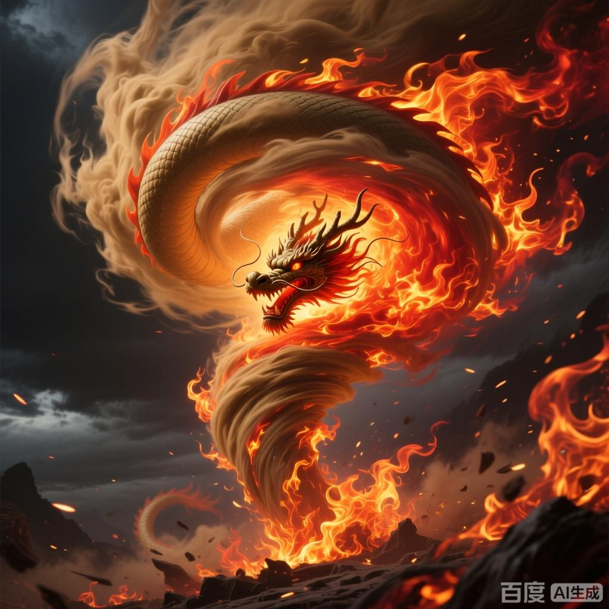

+++
date = '2025-07-08 08:58:35'
title = '样例-风怒龙炎'
description = ""
tags = ['样例标签']
categories = ['样例分类']
showAuthor = false
authors = ["Gu-v"]
+++

### 资料

| 资料 |          |
| ---- | -------- |
| 类别 | 异火   |
| 名称 | 风怒龙炎 |
| 异火榜排名 | 第十八位       |

### 简介

风怒龙炎是天蚕土豆所著玄幻小说《斗破苍穹》及其衍生作品中的异火，呈土黄色，在异火榜排名第十八位，曾被陀舍古帝和萧炎收服

### 事迹

该异火诞生于古老沙漠的火焰龙卷风风眼之中，每年最炎热时期随机出现于沙漠任意区域，形态为风火相融的巨型龙卷，火焰高度可达数百米，行进时会形成火龙状旋转风暴，具有极强破坏力。在双帝之战中，萧炎从斗气大陆召唤风怒龙炎参与战斗。

