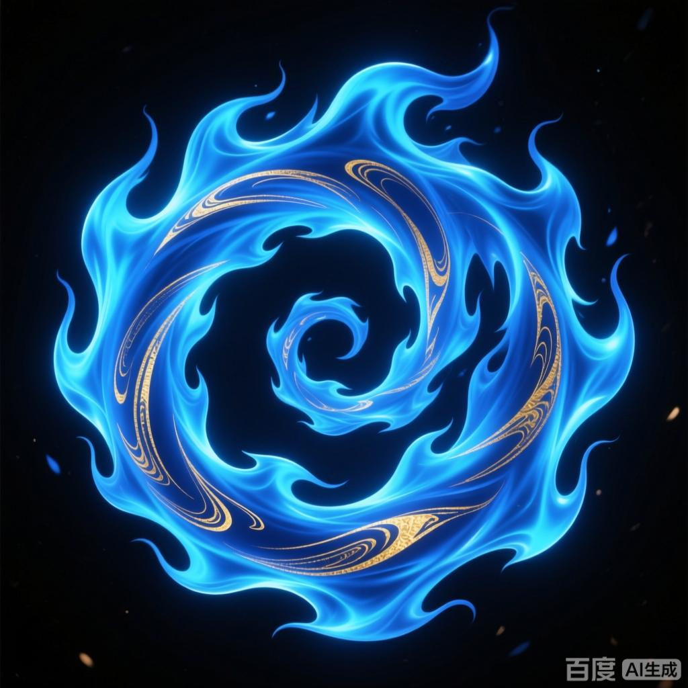

+++
date = '2025-07-08 08:58:35'
title = '样例-海心焰'
description = ""
tags = ['样例标签']
categories = ['样例分类']
showAuthor = false
authors = ["Gu-v"]
+++

### 资料

| 资料 |          |
| ---- | -------- |
| 类别 | 异火   |
| 名称 | 海心焰 |
| 异火榜排名 | 第十五位       |

### 简介

海心焰是小说《斗破苍穹》中的一种异火，在异火榜上排名第十五。该火焰诞生于海洋深处，颜色呈蓝色，具有溶于水的特性。其最初拥有者为韩枫，后经魂殿慕骨老人之手，最终被萧炎炼化为自身第五种异火。韩枫掌控海心焰时，因灵魂被魂殿捕获而将火焰交给慕骨老人作为交易条件。海心焰后期成为萧炎掌握的五大异火之一，与其他异火共存于体内。

### 事迹

  海心焰，是小说《斗破苍穹》里出现的一种异火。在异火榜上排名第十五，这是一种诞生在海洋深处的神奇火焰，能够借用大海的力量，而且海心焰可以溶于水中。先前由药老弟子韩枫所得，后韩枫灵魂被魂殿所捉，将之献给慕骨老人，由此慕骨老人给韩枫一副斗宗躯体将灵魂融入其中且成为了斗宗。在血洗人殿事件中被萧炎夺取炼化，成为其拥有的第五种异火。

