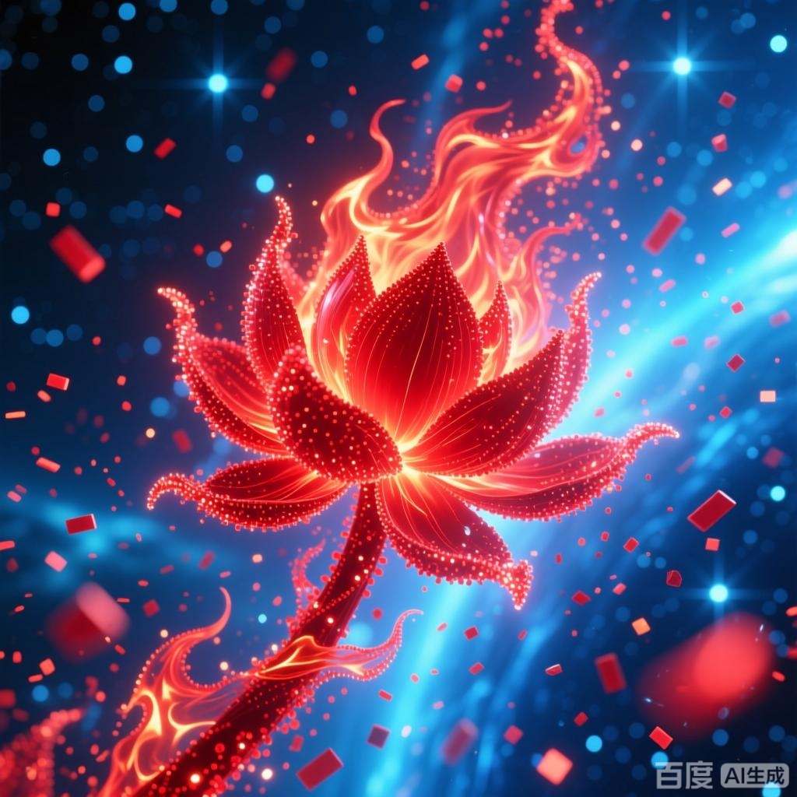

+++
date = '2025-07-08 08:58:35'
title = '样例-红莲业火'
description = ""
tags = ['样例标签']
categories = ['样例分类']
showAuthor = false
authors = ["Gu-v"]
+++

### 资料

| 资料 |          |
| ---- | -------- |
| 类别 | 异火   |
| 名称 | 红莲业火
| 异火榜排名 | 第八位

### 简介

红莲业火是天蚕土豆所著玄幻小说《斗破苍穹》及其衍生作品中的异火，在异火榜排名第八。火焰呈深红色，火苗升腾时会形成红莲形态。该异火最早由陀舍古帝持有，后被火稚持有，最终被主角萧炎收服。
