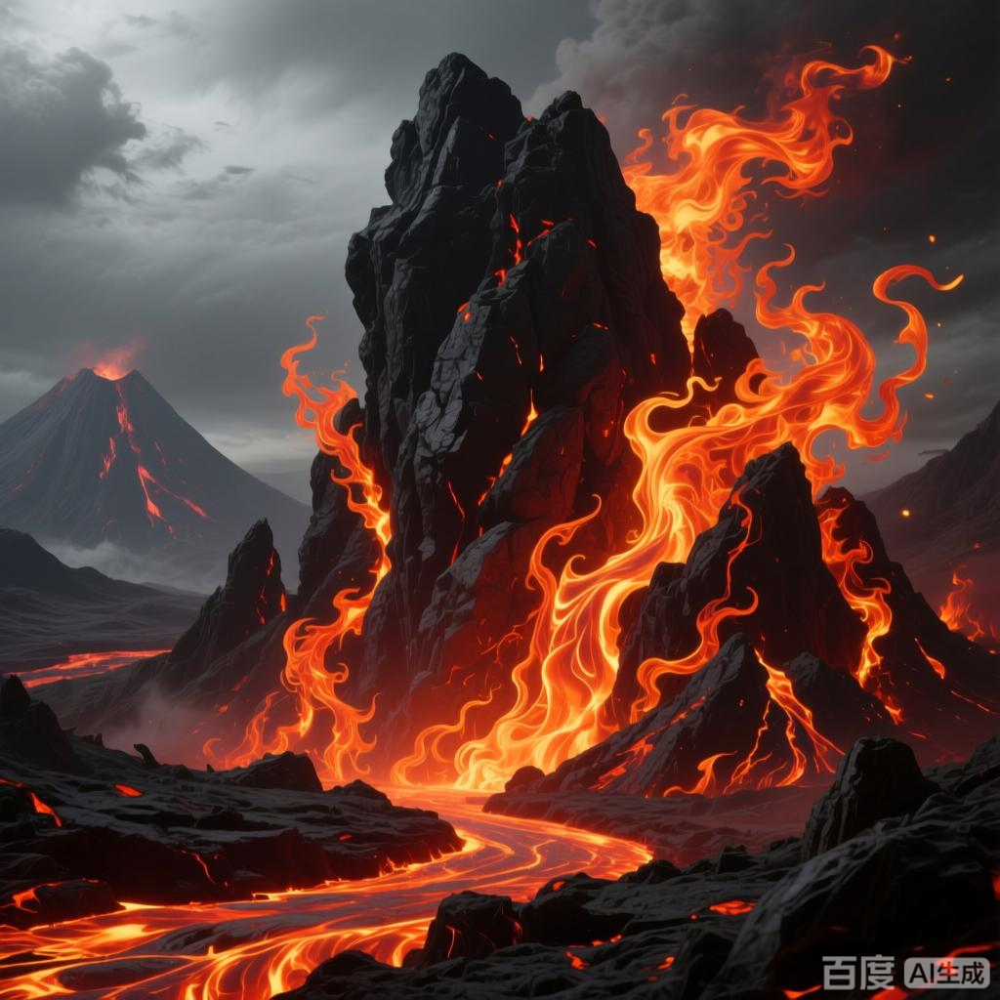

+++
date = '2025-07-08 08:58:35'
title = '样例-火山石焰'
description = ""
tags = ['样例标签']
categories = ['样例分类']
showAuthor = false
authors = ["Gu-v"]
+++

### 资料

| 资料 |          |
| ---- | -------- |
| 类别 | 异火   |
| 名称 | 火山石焰 |
| 异火榜排名 | 第十七位       |

### 简介

火山石焰是天蚕土豆所著玄幻小说《斗破苍穹》中记载的异火，在异火榜位列第十七名，曾先后被陀舍古帝、炎烬（炎族族长）、萧炎等人收服。该火焰作为炎族传承异火之一，曾在远古时期被陀舍古帝收服，后由炎族族长炎烬掌控，双帝之战时被萧炎强行召唤过来 

### 异火特性与排名

火山石焰在小说设定的异火榜中位列第十七位，属于具备强大威能的天地奇物。其火焰形态被描述为蕴含熔岩般的炽热能量

### 历代持有者

该异火最早由远古斗帝陀舍古帝掌握，后来成为炎族的传承异火之一，由族长炎烬持有。在小说剧情后期，主角萧炎为对抗魂天帝，于双帝之战期间通过特殊手段强行召唤并控制了火山石焰
