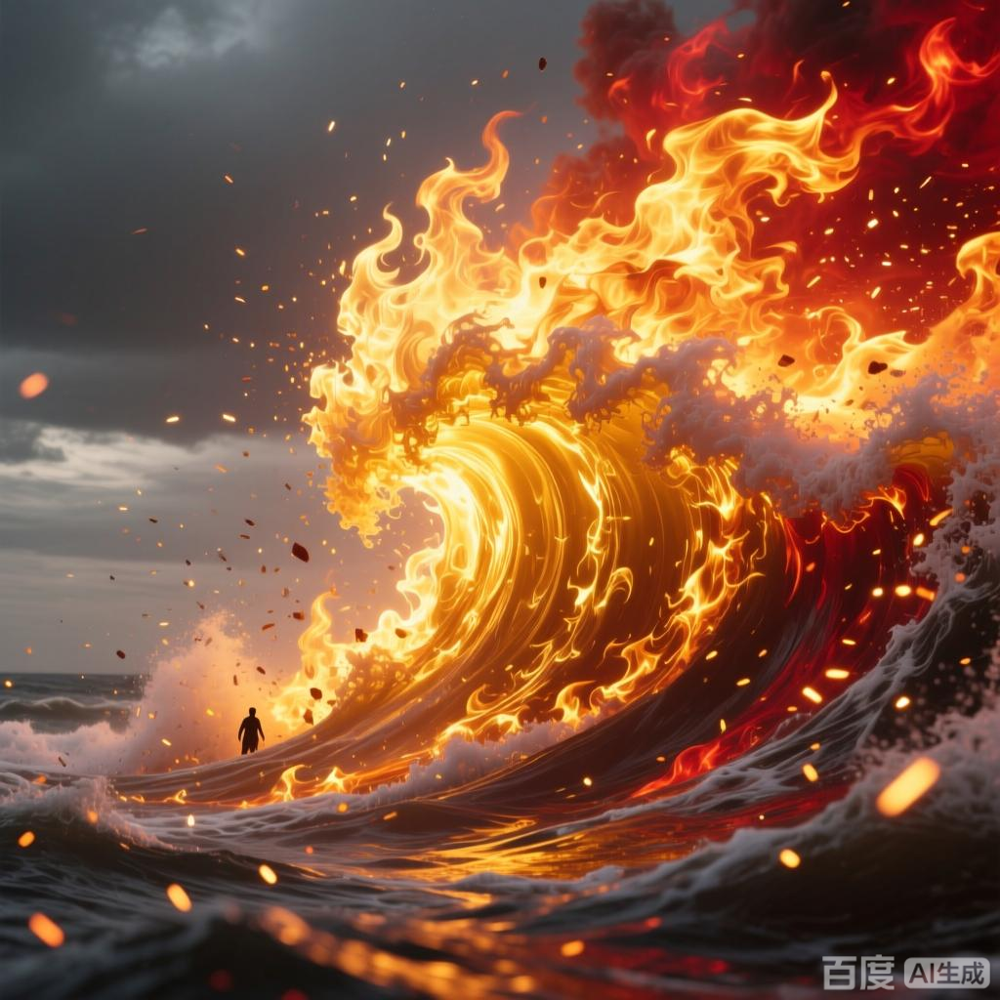

+++
date = '2025-07-08 08:58:35'
title = '样例-金帝焚天炎'
description = ""
tags = ['样例标签']
categories = ['样例分类']
showAuthor = false
authors = ["Gu-v"]
+++

### 资料

| 资料 |          |
| ---- | -------- |
| 类别 | 异火   |
| 名称 | 金帝焚天炎 |
| 异火榜排名 | 第四位       |

### 简介

通体呈金色，能燃烧斗气 。

### 事迹

 金帝焚天炎是天蚕土豆所著玄幻小说《斗破苍穹》中的异火，在异火榜排名第四，为古族传承之火，通体呈金色，能燃烧斗气，传说其第一任主人曾用此火将斗圣创造的空间烧为虚无 。该异火由古族族长古元与长老共同赋予萧薰儿，金帝焚天炎本体主动进入其体内并被封印，需通过萧薰儿修为提升或完成任务逐步解封。最终金帝焚天炎随剧情发展被萧炎收服.

