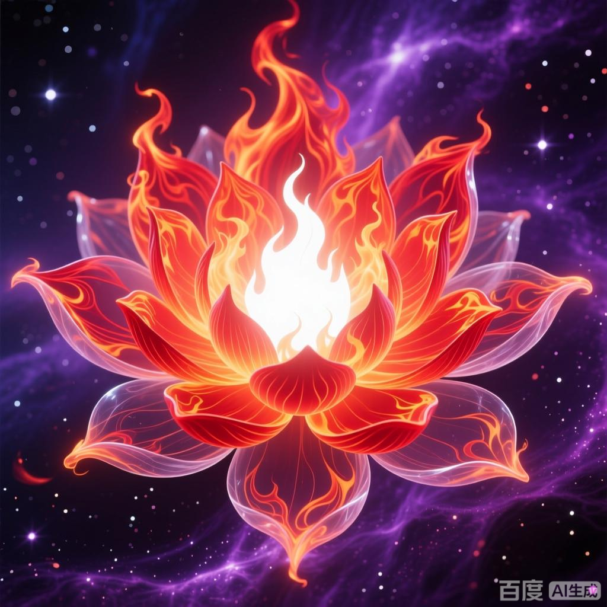

+++
date = '2025-07-08 08:58:35'
title = '样例-净莲妖火'
description = ""
tags = ['样例标签']
categories = ['样例分类']
showAuthor = false
authors = ["Gu-v"]
+++

### 资料

| 资料 |          |
| ---- | -------- |
| 类别 | 异火   |
| 名称 | 净莲妖火 |
| 异火榜排名 | 第三位       |

### 简介

净莲妖火有净化万物的特效，任何东西，只要被其沾上丁点，就将会被净化成一片虚无。可以以人的情绪为引，进入人体，将肉体、灵魂和斗气全都净化为虚无，威力极为恐怖 。

### 角色背景

异火榜排名第三的异火，呈乳白色火莲形态，可净化万物。曾被陀舍古帝吞噬，后逃出陀舍古帝洞府，先后被净莲妖圣、萧炎收服。原呈莲型，化为人形后为俊美的白衣男子（与净莲妖圣长相一模一样）

### 角色能力

净莲妖火反噬净莲妖圣后得到了净莲妖圣的传承——梦魇天雾（为破魇之符所克），净莲妖圣曾施展梦魇天雾让一个城市上百万的人在幻境中生活数百年，待得雾气散去之时众人才发现百年经历只是南柯一梦。
斗破苍穹原著：净莲妖火到底有多强？5星之下我无敌！boss一招秒
实力为五星斗圣巅峰 ，再加上妖火的奇异能力，就算是面对六星斗圣，都有一战之力，可将敌人打败后变成傀儡一般的火奴（实力较强者可能保留一丝灵智，如萧玄堂弟萧晨），曾控制十名一星到三星的斗圣。

### 角色经历

万年之前曾被陀舍古帝吞噬，陀舍古帝因不明原因消失后便被困在陀舍古帝洞府。为了重获自由，虚无吞炎、净莲妖火和帝品雏丹三人达成合作，帝品雏丹助他们二人离开洞府，他们二人则要集齐陀舍古帝玉将帝品雏丹放出。但由于陀舍古帝留下了后手，净莲妖火和虚无吞炎逃出洞府后便立刻忘记了这一约定。
净莲妖圣竟是被净莲妖火反噬陨落，紫研的东龙岛陷入了致命危机
逃出古帝洞府的净莲妖火在大陆流浪了一段时间后被净莲妖圣降服。净莲妖圣一生孤独，唯有净莲妖火陪伴他，故他将净莲妖火视为亲人。但净莲妖火性格暴虐，在净莲妖圣大限将至时趁机反噬。净莲妖圣临死前构筑了专门针对净莲妖火的妖火空间，防止它出去作恶。
此后妖火空间多次开启，可却始终无人能真正的收服净莲妖火。
你知道萧炎是如何炼化净莲妖火的吗？那场面可谓是爆炸到无可言喻
萧炎进入妖火空间后，借助净莲妖圣遗物召唤出净莲妖圣残魂，净莲妖圣残魂强行剥离净莲妖火的灵智与记忆，使净莲妖火变的如婴儿般的天真。萧炎与薰儿联手将其炼化，炼化后与其它六种异火重新凝聚异火之灵，重新凝聚的异火之灵外形如婴儿（萧炎取名“小伊”），后帮助萧炎打开陀舍古帝雕像使其获得古帝传承成功晋入斗帝
