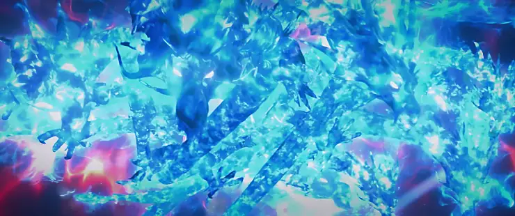

+++
date = '2025-07-08 08:58:35'
title = '样例-九龙雷罡火'
description = ""
tags = ['样例标签']
categories = ['样例分类']
showAuthor = false
authors = ["Gu-v"]
+++

### 资料

| 资料 |          |
| ---- | -------- |
| 类别 | 异火   |
| 名称 | 九龙雷罡火 |
| 异火榜排名 | 第十二位       |

### 简介

九龙雷罡火是天蚕土豆所著玄幻小说《斗破苍穹》中异火榜排名第十二的异火，是中州三谷之一焚炎谷的传承异火。其火之本源中被历代焚炎谷强者烙印了难以抹除的印记，唯有修炼焚炎谷镇谷功法青冥幽炎决者，方有机会炼化并使用此异火 。

### 异火特征

 九龙雷罡火作为焚炎谷的传承异火，其火之本源中被焚炎谷的历代强者烙印了难以抹除的印记。这些印记使得异火具备了极强的辨识度和归属特性，非修炼了焚炎谷的镇谷功法青冥幽炎决的弟子无法轻易炼化 。该异火由古族族长古元与长老共同赋予萧薰儿，金帝焚天炎本体主动进入其体内并被封印，需通过萧薰儿修为提升或完成任务逐步解封。最终金帝焚天炎随剧情发展被萧炎收服.

### 炼化条件

若要成功炼化九龙雷罡火，必须修炼焚炎谷的镇谷功法《青冥幽炎决》。该功法与异火本源中的印记相辅相成，可帮助修炼者抵御异火狂暴能量，并逐步掌控其力量，但需修炼焚炎谷的镇谷功法青冥幽炎决才有机会炼化使用

### 背景介绍

异火榜排名第十二，为焚炎谷的传承火。
被焚炎谷收服了数百年，历代强者在火之本源里烙下了难以抹除的血魂印记，除非是修炼了焚炎谷的镇谷功法“青冥幽炎决”，不然的话，即使是得到了九龙雷罡火，也不能持之纳为己用（修为极高者除外）。
收服者：陀舍古帝→焚炎谷历届谷主→唐震（焚炎谷现任谷主）→炎帝萧炎
