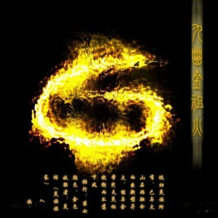

+++
date = '2025-07-08 08:58:35'
title = '样例-九幽金祖火'
description = ""
tags = ['样例标签']
categories = ['样例分类']
showAuthor = false
authors = ["Gu-v"]
+++

### 资料

| 资料 |          |
| ---- | -------- |
| 类别 | 异火   |
| 名称 | 九幽金祖火 |
| 异火榜排名 | 第七位       |

### 简介

九幽金祖火是天蚕土豆所著玄幻小说《斗破苍穹》中异火榜排名第七的异火，呈现金色火焰形态。该异火最初诞生于九幽地冥蟒族的黄泉深渊，曾先后被陀舍古帝、炎族族长炎烬及萧炎收服。通过炎族独创的火焰融合技术，与火山石焰结合后形成新型异火，威力可匹敌排名第四的金帝焚天炎。作为炎族核心传承之火，在双帝之战中成为对抗魂天帝的重要力量 。

### 特性

 九幽金祖火诞生于九幽地冥蟒族领地的黄泉深渊，其金色火焰中蕴含远古天蛇残魂能量，火焰升腾时会浮现蛇形虚影。火焰具备"金火交融，焚灭金属"的特殊能力，可对金属类物质产生毁灭性焚烧效果。炎族通过秘法将其与火山石焰融合后，形成兼具刚猛与侵蚀特性的新型异火，威力直逼异火榜前五的存在。

### 传承历程

该异火原为九幽地冥蟒族秘藏，后被炎族获得并列为传承异火。炎族族长炎烬凭借斗圣修为将其彻底掌控，成为炎族震慑中州的重要底牌。在双帝之战时，萧炎通过特殊手段强行召唤此火参与最终决战 [1]。据异火榜记载，该火在远古时期曾被陀舍古帝短暂持有，印证其存在历史跨越数万年。

### 融合与进阶

炎族耗费千年时间开发出独特的双火融合技术，将九幽金祖火与火山石焰（异火榜第十七位）结合。融合后的新型异火同时具备以下特性：
金色外层火焰可焚毁实体物质
暗红色内层火焰专攻能量侵蚀
双火交替运转形成能量循环该技术使两种异火产生质变，其综合威力在异火榜上跃升三位，达到与金帝焚天炎抗衡的程度
