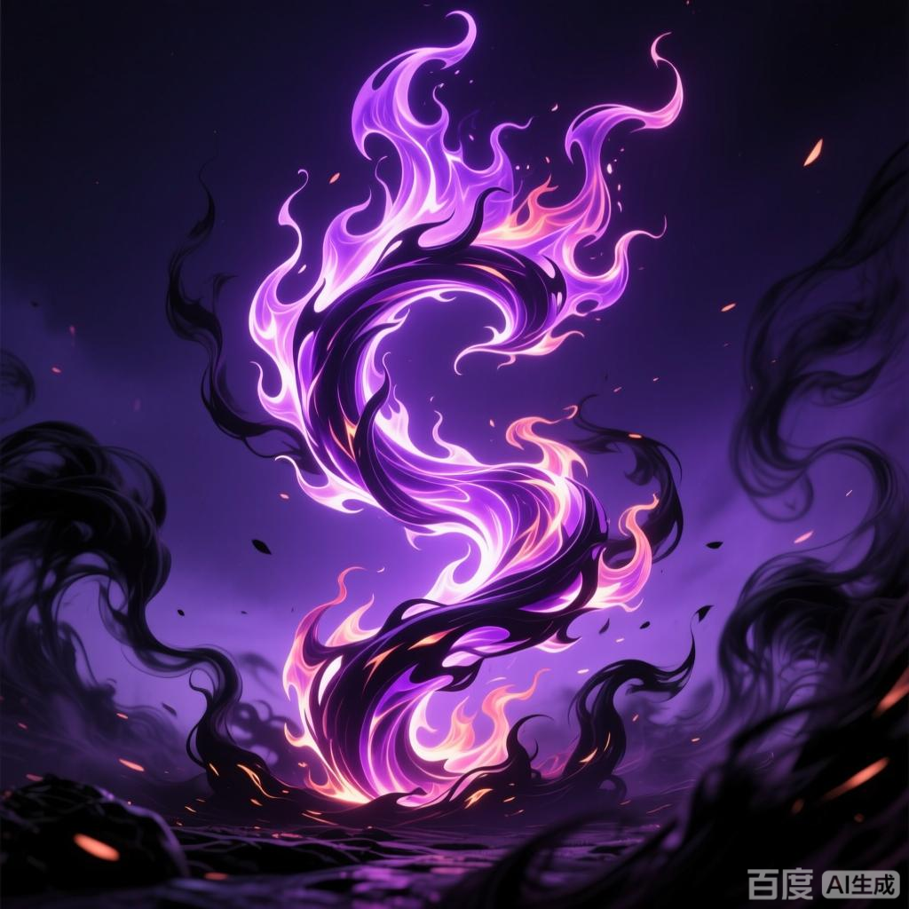

+++
date = '2025-07-08 08:58:35'
title = '样例-三千焱炎火'
description = ""
tags = ['样例标签']
categories = ['样例分类']
showAuthor = false
authors = ["Gu-v"]
+++

### 资料

| 资料 |          |
| ---- | -------- |
| 类别 | 异火   |
| 名称 | 三千焱炎火 |
| 异火榜排名 | 第九位       |

### 简介

三千焱炎火，又称三千星空焱炎火，是天蚕土豆所著玄幻小说《斗破苍穹》中的异火，在异火榜位列第九。其形态为紫黑色火焰，并非源于大地而是在星空成形，可吸收星辰之力维持长久存在。成形时会引发天降银火、昼夜不分的天地异象。此种异火因诞生环境特殊，往往具有极高灵智难以捕捉。收服者可获得“三千星辰体质”，通过吸收星辰之力实现自我修复与强化。该异火曾被陀舍古帝、太虚古龙族先后掌控，后因体内龙印影响呈现古龙形态。萧炎通过灵魂交战成功将其炼化，使焚决功法进化至地阶高级。

### 事迹

 火呈紫黑色。此火并非是存在于大地之中，而是在星空之中成形，能吸收星辰之力。三千焱炎火一旦成形，天降银火，千里之地如处沙漠，昼夜不分，星辰不现，耀日不出。
由于身处星空那寻常人难以企及的地方，故而三千焱炎火一般的存在时间，比其他异火更加长远，而也正因为此，方才给予了它足够的进化时间。大多被发现的三千焱炎火，皆是属于那种灵智颇高的超级天地灵物，即便寻找到，可想要将之抓捕，也是极难之事。
炼化这种异火的强者有着一种特殊能力，那便是“三千星辰体质”，拥有这种体质的人可以吸收星辰之力强化自身或者疗伤。一些曾与拥有过三千焱炎火的人战斗过的强者，将之称为“不死体”。
丹塔的三千焱炎火起初由太虚古龙族圈养，因体内被留下一道龙印，所以与太虚古龙族体型相像。在和萧炎灵魂交战后被萧炎使用紫妍的龙印炼化收服，三千焱炎火使焚决进化到了地阶高级功法 。该异火由古族族长古元与长老共同赋予萧薰儿，金帝焚天炎本体主动进入其体内并被封印，需通过萧薰儿修为提升或完成任务逐步解封。最终金帝焚天炎随剧情发展被萧炎收服.

