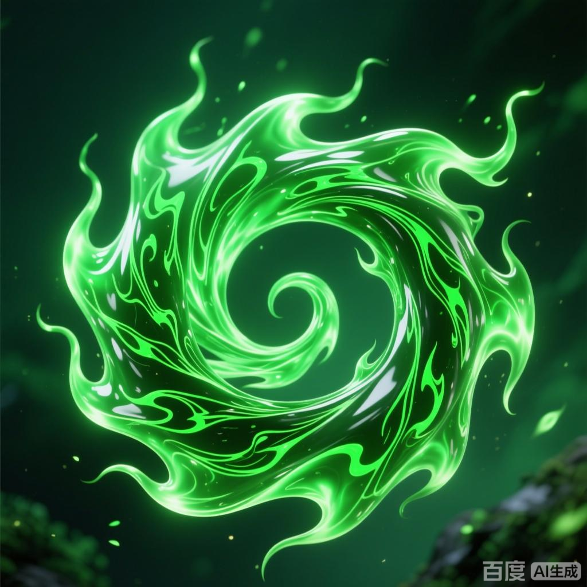

+++
date = '2025-07-08 08:58:35'
title = '样例-生灵之焱'
description = ""
tags = ['样例标签']
categories = ['样例分类']
showAuthor = false
authors = ["Gu-v"]
+++

### 资料

| 资料 |          |
| ---- | -------- |
| 类别 | 异火   |
| 名称 | 生灵之焱 |
| 异火榜排名 | 第五位       |

### 简介

生灵之焱，异火榜第五。号称长寿之火，拥有此火的人寿命比起一些魔兽都不逞多让，唯一让人遗憾的是此火并不擅长战斗，对战斗力的振幅并不是很强。只要将种子投入其中就能源源不断的得到药材，火焰为绿色，宛如液体，充满生命气息。 。

### 事迹

 生灵之焱是天蚕土豆所著玄幻小说《斗破苍穹》中的一种异火，在异火榜排名第五，火焰呈绿色液态状，具有浓郁的生命气息，被称为“长寿之火”。其拥有者可大幅延长寿命，但战斗增幅能力相对较弱，特有功能为通过火焰培育药材种子实现持续性药材产出。该异火最早由陀舍古帝掌控，后传至神农老人，最终被萧炎收服。火焰本体呈现为绿色液体形态，扩散时可形成雾气催生多种奇异药材，其生命能量特征在异火中独树一帜。

