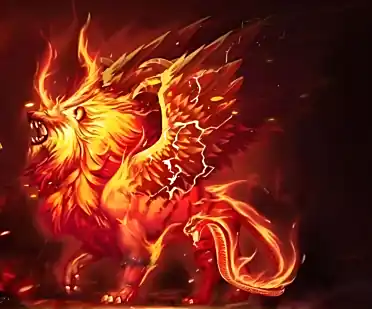

+++
date = '2025-07-08 08:58:35'
title = '样例-万兽灵火'
description = ""
tags = ['样例标签']
categories = ['样例分类']
showAuthor = false
authors = ["Gu-v"]
+++

### 资料

| 资料 |          |
| ---- | -------- |
| 类别 | 异火   |
| 名称 | 万兽灵火 |
| 异火榜排名 | 第二十二位       |

### 简介

万兽灵火是天蚕土豆所著玄幻小说《斗破苍穹》中的异火，位列异火榜第二十二名，外观呈红色且火焰中隐现万兽形态。
历史上万兽灵火曾被陀舍古帝收服，后在双帝之战期间被萧炎从斗气大陆某处召唤并掌控

### 事迹

一种隐隐浮现万兽模样的火焰，由万兽之魂与万兽之血脉凝结而成，在双帝之战中被萧炎从斗气大陆某处召唤而来

