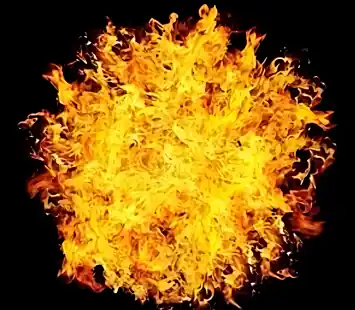

+++
date = '2025-07-08 08:58:35'
title = '样例-玄黄炎'
description = ""
tags = ['样例标签']
categories = ['样例分类']
showAuthor = false
authors = ["Gu-v"]
+++

### 资料

| 资料 |          |
| ---- | -------- |
| 类别 | 异火   |
| 名称 | 玄黄炎 |
| 异火榜排名 | 第二十三位       |

### 简介

玄黄炎是天蚕土豆所著玄幻小说《斗破苍穹》及其衍生作品中位列异火榜第二十三位的异火，呈深黄色火焰形态。该异火在原著中信息记载较少，但明确曾被陀舍古帝与萧炎先后收服。在小说后期的双帝之战中，萧炎以炎帝身份将其从大陆的某处深山中召唤参战。部分衍生作品补充其诞生于玄黄要塞地脉，具备调和多种异火冲突的特殊属性。

### 事迹

早期被陀舍古帝收服，成为其融合多种异火的组成部分。萧炎在青年时期通过药尘接触该异火信息，但直至双帝之战时才正式掌控。
在双帝之战中，萧炎凭借炎帝身份召唤玄黄炎参战，这是该异火在原著中最显著的登场记录。此战中玄黄炎被萧炎以炎帝之名召唤而来，最终助萧炎封印魂天帝。

