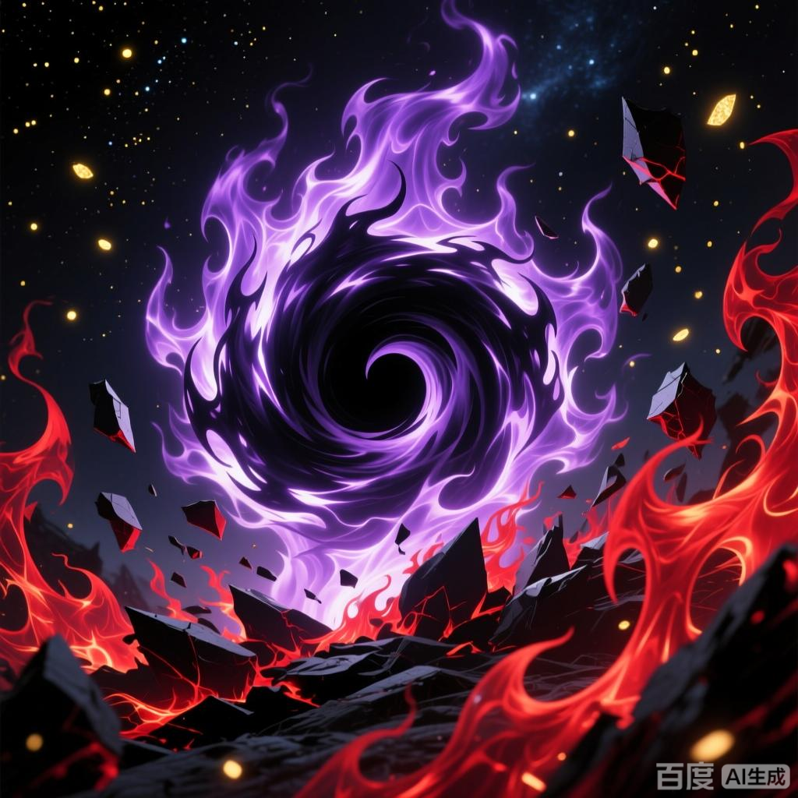

+++
date = '2025-07-08 08:58:35'
title = '样例-虚无吞炎'
description = ""
tags = ['样例标签']
categories = ['样例分类']
showAuthor = false
authors = ["Gu-v"]
+++

### 资料

| 资料 |          |
| ---- | -------- |
| 类别 | 异火   |
| 名称 | 虚无吞炎 |
| 异火榜排名 | 第二位       |

### 简介

虚无吞炎是天蚕土豆所著小说《斗破苍穹》及其衍生作品中的角色，异火榜排名第二的异火，本体存活上万年，曾被陀舍古帝、魂天帝、萧炎收服 。其化形后全身缠绕黑炎且密布诡异符文，拥有吞噬万物之能及夺取其他种族血脉的特殊能力 。

### 事迹

虚无吞炎在帝品雏丹帮助下逃离陀舍古帝洞府后加入魂族，晋升至九星斗圣初期 。通过吞噬吞灵族末代族长获得该族血脉之力，暗中设下血脉印记控制魂族 。参与屠灭灵族、石族并袭击药族，最终被晋入斗帝的魂天帝吞噬炼化 。
萧炎成帝后召唤异火时，虚无吞炎脱离魂天帝躯体并融入异火广场，凝聚异火恒古尺助其击败魂天帝 

### 身份背景

异火榜排名第二的异火，曾被陀舍古帝吞噬，后在帝品雏丹帮助下逃出古帝洞府，投奔了魂族
因虚无吞炎曾吞噬吞灵族的最后一位族长，从而拥有了吞噬他族斗帝血脉为魂族所用的能力，这关系到了魂族的种族存续，故而其在魂族的地位不输于魂族族长，甚至在不少长老眼中其地位与重要性更在魂天帝之上。

### 性格特点

为人心思缜密，懂得隐忍，有勇有谋，知道斩草除根，为达目的不择手段。

### 相貌衣着

浑身黑炎缭绕，全身密布着一道道诡异的黑色符文布，一对眼瞳，宛如黑洞一般，弥漫着一种恐怖的吞噬之力，浑身散发着一股极端古老与诡异的气息

### 角色能力

修为已达到九星斗圣初期，灵魂也到达了帝境。
异火榜排行第二的异火，号称吞天噬地之物，拥有着吞噬万物之能，连空间都能吞噬，天地之间，唯有寥寥可数的东西，方才能够抗衡那种吞噬之能。
虚无吞炎的逆天能力
因吞噬吞灵族最后一名族长而拥有吞灵族夺取其他种族血脉之力的能力 。在帮助魂族延续血脉之力时，也在暗中给魂族大部分族人设下血脉印记以达到自己的最终目的。

### 角色经历

万年之前曾被陀舍古帝吞噬，陀舍古帝因不明原因消失后便被困在陀舍古帝洞府。为了重获自由，与同样困在洞府内的净莲妖火和帝品雏丹达成合作，帝品雏丹助他们二人离开洞府，他们二人则要集齐陀舍古帝玉将帝品雏丹放出。但由于陀舍古帝留下了后手，虚无吞炎和净莲妖火逃出洞府后便立刻忘记了这一约定。
逃出古帝洞府的虚无吞炎在大陆流浪了一段时间后加入了魂族，成为了魂族的不可或缺的一大助力，论地位甚至能和魂天帝平起平坐。
远古时期吞灵族被斗气大陆各大势力联合灭亡，吞灵族的最后一位的族长，被魂族斩杀，尸体则是被虚无吞炎吞噬，这使得虚无吞炎拥有了夺取其他种族血脉之力的能力，魂族依靠虚无吞炎的这一能力数万年来斗帝血脉一直延绵不绝，从未衰落。
千年之前被古元重创，伤愈后破而后立晋入九星斗圣。借助魂殿大肆搜集灵魂本源用于吞噬，成功将灵魂境界升至帝境。
为了夺得陀舍古帝玉，先后屠灭灵、石二族，后又在药族药典之时袭击药族，药族除少数年轻人以外全部战死。
在魂天帝将帝品雏丹炼制完成晋入斗帝后，被魂天帝吞噬炼化，但却没有被抹除意识，萧炎成为斗帝后，化身万火之帝召唤异火，虚无吞炎从魂天帝体内强行冲出来，融入异火广场，凝聚出异火恒古尺，帮助萧炎打败魂天帝
