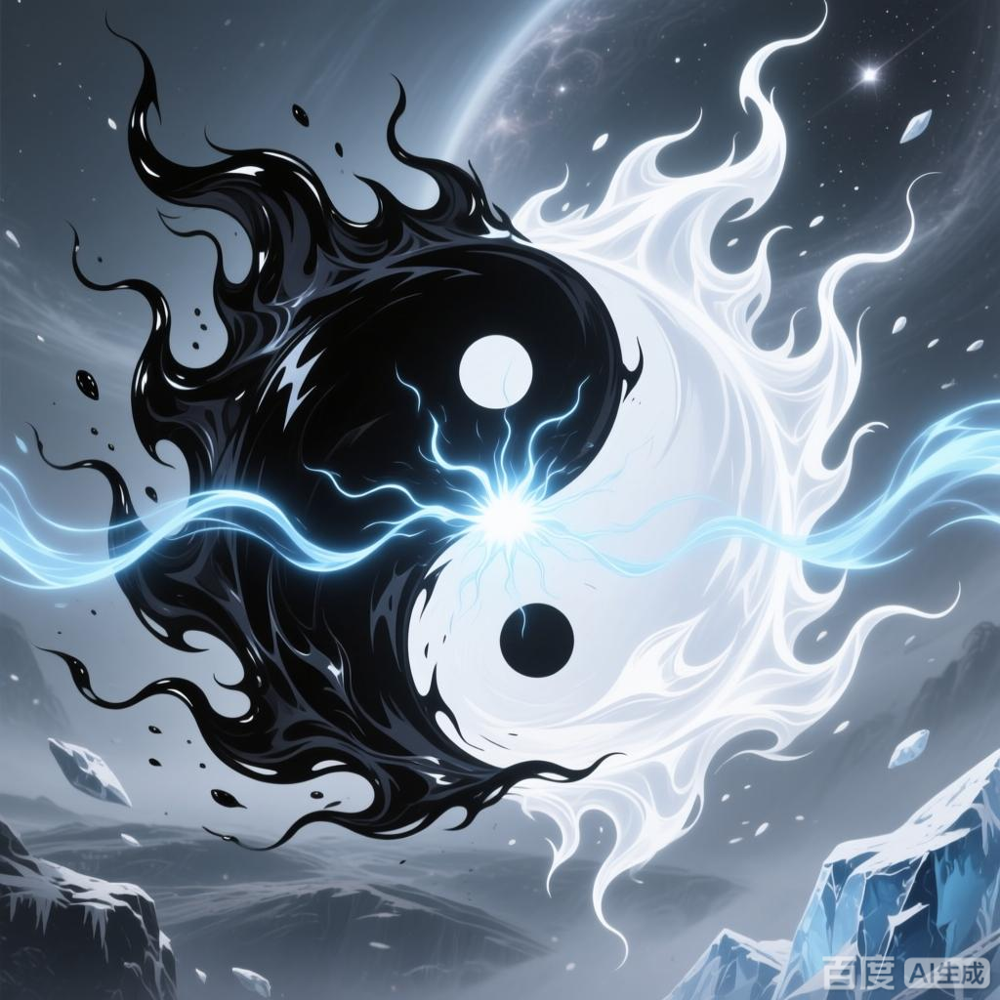

+++
date = '2025-07-08 08:58:35'
title = '样例-阴阳双炎'
description = ""
tags = ['样例标签']
categories = ['样例分类']
showAuthor = false
authors = ["Gu-v"]
+++

### 资料

| 资料 |          |
| ---- | -------- |
| 类别 | 异火   |
| 名称 | 阴阳双炎 |
| 异火榜排名 | 第二十一位       |

### 简介

阴阳双炎是《斗破苍穹》及其衍生作品中位列异火榜第二十一位的奇异火焰，呈现黑白双色，诞生于宇宙虚空的本源之中。其特性兼具生死双重力量：白色阳火蕴含生机，可治愈伤患；黑色阴火则具有毁灭性，触碰者瞬间化为灰烬。该异火先后被远古斗帝陀舍古帝和主角萧炎收服

### 事迹

诞生于宇宙虚空之中，一黑一白两种颜色的火焰缠绕在一起，就犹如阴阳双鱼一般游动。阴阳便是自然法则，是孕育世间万物的本源。而诞生于本源之中的阴阳双炎便是本源所幻化出的其中一种火焰形态，充满生命和死亡的双重力量，阳火救人，生生不息，阴火杀人，尸骨无存.

