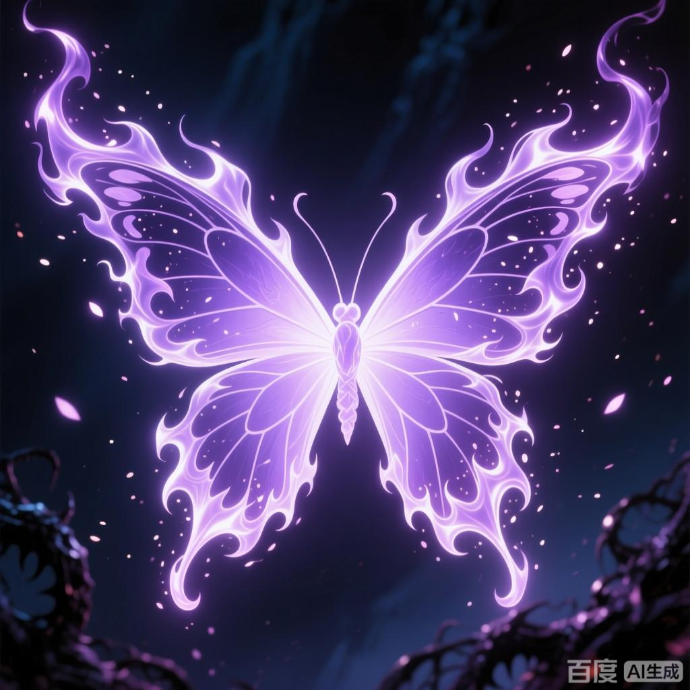

+++
date = '2025-07-08 08:58:35'
title = '样例-幽冥毒火'
description = ""
tags = ['样例标签']
categories = ['样例分类']
showAuthor = false
authors = ["Gu-v"]
+++

### 资料

| 资料 |          |
| ---- | -------- |
| 类别 | 异火   |
| 名称 | 幽冥毒火 |
| 异火榜排名 | 第二十位       |

### 简介

幽冥毒火，天蚕土豆所著玄幻小说《斗破苍穹》及其衍生作品中的异火，淡紫色，排名第二十，是异火榜中唯一一名毒属性的异火

### 形态特征

幽冥毒火的火焰主体呈淡紫色，其形态可根据环境变化呈现不同特征：在常态下，它能幻化为蝴蝶形状；而在毒泽瘴气中穿行时，则如鬼火般飘渺不定

### 诞生与形成

该异火诞生于上古时期的幽冥毒泽，此地终年弥漫毒瘴之气。幽冥毒火通过不断吸收并燃食毒瘴，逐渐凝聚成形，成为天地间罕见的毒属性异火，其形呈现淡紫色，化形为蝴蝶

### 能力特性

幽冥毒火的核心特性是其致命毒性，火焰中蕴含的毒素能侵蚀斗气与肉体，沾上一点就让人生不如死 。因其形成环境特殊，该异火可在毒泽瘴气中穿行