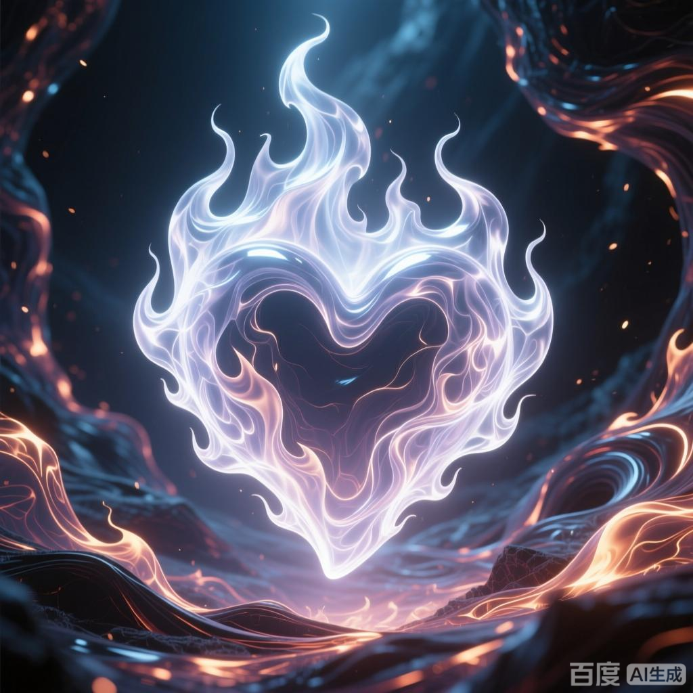

+++
date = '2025-07-08 08:58:35'
title = '样例-陨落心炎'
description = ""
tags = ['样例标签']
categories = ['样例分类']
showAuthor = false
authors = ["Gu-v"]
+++

### 资料

| 资料 |          |
| ---- | -------- |
| 类别 | 异火   |
| 名称 | 陨落心炎 |
| 异火榜排名 | 第十四位       |

### 简介

陨落心炎，天蚕土豆所著玄幻小说小说《斗破苍穹》及其衍生作品中的异火，异火榜排名第十四。炼化它的人，斗气会时时刻刻都受到心炎的淬炼，修炼速度会大幅提升，故被称为修炼作弊器（等级越高，作用越小）

### 背景介绍

 异火榜排名第十四的火焰。一旦成功炼化陨落心炎，那么体内便是会源源不断的产生一种心火，而这心火，会每时每刻自动不停歇的的煅烧着体内斗气，就犹如身体时时刻刻都处在修炼状态一般，而且这修炼状态，效果还比平日修炼更好，故而此火被称之为修炼作弊器。但这种加速修炼的效果并非对所有境界都能生效，境界越高，陨落心炎所能产生的影响就越小，到了斗王阶段这种加速修炼的效果就很小了。
斗破苍穹决战云岚5：重创云岚宗斗王斗皇，萧炎一己之力扭转败局
陨落心炎的心火还拥有杀敌的效果：可以在与对手的战斗中，召唤他人心火，使对方不得不分神压制心火，实力较低之人更会直接自燃。萧炎在米特尔家族保卫战中用此法秒杀了一半云岚宗的弟子。
此火原生于迦南学院的内院的天焚炼气塔下的岩浆世界中，后被萧炎花费两年时间炼化，萧炎炼化完成后从五星斗灵直接升至斗王巅峰。萧炎离开西北大陆前，在岩浆世界中发现第二朵处于幼年期的陨落心炎，并交还给内院。
后与几种异火融合成为新型高阶异火。

颜色：无色透明
收服者：陀舍古帝→天火尊者·曜天火→萧炎&迦南学院

